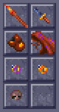

# Templar's Ledger

A companion for **Dark Sun: Shattered Lands** (the GOG release) running in
DOSBox, in the spirit of the Gold Box Companion. In Draj the templars keep the
records; this ledger keeps the ones the game doesn't show you.

## Contents

- [What it does](#what-it-does)
- [Requirements](#requirements)
- [Running it (Windows)](#running-it-windows)
  - [One-time setup](#one-time-setup)
  - [Every time you play](#every-time-you-play)
  - [Other ways to start](#other-ways-to-start)
  - [If DOSBox closes by itself](#if-dosbox-closes-by-itself)
  - [Crash reports](#crash-reports)
  - [From a command prompt](#from-a-command-prompt)
- [The Ledger's window](#the-ledgers-window)
  - [The Spells tab](#the-spells-tab)
  - [The Dialogue tab](#the-dialogue-tab)
- [The dice log](#the-dice-log)
  - [Initiative](#initiative)
  - [Two weapons](#two-weapons)
  - [Spells and effects](#spells-and-effects)
  - [Thief skills](#thief-skills)
  - [Psionics](#psionics)
  - [Character creation](#character-creation)
  - [Attacks from behind and backstabs](#attacks-from-behind-and-backstabs)
  - [Saving throws](#saving-throws)
  - [Monsters' defences](#monsters-defences)
  - [No critical hits](#no-critical-hits)
  - [How the dice log works](#how-the-dice-log-works)
- [In the game](#in-the-game)
  - [In the game: THAC0, saves and thief skills](#in-the-game-thac0-saves-and-thief-skills)
  - [In the game: spell slots on the USE screen](#in-the-game-spell-slots-on-the-use-screen)
  - [In the game: each turn's rolls](#in-the-game-each-turns-rolls)
  - [In the game: what hurts a monster (the Look box)](#in-the-game-what-hurts-a-monster-the-look-box)
- [Rule changes](#rule-changes)
  - [Thief skills from AD&D's table](#thief-skills-from-adds-table)
  - [Half-giants' two-handed weapons](#half-giants-two-handed-weapons)
- [New content](#new-content)
  - [The Ring +1](#the-ring-1)
  - [Picking pockets](#picking-pockets)
  - [The cooked vulture](#the-cooked-vulture)
  - [The slave pens' gear](#the-slave-pens-gear)
  - [Kreenfang and Shadowseeker](#kreenfang-and-shadowseeker)
  - [The bone scale set](#the-bone-scale-set)
  - [Kalzith](#kalzith)
  - [Semyon](#semyon)
  - [Dinos and the Trustee on Kalzith and Semyon](#dinos-and-the-trustee-on-kalzith-and-semyon)
  - [Item icons](#item-icons)
  - [New item names](#new-item-names)
- [On the screen](#on-the-screen)
  - [What the party wears](#what-the-party-wears)
  - [Shadows](#shadows)
  - [Dust](#dust)
- [Controls](#controls)
  - [Choosing an enemy: Tab, Enter and the rings](#choosing-an-enemy-tab-enter-and-the-rings)
  - [Scrolling the map](#scrolling-the-map)
- [Game speed](#game-speed)
  - [Suggested system requirements](#suggested-system-requirements)
- [Accessibility](#accessibility)
- [What is known](#what-is-known)
- [Practising without the game](#practising-without-the-game)
- [How it works](#how-it-works)
- [Development](#development)
  - [Mapping memory](#mapping-memory)
  - [Command-line mapping tools](#command-line-mapping-tools)

## What it does


**In the Ledger's window**

- **Party viewer:** every party member's stats, live, including numbers the
  game doesn't show: THAC0 with each weapon and the saving throws as they
  stand now (with Bless, rings and the like counted), attacks per round, the
  AC the game uses in a fight and what it's made of, spell slots, thief
  skills, and everything they carry.
- **Dice log:** the rolls the game makes behind the scenes, with what they were
  compared against and where every bonus comes from. For example:

  ```
  Round 2: Dag 27, Mountain Stalker 25, Daaki 21, Red Slaad 20
  Dag's turn
  Dag attacks Mountain Stalker with Long Sword +1 (1d8+1): d20 = 18, needs 4+ (85%), hits AC -10, target AC 4 -> HIT
      THAC0 16, +1 Blessed, +6 STR, +1 weapon = 8
    Dag hits Mountain Stalker for 20: 1d8 = [7] +1 weapon +12 STR 24
    Mountain Stalker now 12/32 HP (-20)
  Fireball damage: 9d6 = [3 + 2 + 3 + 4 + 5 + 4 + 1 + 2 + 2] = 26
  Red Slaad magic resistance 30% vs Fireball: d100 = 71 -> not resisted
  Red Slaad saves vs Fireball from Daaki (petrification/polymorph): d20 = 6, doubled against fire = 12, needs 11 (75% to save) -> saved: half damage, 13 of 26
    Red Slaad takes 13 from Fireball, now 47/60 HP
  Jellybelly gives Blessed to Daaki: +1 to hit, +1 on saves
  Slig is killed (270 XP)
  XP: Gerakis +67, K'ratchek +22, Cermak +67, Cilla +22 (for Slig 270)
  ```

  (That Fireball save is the game's own rule; with the
  [rule changes](#rule-changes) on, as they are by default, it would be the
  spell save, with DEX's dodging adjustment instead of the doubled d20.)
- **Dialogue:** what characters say, the replies you're offered and the one
  you picked, kept in a tab you can scroll back through.
- **Spells:** a tab listing what every spell and psionic power really does,
  from the game's own records (see [the Spells tab](#the-spells-tab)).

**In the game**

- **In the game itself**, in the game's own lettering: the inventory screen
  also shows each character's THAC0 (for each weapon too), saving throws,
  DEX reaction and defensive adjustments and (for thieves) their thief
  skills, all as they stand now, and the
  View Character screen their THAC0 and saves
  (see [In the game](#in-the-game-thac0-saves-and-thief-skills)); the USE
  screen shows their spell slots left (see
  [spell slots](#in-the-game-spell-slots-on-the-use-screen)); and, if you
  tick it, after each turn in a fight the game stops to show what came of
  that turn, or its attack rolls, spell damage and saving throws too, and who
  is still to act (see
  [each turn's rolls](#in-the-game-each-turns-rolls)); and Looking at a monster
  in a fight tells you what hurts it (see
  [the Look box](#in-the-game-what-hurts-a-monster-the-look-box)). The game,
  these additions and the Ledger's window start together.

**Rule changes**

- **Rule changes**, each switchable on the Options tab: helms give AC 1,
  boots a move more in a fight, AD&D's two-weapon penalties, spells saved
  against with the spell save, DEX rather than a doubled d20 on saves against
  fire, cold and electricity, a new spell (Cat's Grace), thieves and rangers
  hiding in shadows to attack from behind, class levels up to 10, and thief
  skills from AD&D's table with Dark Sun's race and DEX adjustments, and
  half-giants wielding two-handed weapons in one hand (see
  [Rule changes](#rule-changes)). And thieves no longer lose skill for what
  they hold (see [Thief skills](#thief-skills)).

**New content** (each can be switched off on the Options tab)

- **A Ring +1** (+1 AC, +1 on saving throws) found by searching the Tied-up
  Prisoner's body in the arena, an item of the Ledger's own (see
  [The Ring +1](#the-ring-1)).
- **Picking pockets:** a thief can try anyone's pockets, with the Thieves'
  Tools every thief now carries (or, if ticked, with P in a conversation), a
  move silently roll deciding whether a fumble is noticed (see
  [Picking pockets](#picking-pockets)).
- **A use for the cooked vulture:** ask Dinos in the slave pens about it, and he
  cooks it properly for the party (see [The cooked vulture](#the-cooked-vulture)).
- **Gear for the slave pens' bosses:** Kurzak, Legcrusher and Pehtucl carry
  things worth taking from them (see [The slave pens' gear](#the-slave-pens-gear)).
- **Two named magic weapons:** the arena's 2 handed Bone Gythka becomes
  Kreenfang, and Kurzak's short sword Shadowseeker, which lets its wielder see
  the invisible; lifting Shadowseeker from Kurzak is worth 200 XP (see
  [Kreenfang and Shadowseeker](#kreenfang-and-shadowseeker)).
- **Kalzith, a defiler in the slave pens,** who sells spell scrolls to a party
  that treats him well (see [Kalzith](#kalzith)).
- **Semyon back in the slave pens,** as he promises when he leaves the arena,
  and breaking out with the party and Scar if he is beside them (see
  [Semyon](#semyon)).
- **Dinos and the Trustee asked about Kalzith and Semyon** (see
  [Dinos and the Trustee on Kalzith and Semyon](#dinos-and-the-trustee-on-kalzith-and-semyon)).
- **Icons of their own** for the Ledger's magic items and the Short Sword,
  made from the game's (see [Item icons](#item-icons)).

**On the screen**

- **What the party wears, on the map:** their weapons and shields, bows and
  quivers, armour, helms, cloaks, boots and belts show on their figures, and
  change when their gear does (see [What the party wears](#what-the-party-wears)).
- **Shadows** under every figure on the map, see-through and in the floor's own
  colours (see [Shadows](#shadows)).
- **Dust** raised behind the feet of anyone walking on sand or dirt (see
  [Dust](#dust)).

**Controls**

- **Choosing an enemy with Tab** in a fight, marked by a red ring, and
  attacking it with Enter even when someone stands in front of it (see
  [Choosing an enemy](#choosing-an-enemy-tab-enter-and-the-rings)).
- **Scrolling the map with the mouse:** press the wheel and move to drag the
  map, or turn it (see [Scrolling the map](#scrolling-the-map)).

**Smoother play, and help when something goes wrong**

- **Game speed:** DOSBox is given more of the computer, for smoother walking
  with the whole party in view (see [Game speed](#game-speed)).
- **Crash reports:** if DOSBox crashes or the game stops with an error, what
  happened is saved in a file to send (see [Crash reports](#crash-reports)).

Nothing in the game folder or your save files is changed, except that a game
you save keeps what the Ledger has handed out or changed in play: the Ring +1,
a thief's Thieves' Tools, whatever a thief has lifted, the slave pens' gear,
Kreenfang and Shadowseeker, cloaks', boots' and belts' prices, Kalzith and his scrolls, Semyon in his pen, and the XP and rest from Dinos's meal (untick the ring's and the pockets'
boxes to go without those). The Short Sword and the Cloak of Protection are
item types the original game doesn't have, so a save with them should be
loaded with the dice log.
Apart from those, what it hands the dice log's helper and the marks that have
the game draw a figure again, the Ledger only reads the game's memory. For the
dice log, the launcher runs a patched copy of the game, and copies of four of
its files (the objects with the new icons and Kalzith, the scripts and the
slave pens with Kalzith and Semyon, the screens' pictures with Cat's Grace's
icon), that it keeps in its own folder (see
[How the dice log works](#how-the-dice-log-works)).

The window is dressed in the game's own colours: its grey stone panels, the
amber of its dialogue, the yellow of its character screen and the red rock of
the arena, all sampled from the game (no game artwork is copied).


## Requirements

- **Windows** with DOSBox (plain DOSBox 0.74, DOSBox Staging, or the DOSBox
  bundled with the GOG/Steam release).
- **64-bit Python 3.8+** from python.org. If it isn't installed, the `.bat`
  files offer to install it for you (see below). Python includes tkinter and
  needs no extra packages. It has to be 64-bit because 64-bit DOSBox can't be
  read from 32-bit Python.
- Linux works too if you can read other processes' memory (root, or
  `kernel.yama.ptrace_scope=0`).

## Running it (Windows)

Templar's Ledger is a separate program that runs next to the game. You don't
install anything into the game folder.

### One-time setup

1. Download the latest release, `Templars-Ledger-<version>.zip`, from the
   [Releases page](https://github.com/daaki85/darksun-companion-mod/releases),
   and unzip it anywhere: the files you need are in its
   `Templars-Ledger-<version>` folder. (Or the project as it stands: on its
   GitHub page click **Code → Download ZIP**; the files are then in its
   `darksun-companion` folder.)
2. Python: the first time you double-click one of the `.bat` files, it
   checks for a 64-bit Python 3.8 or later. If there is none, it asks
   whether to install it with Windows' own package manager (winget): that
   downloads the official, signed installer from python.org, for your user
   only, with no administrator rights. Answer **Y**, and when it's done, start
   the `.bat` file again. (If you'd rather do it yourself, or winget isn't
   there, install the 64-bit Python from <https://www.python.org/downloads/>
   and tick **"Add python.exe to PATH"** on the installer's first screen.)

**"Open File - Security Warning"** ("The publisher could not be verified"): Windows
asks this for any `.bat` file unzipped from a download, since a `.bat` file can't
be signed. To skip it altogether, before unzipping right-click the zip, choose
**Properties**, tick **Unblock** and press **OK**. Otherwise press **Run** the
first time: the Ledger then takes the download mark off the files in its own
folder (what that Unblock box does, and nothing outside the folder), so the other
`.bat` files start without asking.

Everything else is plain text you can read: the `.bat` files, the Python
code in `dscompanion`, and the dice log helper's source (`dos\dsclog.asm`,
which builds `dos\DSCLOG.EXE`, the small DOS program DOSBox loads). There is
no packaged program to trust.

### Every time you play

1. Double-click **`Start Templar's Ledger.bat`** in that
   folder. The Ledger opens on its own.
2. On its **Options** tab, pick what you want: the rule changes, the Ring +1,
   picking pockets, each turn's rolls in the game and so on (see
   [The Ledger's window](#the-ledgers-window) and [Rule changes](#rule-changes)).
   They're remembered for next time.
3. Pick the **Game window** size at the top if you like, then press **Start
   the game** (top left).

That starts Shattered Lands (through GOG's own DOSBox) with the dice log helper
loaded and your options in force, and the Ledger picks it up once DOSBox is up.
The game gets its in-game additions too: each turn's rolls shown in the game if
you want them, THAC0, saves and thief skills on the inventory and View
Character screens, and spell slots on the USE screen. Your saves are the same
ones the game normally uses. The first time, it looks for the game in the usual
GOG folders; if it can't find it, it asks you where the game is installed and
remembers the answer.

DOSBox opens in a window three times the game's size (960x720), not full
screen. To change that, pick **Game window** at the top of the Ledger:
**Double (640x480)**, **Triple (960x720)**, **Quadruple (1280x960)** or **Full
screen**. It's remembered, and used from the next time you start the game.
Alt+Enter switches between window and full screen while playing. (From a
command prompt: `--window-scale 2` to `4`, `--fullscreen` or `--windowed` after
`launch` or `play` do the same.) GOG's DOSBox has no four-times scaler, so
Quadruple has DOSBox stretch its window with OpenGL (`output=opengl`,
`windowresolution=1280x960`); if your graphics driver doesn't take to that,
pick Triple.

Load your game. The party's stats fill in by themselves, and rolls appear in
the **Dice log** tab as they happen.

### Other ways to start

**Game and Ledger in one double-click:** **`Start Game with Dice Log.bat`**
starts the game with the dice log and opens the Ledger next to it, with the
options as you last set them on the Options tab. With the game started the
normal way instead (GOG's own shortcut), the Ledger still shows the party, but
the dice log will say the game was started without it.

**Just the game, with the in-game additions, no Ledger window:** double-click
**`Play Dark Sun (in-game rolls).bat`**. The dice log runs unseen and stops
when you close DOSBox. It uses the switches on the Ledger's Options tab as you
last set them (each turn's rolls, monster descriptions, the Ring +1, picking
pockets, the rule changes); the slave pens' gear and the cooked vulture work
there too. If anything goes wrong it says so in a message box and
writes the details to `play.log`.

### If DOSBox closes by itself

When the game stops with an error (such as
"Null pointer assignment"), DOSBox now waits with the game's message on screen
("The game stopped with an error", then press a key) rather than closing over
it. With the game started from the Ledger (or either `.bat` file), the dice log
also says how DOSBox closed: `DOSBox closed: it crashed (an access violation,
code C0000005h)` means DOSBox itself failed, not the game.

### Crash reports

Either way, the Ledger saves a crash report in the
`crash-logs` folder (beside `Start Templar's Ledger.bat`), named for the time,
such as `crash-logs\crash-2026-10-04-213012.txt`, and says so in the dice log
(or, with `Play Dark Sun (in-game rolls).bat`, in a message box). It holds:
- how DOSBox closed (its exit code), and what the game left on the screen;
- how long the game ran, and the Ledger's switches and game speed (not where the
  game is installed, nor the party's names);
- DOSBox's own `stdout.txt` and `stderr.txt` from that run, if it wrote them;
- any writes into the game the Ledger refused as unsafe;
- the last 300 lines of the dice log and the last 80 of the dialogue.

Send the file along with what you were doing just before. A game closed the
usual way (Exit to DOS, or closing DOSBox's window) writes no report. With the
game started from GOG's own shortcut, the Ledger can't see how it closed, so
there is no report.

**Checking a save file (no game needed):** drag a `SAVEnn.SAV` file from the
game folder onto **`Show Save.bat`**.

### From a command prompt

The same things are (`dscompanion` is the program's
internal name):

```
python -m dscompanion launch                        # start the game with the dice log, and the viewer
python -m dscompanion view                          # the viewer only
python -m dscompanion play                          # the game with the in-game additions, no viewer
python -m dscompanion dicelog                       # the dice log in the command prompt
python -m dscompanion save C:\path\to\SAVE01.SAV   # the party stored in a save
python -m dscompanion processes                     # is DOSBox found?
```

If more than one DOSBox is running, add `--pid <number>` (from `processes`).

## The Ledger's window

The window has the party on one side and the logs and tools on the other, with
**Start the game**, the game window's size and the text size along the top. The
party pane has two tabs:

- **Characters** (Alt+C): a card for each character, laid out like the game's
  View Character screen. It shows the figure for their race and sex (the one
  on the character creation screen, read from your install) and their name.
  Then HP and PSP as the game shows them (PSP in blue). Then their condition
  (the game's Okay, Stunned, Out Cold, Dying, Dead, Animated, Petrified or
  Gone, followed by any spells and effects on them, with the rounds or charges
  each has left: `Blur (22 rounds)`, `Stoneskin (5 charges)`; from the game's own
  clock and timers). Then the character
  sheet: scores, sex, race and alignment, classes and levels, experience,
  AC, THAC0 with each weapon ready (`THAC0: 15 with Wooden Club, 14 with
  Wooden Bow (base 19)`), the saves as the d20 needed now (see
  [In the game](#in-the-game-thac0-saves-and-thief-skills)), movement (and a
  fight's, with boots: `Move: 12 (13 in a fight: boots)`) and attacks. AC is
  the one the game last used in a fight, with the base AC beside it; before the
  first fight only the base AC is known. Then what they wear and hold, by the
  game's own slot names ("Right hand: Bone Long Sword", "Chest: Leather Chest
  Armor"; "Carried" for anything in the backpack), with each item's material
  and plus. Last, for spellcasters, their spell slots (see below), for
  thieves their skills, and for rangers, with the stealth rule on, their
  chances to hide and move silently (`Ranger skills now`). Scroll
  with the mouse wheel, or Tab to the cards and use the arrow and Page keys.
- **All fields** (Alt+A): every field the layout maps, in a table, with rows
  of its own for the AC in a fight and what it's made of, THAC0 with each
  weapon and the saves now, and at the end the spell slots, thief skills and
  equipment.

The other side has the **Dice log**, **Dialogue**, **Spells** and **Memory
tools** tabs, and **Options** (Alt+O) with the Ledger's switches, in groups:

- **Dice log**: unlabelled rolls, and the details behind each roll.
- **In the game**: each turn's rolls and how much they say, monster
  descriptions.
- **Rule changes**: helms, boots, two weapons, half-giants' two-handed
  weapons, the spell save, doubled saves, Cat's Grace, levels up to 10, the
  thief skill table, hiding in shadows (and under it, a worn cloak's, boots'
  and belt's bonuses).
- **New content**: Kalzith, Semyon, the cooked vulture, the slave pens' gear,
  Kreenfang and Shadowseeker,
  the Ring +1, picking pockets, and a button that gives each thief a set of
  Thieves' Tools now. Kalzith, Semyon and the vulture are put in the game's
  copies the next time it is started; what a saved game already has (people
  met, items given) stays in it.
- **On the screen**: what the party wears, shadows, dust, and the rings in a
  fight (none, the chosen enemy's, or all).
- **Controls**: Tab and Enter, scrolling with the wheel (and the right
  button), and a click on the Effects screen keeping a spell.
- **Game speed** (see [Game speed](#game-speed)).

All are on by default except unlabelled rolls, each turn's rolls in the game
and the right button, and are remembered for next time. In a window too small
to show them all, the tab scrolls (scrollbar, mouse wheel, or arrow and page
keys once it has the focus).


**Spell slots.** `Priest spells left: 1st 5/5, 2nd 3/3, 3rd 2/2`
means five first-level priest spells can still be cast out of five, and so
on. Casting a spell uses one slot of its level, and resting fills them
again. Wizard slots belong to preservers; priest slots belong to clerics,
druids and rangers. A multi-class character's classes add up, for example a
druid/preserver has both. The "most" is worked out the way the game does it
when it refills them (its tables are read from memory):
- Preservers: from their level only.
- Clerics and druids: from their level plus a WIS bonus.
- Rangers: from their level only, with their first slot at level 8.

The game's WIS bonus doesn't depend on level, so it gives a 2nd-level druid
with WIS 19 slots at the 2nd to 4th levels too, though a druid that level
casts only 1st-level spells. Those aren't shown (here or in the game): only
the spell levels the character's class levels reach, as in AD&D, where the
WIS bonus counts only at levels the priest can cast. For a human dual-class character, a
later class counts only while its level is below the first class's. Checked
against two characters at the start of a new game, whose slots the game had
just filled.


The viewer's **Current AC** row is the AC the game last used for each
character in a fight (armour, DEX and spells included), and the rows under it
say what it was made of: armour and shield (and spells that take their place,
such as Spirit Armor and Magical Vestments), DEX (the game's table: −1 at 15
down to −6 at 24; not counted when attacked from behind), and spells, rings
(see [The Ring +1](#the-ring-1)) and anything else. They show "-" until the game has worked out that character's AC
in a fight.

Ability scores such as `STR 24 (20 without spells)` show the score now and, in
brackets, the character's own score when a spell (Strength, for one) has
raised it. The character's own score already includes the racial adjustment:
a half-giant's 20 + 4 shows as 24.

### The Spells tab

What each wizard and priest spell and psionic power does, read from the
running game's records: its damage dice and kinds (and that damage stops
growing at caster level 10), its saving throw (which of the five, any
modifier, whether the d20 counts double, and whether saving halves or stops
the damage), the effect it gives and what that does, how long it lasts, and
each party member's caster level for it. **Show** picks wizard, priest or
psionic, and **Only spells the party has a caster level for** leaves out the
rest. **Save...** writes it to a text file. It's filled when you open the tab
(or press **Refresh**) while the game is running.

### The Dialogue tab

Everything the game shows in its dialogue window, one entry per window of
text, with the replies offered numbered underneath (and the list's title,
such as "Answer Yes or No", above them), and then the one you picked:
`You chose: No`. (The game keeps the clicked row at DS:1F0A while it flashes
it; the log reads the reply's text from the game's own list.)

**Who's speaking.** The game's dialogue window gets only a portrait number,
never a name. But when the game runs a script on someone (you click them, or
they come up to you), it notes who; the log reads that when a conversation
opens. A conversation that shows one face, started on a named creature outside
the party, is that creature talking, and from then on the portrait carries its
name: in the pens, portrait 5 became `Kurzak` ("Legcrusher! Get gladiators!")
and portrait 100 `Legcrusher` ("Kurzak told me to bring you to the arena").
When several faces take turns in one conversation, nothing is learned from it,
as it can't be told who is who. Names learned are shown on the lines already
there too, and kept in `settings.json` (`speakers_learned`). A speaker not
named yet shows as `Portrait 57`. Portrait 119 is named `The Announcer`, as the
game itself calls him ("Yell something back at the Announcer?"). That name isn't
replaced by one learned (he calls out in the middle of fights, when the
game's last script ran on a fighter). To name a
speaker yourself (your name wins over a learned one), right-click the name
line in the Dialogue tab, or press **Name speaker...** (it names the latest
speaker). The name replaces the number on every line from that portrait,
the ones already shown included, and is remembered in `settings.json` for
next time (the command-line log uses it too). Leave the name empty to go back
to the number. Text shown without a face (the emblem instead) is `Narration`.

Each entry shows the speaker's portrait, as the game's own dialogue window
does. Portraits and the title's lettering are read from your installed game
at run time (GPLDATA.GFF and RESOURCE.GFF in the install folder the launcher
remembers); nothing from the game is copied into Templar's Ledger. Without
the game installed the window uses its own lettering and no portraits (the
screenshots here are taken that way).

## The dice log

| Line | Meaning |
|---|---|
| `Round 2: K'ratchek 32, Cermak 31, Cilla 30, Gerakis 26, Slig 26` | A new round of a fight, numbered from the fight's start, and the order everyone acts in (highest first). The order also stays in view above the log for the whole round, however far the log has scrolled: `Round 2. Now: Cilla (30). Still to act: Gerakis 26, Slig 26. Done: K'ratchek 32, Cermak 31. Down: ...`, and the in-game turn summary ends with who is still to act (or the next round's order). The lines under it (shown with **Show details**) give each score's make-up: `    Gerakis 26 = 20 + 6 (0-9 roll), tie broken by 38 (0-199 roll)` (see Initiative below). If the log was started in the middle of a round, the list has only the rolls it saw. |
| `Gerakis's turn` | Whose turn it is now, each time the turn passes in a fight. |
| `X attacks Y with Long Sword +1 (1d8+1): d20 = 14, needs 12+ (45%), hits AC 1, target AC 3 -> HIT` | An attack roll, the weapon and its damage dice. `needs 12+ (45%)` is the d20 this attacker needed against this target (THAC0 − target AC) and the chance of rolling it; `hits on anything but a 1` or `only a 20 hits` when it's out of the ordinary range. `X attacks Y from behind ...` and `X attacks Y BACKSTAB ...` mark attacks from behind and backstabs (see below). "Hits AC" is the lowest AC this roll hits (THAC0 − d20); the target AC is the one the game used, with armour, DEX and spells. A natural 20 always hits and a natural 1 always misses, but a 20 does no extra damage: the game has no critical hits (see below). |
| `    THAC0 16, +1 Blessed, +6 STR, +1 weapon = 8` | Where the attacker's THAC0 for this attack comes from: STR (melee) or DEX (missiles), spells (Bless, Prayer, Slow, Graft Weapon, the target's Blur), attacking from behind, the weapon's plus, the penalty for non-metal weapons (wooden −3, bone −1, stone and obsidian −2), the two-weapon adjustment (see below), and the difficulty setting for monsters. |
| `  X hits Y for 14: 1d8 = [6] +8 STR 20` | The damage of that hit: the dice, the weapon's bonus, and the STR bonus the game adds for melee. Damage is at least 1. |
| `  X hits Y for 51: (1d8 = [5] +12 STR 24) x3 backstab` | A backstab (see below) multiplies the whole damage, STR bonus included. |
| `Shocking Grasp damage: 1d8 = [5] +10 = 15 (1d8 + 1 for each caster level: 10 at caster level 20, which counts as 10)` | A spell's damage roll, rolled for each target before its saving throw, with the spell's formula from the game's data. Damage stops growing at caster level 10 (Fireball does at most 10d6). Magic Missile, Flame Arrow and Minute Meteors are rolled elsewhere in the game, without the caster's level, so their line says how many steps the dice stand for. |
| `  Slig takes 15 from Shocking Grasp, now 3/18 HP` | What the spell really did to each creature, after its save, resistances and protections (or the healing it gave). A creature that is Out Cold gets no save and takes the most the dice can do (the game's damage code does that), marked `(Out Cold: the most the dice can do)`. |
| `    Blur lasts 23 rounds (caster level 20: 1 for each caster level = 20 + 3 from the dice; dice 3d1)` | How long a spell's effect lasts, and how the game worked it out. A round is 60 game seconds. The game often "rolls" dice with one side, which are fixed numbers. |
| `    Stoneskin has 23 charges (caster level 20: 1 for each caster level = 20 + 3 from the dice; dice 1d4 = [3])` | Effects that last a number of uses rather than a time (Stoneskin's blows, Mirror Image's images, Invisibility's one attack, Poison's rounds): the game stores them as charges, worked out like a duration. |
| `    Acid on Slig: 2d4 = [3 + 1] = 4 acid damage` / `    Ironskin on Cilla: one charge used` | Acid Arrow's damage each round while the acid lasts; and an effect with charges using one up (Stoneskin or Ironskin stopping a blow, Mirror Image losing an image...). |
| `Strength: 1d6 = 5 -> Cilla's STR +5 while it lasts (at most 24)` | The amount Strength (or Adrenalin Control) adds. |
| `Y magic resistance 30% vs Fireball: d100 = 71 -> not resisted` | The magic resistance roll (only shown for targets that have some), counting Mind Bar and Lower Resistance. |
| `    Dispel Magic on Slig's Blessed: d100 = 60, needs 85 or less (50 + 5 x 7 - 5 x 0 (its caster's level)) -> dispelled` | Dispel Magic tries each effect on its target separately: 50 + 5 for each of the dispeller's levels, less 5 for each of the level the effect was cast at. It can't touch some (Biofeedback, Diseased, Feeblemind, Poisoned, Graft Weapon, No spell use, Stuck, Mind Bar and a few more). |
| `    Abjure on Y: d20 = 14, needs 12 or more (11 - caster level 5 + its level 6) -> sent away` | Abjure sends a summoned creature away (1000 damage) on a d20 at or over 11 - the caster's level + the creature's. |
| `    Summoning: 1d3 = 2 picks which of its 3 creatures comes` | Which creature a summoning spell brings. |
| `Y saves vs Fireball from X (petrification/polymorph): d20 = 6, doubled against fire = 12 +1 Blessed = 13, needs 11 (80% to save) -> saved: half damage, 19 of 38` | A saving throw: which of the target's five saves it uses, the d20, each of the game's modifiers by name (see Saving throws below; anything the log can't account for shows as `other`), and the number it had to reach. With the [rule changes](#rule-changes) off, the game uses petrification/polymorph for almost every spell and doubles the d20 against fire, cold and electricity spells, as here (see Spells and effects); with them on (the default), the line names the spell save and DEX's adjustment instead (`+5 DEX 21 dodging`). A natural 1 always fails and a natural 20 always saves. The chance of saving is worked out for you (`needs 14 (70% to save)`); with the game's doubled d20, Fireball's victims usually save. For a damaging spell the result says what the save left, from that target's damage roll just before it: `saved: half damage, 19 of 38`, `failed: full damage, 38`, or `saved: no damage` for spells such as Chill Touch. The HP line after it shows what the creature really lost, once resistances and protections have had their say. A failed save also lets the spell's effect take hold. Spells left on the ground (Grease, clouds) make creatures save again as they stay in them; those lines have no "from". |
| `X gives Blessed to Y, Z: +1 to hit, +1 on saves` / `Blessed ends on Y` | A spell or psionic effect starting or ending, with what it does in the game's code where that is known: to-hit, AC and saving throws, movement and attacks, whether the creature can attack or cast, who controls it (see Spells and effects below). `Stuck on Y` (no "gives") is an effect a creature has from a spell on the ground or cast on itself. |
| `X DEX check: d20 = 9, needs 16 or less (DEX 16) -> success` | An ability check. A natural 20 always fails. |
| `Cilla tries to open locks: d100 = 35, needs 40 or less -> success` / `    open locks 40 = 18 + 16 thief level 4 + 10 elf...` | A thief skill roll (see Thief skills below), and what its chance is made of. |
| `    X's Bone Long Sword nearly broke: 0 on 0-7, then 12 on 0-19 (needed 0)` / `... BREAKS` | The weapon check the game makes after an attack sequence whose last attack hit. Only non-magical wood, bone, stone and obsidian weapons can break (and not every kind: clubs and quarterstaffs can't): they break when a 0-7 roll and then a 0-19 roll both come up 0, 1 chance in 160. The line only appears when the first roll comes up 0. |
| `Message: Long Sword is broken !` | The game's own message boxes: broken or corroded weapons and armour, level-ups, "NO PATH FROM HERE" and so on. |
| `  Slig now 8/18 HP (-10)` / `  Gerakis now 51/54 HP (+1)` | Any combatant's hit points going down or up, with what's left out of their most. The game never shows a monster's HP; this does. The line comes just after the damage that caused it (sometimes after the next roll, when the game is quick). |
| `  Gerrard regenerates 1 HP (CON 22), now 16/35 HP` | A hit point back by itself: the game gives one now and then to anyone with CON 20 or more (in the game, CON 20 regenerates and 18 or 19 don't). |
| `  Rampager now 69/72 HP (-3: 3 of the 7 rolled, non-magical weapons do half)` / `  Mastyrial takes none of the 6 damage: crushing weapons can't hurt it` | A weapon hit that took less than its roll, or none at all (no HP lost three seconds on, or by the next round), with the reason when the monster's own defences give one (what weapons hurt it); otherwise "a protection or resistance took it" (Stoneskin, say). |
| `    X's special effect on Y: d10 = 1, works on a 1 -> it works` | The 1-in-10 extra effect some creatures' hits have (the thri-kreen bite, for one). |
| `Slig is killed (270 XP)` | A creature dying, with the XP it's worth (from its character sheet). |
| `XP: Gerakis +67, K'ratchek +22, ... (for Slig 270)` | Experience the party got, and for which kills. The game gives it right after the kill: an equal share to each character, split again between a multi-class character's classes (the sheet counts XP per class, so a three-class thri-kreen shows a third of the share). |
| `Cilla is now a 3rd level Ranger` / `    max HP 15 -> 21 (+6)` | A level gained, and the new maximum HP. |
| `    no hit point roll: that comes only when the highest class level rises (still 3rd)` | A multi-class character's level in one class went up without raising their highest level: the game gives no hit points for it. |
| `Cilla's 3rd Ranger level: hit points d10 = 2, raised to 3 for CON 21` | The hit point roll for a new level: the class's die (d8 clerics and druids, d10 fighters, gladiators and rangers, d4 preservers, d6 psionicists and thieves), never less than 2, 3 or 4 with CON 20, 21-22 or 23+, and doubled for half-giants. After level 9 or 10 there's no roll, just a fixed gain (thieves roll at 10th too with [levels up to 10](#rule-changes)). |
| `Cilla hides in shadows: d100 = 21, needs 27 or less (54, halved in daylight) -> hidden` / `  Cilla moves silently: ...` | A thief's or ranger's hiding and moving silently at the start of their turn (the [stealth rule](#rule-changes)). |
| `Chosen with Tab: Guard (50 HP) - Enter attacks it` | An enemy chosen with Tab in a fight (see [Choosing an enemy](#choosing-an-enemy-tab-enter-and-the-rings)). |
| `Dinos cooks the vulture and the party eats with him: ... restored as after a full rest (HP, PSP and spell slots); the game gives each 100 XP` | Dinos asked about the cooked vulture (see [The cooked vulture](#the-cooked-vulture)); the XP itself is on the `XP:` line after it. |
| `Character creation, STR 17: best of four 4d4 (7, 11, 9, 10) = 11, +4, +1 dwarf = 16, raised to 17 (the Fighter's prime requisite)` | An ability score rolled on the character creation screen (see below). |
| `Character creation, hit points 15: Fighter d10 per level: 7 + 9; Thief d6 per level: 5 + 1 = 22, / 2 classes = 11, +4 CON 16 = 15` | The new character's hit points: a die for every level of every class, divided by the number of classes, plus CON's bonus (see below). |
| `Character creation: a name picked at random, 1d33 = 6` | The game picks a new name from its lists when the sex or race changes. |
| `Dice: 1d8 = [3] = 3` | Dice the log couldn't tie to anything (for example a spell with no saving throw). |
| `(The Ledger stopped one of its own writes over the game's memory: ...)` | A safety net: the Ledger never writes over the start of memory (the interrupt vectors, the BIOS's and DOS's data) or the first bytes of the game's data, which its C runtime checks ("Null pointer assignment"). Such a write could only come from a pointer the game has left empty for a moment; the line says where in the Ledger it came from. Please report it. |

**Reading it at a glance.** Lines at the left edge are the events: a round
starting, whose turn it is, attack rolls, saves, spells, kills. Lines indented
two spaces are their results (damage, HP left); lines indented four spaces are
the details: the sums behind a THAC0, a save's modifiers, the initiative
scores. Untick **Show details** (on the Options tab, with the Ledger's other
switches) to hide the details and keep the rest; they
come back when it's ticked again. In the window, each kind has its colour
(hits green, misses grey, damage amber, saves blue, turns sand, rounds
underlined with a gap above), but the words say the same thing, so nothing
depends on telling colours apart. Names stand out in bold: each party member
in a colour of their own (cyan, magenta, peach and white, by place in the
party) and every monster and other creature in red, so who acts and who is
hit can be followed down the log. Every colour has at least 4.5:1 contrast
with the log's background (WCAG 2.0 AA, as AODA asks).

The log keeps its newest line in view. Scroll up to read back and it stays
where you are; scroll to the bottom again and it follows the new lines once
more. The Dialogue tab does the same.

**Show unlabelled rolls** also lists everything else the game randomises
(creatures wandering, animations and so on), as raw numbers with where in the
game's code they came from. It's noisy, but useful for finding more rolls worth
labelling.

Tested in play: the attack and damage lines match the HP the game takes off,
for both the party and the monsters, and every saving throw of a Fireball is
logged.

### Initiative

From the game's code: at the start of every round each combatant's initiative
is 20 + a roll of 0-9 + a DEX adjustment + Hasted +2, Slowed −2 and Blind −2.
The DEX adjustment has its own table: −6 at DEX 1, −4 at 2, −3 at 3, −2 at 4,
−1 at 5, none for 6-15, +1 at 16, +2 at 17-18, +3 at 19-20, +4 at 21-23 and
+5 at 24-25. The weapon makes no difference (there are no weapon speeds). The
highest score acts first; a second roll, 0-199, decides between equal scores
(the log shows it only for those). Choosing Wait lowers the character's score
to 10 (or by one, if it's 10 or less already) so they act later in the round.

### Two weapons

The manual says a character with two weapons ready uses the second "at a
disadvantage", unless a ranger or dextrous. The game's code does something
else: with two weapons ready (in melee), every attack, first hand and second
alike, is adjusted by the DEX table used for initiative with its sign flipped
and never below 0, and rangers are left out. That comes to a **bonus** of +6 at
DEX 1, +4 at 2, +3 at 3, +2 at 4 and +1 at 5, and nothing at DEX 6 and up, so
in practice there is no off-hand penalty at all: both weapons hit as well as a
single one would. The log names it, e.g. `+2 two weapons at DEX 4`.

Tested in one arena fight by changing DEX in memory: a gladiator with a club
and a bone long sword got +6 on **both** weapons at DEX 1 (THAC0 11 and 12
became 5 and 6), and nothing at DEX 15 or 25; a character with one weapon
(a quarterstaff) got nothing at DEX 1. The game rolled damage for every
logged hit and none for the misses (46 attacks), including a d20 of 4 that
only hit because of the +6. It looks like a sign slip in the game: AD&D uses
the same DEX adjustment to make two-weapon fighting *harder* at low DEX.
The [rule changes](#rule-changes) can put AD&D's rule in instead: -2 and -4,
with the DEX adjustment.

### Spells and effects

What the log says about spells comes from the game's own spell records and
code, checked by casting each spell in a fight. Where the game differs from the
AD&D rules, the log follows the game.

**Damage.** Each spell's record gives its dice: base dice plus dice (and a flat
bonus) for each step of caster level, counted up to level 10. So Fireball and
Lightning Bolt do at most 10d6, and Burning Hands 1d3 + 2 a level. A save halves
the damage, or stops it all for spells such as Chill Touch. A creature that is
Out Cold gets no save and takes the most the dice can do.

**Fire, cold and electricity: the save's d20 counts double.** Each spell's
record has a word of flags saying what kind of damage it does, and the saving
throw code doubles the d20 whenever the kind is fire, cold or electricity
(`test word [flags], 86h` then `shl al, 1` in DSUN.EXE). Nothing else is
doubled: not acid (Acid Arrow), crushing (Ice Storm, Magical Stone), poison
(Cloudkill), draining (Vampiric Touch, the Cause Wounds spells) or the
psionic attacks. The doubled spells are:
- fire: Burning Hands, Flaming Sphere, Fireball, Flame Arrow, Minute Meteors,
  Fire Shield, Wall of Fire (both), Focus Heat, Produce Fire, Flame Strike;
- cold: Chill Touch, Cone of Cold;
- electricity: Shocking Grasp, Lightning Bolt.

A natural 1 still fails and a 20 still saves, but in between the doubled roll
makes saving far easier: needing 14, a normal d20 saves 35% of the time and a
doubled one 70%. That's why Fireball's victims usually get away with half
damage. It isn't AD&D, and the game never explains it, so why SSI did it is a
guess; it may have been meant as a dodge that makes energy blasts a gamble.
The log says it on each save: `d20 = 7, doubled against fire = 14`.

Almost every spell in the game is saved against with **petrification/polymorph**
(its code maps the spell's save kind 5 to the sheet's third save; kind 1 is
paralysis/poison/death, used by the clouds, Poison, Slay Living and the psionic
attacks). The spell save, the one AD&D uses for spells, is never used. That
was checked against the AD&D tables: a 3rd-level warrior needs 13 against
Psychic Crush (paralysis) and 14 against Fireball (petrification), where the
spell save would be 16. The [rule changes](#rule-changes) can put the spell
save back, and take the doubled d20 away.

**How long.** A duration is (caster level × so much + dice) × a unit of time.
A round is 60 game seconds. Some effects last a number of uses instead
(charges):
- Stoneskin: 1 a level + 1d4. Any damage uses a charge, even fire that gets
  through, but only blows are stopped.
- Ironskin: 1d6 blows stopped.
- Mirror Image: 1 a level + 1d4 images. Each weapon attack has a 75% chance to
  hit an image.
- Invisibility: one attack or hostile spell ends it. Improved Invisibility is
  timed instead, so attacking doesn't end it.
- Minor Spell Turning: one spell turned back.

Charm, Feeblemind, Web and a few others last until removed.

**What effects do**, from the game's code:

| Effect | In the game |
|---|---|
| Blessed / Cursed | +1 / −1 to hit (Bless also +1 on saves); each one cancels the other instead of being added |
| Hasted / Slowed | Hasted: double movement and attacks, +2 initiative. Slowed: half movement and attacks, loses every other turn, −4 to hit, AC 4 worse, −2 initiative. Each cancels the other; Free Action and Protection from Paralysis stop Slow |
| Paralyzed | Loses its turns, can't move, fails every saving throw. Free Action and Protection from Paralysis stop it |
| Stuck (Grease, Web, Entangle, Solid Fog, Quicksand) | Can't move; Free Action stops it; some creatures are immune |
| Afraid | The computer runs it; it can't attack or cast. Undead are immune, and Cloak of Bravery stops the next fear (and ends) |
| Charmed | Joins the caster's side, run by the computer |
| Confused | Each turn a d10: 1 runs off, 2–6 does nothing, 7–9 fights for a side picked with a d2, 10 acts normally (the log shows the rolls) |
| Berserk | Fights for a side picked at random each turn; can't cast |
| Can't Attack (Stinking Cloud) | Can't attack or cast harmful spells |
| No spell use, Feeblemind | Can't cast spells |
| Blind | AC 4 worse, −2 initiative, can't cast spells that need sight |
| Acid (Acid Arrow) | 2d4 acid damage each round |
| Poisoned | Fatal (1000 damage) if time passes out of combat, for instance resting, before it wears off or is cured |
| Cloak of Fear | Whoever hits the wearer has Cause Fear cast on them, once |

Other things the game does its own way:
- Cause Serious Wounds rolls 2d9, and Cause Critical Wounds 3d9 (AD&D: 2d8+1
  and 3d8+3). The Cure spells are 1d8, 2d8+1 and 3d8+3 as in AD&D.
- Strength adds 1d6 to STR while it lasts, up to 24. The same goes for
  the psionic Adrenalin Control, and Weakened or lending strength takes it away
  (never below 3).
- Shillelagh, Flame Blade and Spiritual Hammer need an empty hand: with a
  weapon ready the game says "Failed, weapon in hand" and nothing happens.
- Death spells (Slay Living, Dismissal) do the target's HP + 10 on a failed save.
- In the arena, summonings fail ("Your summoning goes unanswered").
- A spell's caster level is the caster's highest level in a class that shares
  a sphere with the spell. Priests have one element each (cleric, druid and
  ranger classes come in air, earth, fire and water): Flame Blade, Focus Heat
  and Flame Strike are fire spells, Blood Flow and Dehydrate water, Deflection
  air, while spells such as Bless, Barkskin or Spiritual Hammer belong to
  every sphere. Cast by a priest of another element, an elemental spell counts
  caster level 0. The game shows each priest only their element's spells, so
  this only happens if a character somehow has the others. The log's
  `caster level 0` lines in testing came from an earth druid given every spell.

The spell's area catches its caster too. Cilla's Scare made her Afraid, and her
Fireball, cast at a Slig next to her, killed her.

### Thief skills

The game never shows thief skills, but it rolls them: for traps, and for the
locks, walls and so on its scripts ask for (see Where the game rolls them). The
roll is a d100 that must come in under the skill's chance. The game's code works
the chance out as:
- a base for each skill (28, 18, 13, 28, 18, 23, 78, −4),
- plus 4 for each thief level,
- plus a racial adjustment. These are AD&D's, for example a dwarf gets +10 to
  open locks, +15 to find traps, −10 to climb walls and −5 to read languages.
- plus DEX: −5 for each point below 12, 11, 12, 13 or 11 (the first five skills);
  +5 for each point above 16, 15, 17, 16 or 16; and −3 for each point above
  21, 20, 21, 19 or 19, so very high DEX gains less,
- minus an equipment penalty (5, 0, 0, 10, 5, 0, 10, 0) when the thief has
  anything at all in the leg armour slot, the quiver or either hand. That is the
  game's own check: it doesn't look at what the item is (leather or metal) and
  ignores chest and arm armour and helmets, so a thief holding any weapon pays
  it. (The manual's "anything other than leather-type armor" is AD&D's rule,
  not what the code does.) In games started with the dice log there is no
  equipment penalty at all: the slots are a list in the game's data
  (DSUN.EXE 44F70h: legs, quiver, left hand, right hand), and the dice log's
  copy of the game empties it. The Ledger reads the list from the running
  game, so its numbers match whichever game it is.
- plus the situation's bonus or penalty (a hard lock, say).

With **Thief skills from AD&D's table** ticked (see
[Thief skills from AD&D's table](#thief-skills-from-adds-table)), the first
two and the DEX part are AD&D's instead.

Only characters with thief levels have the skills; everyone else's chance is 0.
The character's condition must be Okay (the status the character screen shows
under HP): a thief who is
Stunned, Out Cold, Dying and so on can't use the skills.

Some effects rule out a skill:
- Blind, Afraid, Confused, Berserk and Paralyzed stop them all, except that a
  blind thief can still hear noise.
- Slowed stops all but picking pockets.
- Fire Shield stops picking pockets and hiding; Mirror Image stops hiding.
- Graft Weapon stops picking pockets, opening locks and climbing.
- Feeblemind stops reading languages.
- Enlarge scales the situation's bonus or penalty, not the skill: for hiding it's
  divided by (100 + 10 × Enlarge's level)%, for climbing multiplied by it. With
  no bonus or penalty it changes nothing; with a penalty, climbing gets harder.

Two effects make a skill certain instead: Detect Traps (anyone, thief or not,
finds traps) and Invisible (hiding in shadows).

These effects work on the situation's bonus: ruling a skill out takes 1000 off
it, so the roll can't succeed, and making it certain adds 1000. (One more rule
in the code would make move silently certain, and hearing noise impossible, for
someone wearing one particular item on their legs, but the game passes that
check its two lists the wrong way round, so it never applies.)

The game gives the skills no names. The eight are AD&D's in AD&D's order (pick
pockets, open locks, find/remove traps, move silently, hide in shadows, hear
noise, climb walls, read languages): the checks above fit them.

#### Where the game rolls them

There is no hide or sneak command, and nothing in the game's code rolls a thief
skill on its own: every roll comes from the game's scripts (conversations,
doors, walls...), which ask in two ways. Every script in GPLDATA.GFF decodes
(see `dscompanion/gpl.py`), so these are all of them:
- **13 skill checks**: find/remove traps 4 times (a hidden passage, a secret
  door, a loose rug, a cord on a lava-dome egg; bonuses −10 to +3), open locks
  4 times (a safe, a grate and cell doors; −4 to +8), climb walls 3 times, and
  pick pockets and hear noise once each (a key in a trustee's pocket; two men
  arguing by a wagon, a check for the whole party). Most are made by the
  character who acted.
- **50 trap triggers, in 16 scripts.** A script sets off an object at a spot on
  the map (a trap, or a blast: the bound prisoners in the arena, a Drajian
  messenger's thrown sphere, a summoning circle, a breaking mirror...). First
  the party's best at find/remove traps rolls, with no bonus; success, or
  Detect Traps on the character who set it off, avoids it. This is the roll the
  arena prisoner makes.

A party check always goes to the member with the best chance. (The game also
has a script command that lets each member try in turn, but no script uses it.)

**Move silently, hide in shadows and read languages are never rolled** anywhere
in the game, so they make no difference; nor does the equipment penalty on
them. (The Ledger rolls move silently when a pocket isn't picked, see
[Picking pockets](#picking-pockets), and hide in shadows and move silently in
fights with the [stealth rule](#rule-changes).) The scripts also make 3 ability checks (a d20 under the ability): CHA
twice and STR once.

`python -m dscompanion checks` lists them all with the script's text around
each (spoilers).

The **Characters** tab shows each thief's chances as they stand, with the
equipment penalty (none in games started with the dice log) and effects (but
not the situation's bonus or penalty), for the five skills the game rolls
(pick pockets, open locks, find/remove traps, hear noise, climb walls) and
the two the Ledger rolls: move silently (when a pocket isn't picked, see
[Picking pockets](#picking-pockets)) and hide in shadows (for the
[stealth rule](#rule-changes)). **All fields** has them in a row
(`PP/OL/FT/MS/HS/HN/CW`).

### Psionics

Psionic powers are numbered after the spells (Detonate 138 to Thought Shield
171) and go through the same code: the same records for damage, saves and
effects, so the log treats them like spells and names them. Some things are
their own:

- **Level.** A power works at the character's psionicist level; anyone else
  with psionic powers counts as level 1.
- **PSP.** A power costs its PSP to use. Kept-up powers (Inertial Barrier,
  Biofeedback, Graft Weapon...) cost more PSP at the start of each round, and
  the game puts them on again for another round; when the PSP runs short, the
  power drops. The log shows every change in a party member's PSP
  (`    K'ratchek spends 18 PSP (52 -> 34)`).
- **Psionic defence.** Attacked by a psionic attack mode (Psychic Crush, Ego
  Whip, Id Insinuation, Psionic Blast), a character automatically raises the
  best defence mode they know and can pay for, and pays its PSP.
- **Mind Bar** adds 75% magic resistance against mind-affecting spells:
  charms, holds, Scare, Confusion, Chaos, Feeblemind, Minor Malison. The log's
  magic resistance line counts it, and Lower Resistance halving the result.
- **Body Weaponry** makes unarmed attacks 2d4; **Animal Affinity** at least 1d10.
- Monsters use them too: the Screamer Beetle's "special attack" in earlier
  logs was Psychic Crush (1d8, save vs paralysis/poison/death for half).

What each costs, from the game's own table (it differs from the books in
places: Enhanced Strength and Domination cost nothing to start):

| Power | Discipline | PSP to use | PSP each round kept up |
|---|---|---|---|
| Detonate | psychokinesis | 18 | — |
| Disintegrate | psychokinesis | 40 | — |
| Project Force | psychokinesis | 10 | — |
| Ballistic Attack | psychokinesis | 5 | — |
| Control Body | psychokinesis | 8 | — |
| Inertial Barrier | psychokinesis | 7 | 5 |
| Animal Affinity | psychometabolism | 15 | 4 |
| Energy Containment | psychometabolism | 10 | — |
| Life Draining | psychometabolism | 11 | — |
| Absorb Disease | psychometabolism | 12 | — |
| Adrenalin Control | psychometabolism | 8 | 4 |
| Biofeedback | psychometabolism | 6 | 3 |
| Body Weaponry | psychometabolism | 9 | 4 |
| Cell Adjustment | psychometabolism | 5 | — |
| Displacement | psychometabolism | 6 | 3 |
| Enhanced Strength | psychometabolism | 0 | 8 |
| Flesh Armor | psychometabolism | 8 | 4 |
| Graft Weapon | psychometabolism | 10 | 1 |
| Lend Health | psychometabolism | 4 | — |
| Share Strength | psychometabolism | 6 | 2 |
| Domination | telepathy | 0 | — |
| Mass Domination | telepathy | 0 | — |
| Psychic Crush (attack mode) | telepathy | 7 | — |
| Superior Invisibility | telepathy | 5 | 5 |
| Tower of Iron Will (defence mode) | telepathy | 6 | 0 |
| Ego Whip (attack mode) | telepathy | 4 | — |
| Id Insinuation (attack mode) | telepathy | 5 | — |
| Intellect Fortress (defence mode) | telepathy | 4 | 0 |
| Mental Barrier (defence mode) | telepathy | 3 | 0 |
| Mind Bar | telepathy | 6 | 4 |
| Mind Blank (defence mode) | telepathy | 0 | 0 |
| Psionic Blast (attack mode) | telepathy | 10 | — |
| Synaptic Static | telepathy | 15 | 10 |
| Thought Shield (defence mode) | telepathy | 1 | 0 |

### Character creation

Every click of the die on the creation screen (and every change of race or sex)
rolls a new character. From the game's code, and checked against the screen:

* **Abilities.** Each score is rolled four times as 4d4 + 4 + the race's
  adjustment, and the best of the four counts. That's 8 to 20 before the race's
  adjustment. The score is then raised, if need be, to the least that the
  classes allow: 17 in the class's prime requisite (STR for fighters and
  gladiators, WIS for clerics, druids, psionicists and rangers, INT for
  preservers, DEX for thieves), and otherwise 9 (clerics, fighters, preservers,
  thieves), 12 (druids, psionicists), 13 (gladiators) or 14 (rangers). A
  multi-class character takes the highest of their classes' minimums.
* **Race adjustments** (STR, DEX, CON, INT, WIS, CHA): dwarf +1 −1 +2 0 0 −2;
  elf 0 +2 −2 +1 −1 0; half-elf 0 +1 −1 0 0 0; half-giant +4 −5 +2 −5 −3 −3;
  halfling −2 +2 −1 0 +2 −1; mul +2 0 +1 −1 0 −2; thri-kreen 0 +2 0 −1 +1 −2.
  Humans have none.
* **Hit points.** One die for every level of every class (d8 clerics and
  druids, d10 fighters, gladiators and rangers, d4 preservers, d6 psionicists
  and thieves), doubled for half-giants. The total is divided by the number of
  classes (rounded down), and then CON's bonus is added for every level: a
  warrior's full bonus (+1 at CON 15, +2 at 16, +3 at 17, +4 at 18, +5 at
  19-20, +6 at 21-23, +7 at 24-25; −1 at 4-6, −2 at 2-3, −3 at 0-1), and at
  most +2 for levels in the other classes. There is no automatic maximum at
  first level: the first level rolls like the rest.
* **Choices without dice.** Raising a score to a new class's minimum (adding
  Thief raises DEX to 17) and PSP aren't rolled, so they don't appear in the
  log. The creation screen's other random numbers only choose pictures.

Changing sex or race can make the game roll hit points twice, once with the
old scores and once with the new: the last hit point line is the one that
counts.

### Attacks from behind and backstabs

From the game's code:

- An attack is **from behind** when the attacker stands in the square directly
  behind the way the target is facing. A creature faces nowhere in particular
  at the start of each round; the first attack on it in the round turns it
  to face that attacker (one of eight directions), and it keeps facing that
  way for the rest of the round. So a second attacker on the far side, later
  in the same round, attacks from behind. (Its own attacks don't turn it.)
  It gets +2 to hit, and the target loses its DEX bonus and its shield.
- A **backstab** is an attack from behind by a thief, in melee, with a weapon
  that isn't too heavy (the game's weight value at most 40; a long sword's
  is 20). It gets another +2 to hit (+4 in all), and on the thief's first
  attack of the round the damage, STR bonus included, is multiplied: x2 at
  thief levels 1-4, x3 at 5-8, x4 at 9-12, x5 from 13.

Which weapons can backstab, from the game's item tables. Weight belongs to the
weapon's kind and material, in the game's units, which look like tenths of a
pound (a dagger is 10, a club 30, a mace 100, as AD&D's 1, 3 and 10 lb), so
the limit is 4 lb. Missile weapons (slings, bows, a thrown chatkcha) never
backstab: it has to be melee.

| Weapon | Material | Damage | Weight | Backstab |
|---|---|---|---|---|
| Dagger | stone, obsidian | 1d4 | 10 | yes |
| Long Sword | bone | 1d8 | 20 | yes |
| Long Sword | obsidian | 1d8 | 30 | yes |
| Long Sword | metal | 1d8 | 40 | yes (the limit) |
| Short Sword ([Kurzak's](#the-slave-pens-gear), the Ledger's own) | metal | 1d6 | 30 | yes |
| Club | wood | 1d6 | 30 | yes |
| Quarterstaff | wood | 1d6 | 40 | yes |
| Dark Flame (+2) | obsidian | 1d8 | 40 | yes |
| Shillelagh, Flame Blade, Spiritual Hammer (spells) | | 2d4, 1d4+4, 1d4+1 | 10, 40, 40 | yes |
| Axe (and Soulcrusher +1) | metal | 1d8 | 70 | no |
| Mace (and the Wyvern Hook) | bone | 1d6+1 | 100 | no |
| Blackmace (+1) | obsidian | 1d6+1 | 100 | no |
| Cahulaks | bone | 1d6 | 120 | no |
| Gythka | bone | 2d4 | 120 | no |
| Polearm | bone | 1d10 | 150 | no |

About a dozen more weapon kinds are in the game's tables with no item of
theirs in its data (monsters' own, made by scripts, or unused).

### Saving throws

From the game's saving throw routine. The spell names which of the character
sheet's five saves to use (almost always petrification/polymorph, see Spells
and effects). The d20 counts double against fire, cold and electricity; a
natural 1 always fails and a natural 20 always saves; otherwise the d20 and
the modifiers below must reach the save's number.

The target's spells and effects:
- Blessed +1, Barkskin +1, Spirit Armor +3 (but not on
  paralysis/poison/death saves), and the Save penalty effect -1.
- Prayer: +1 if its caster is on your side, -1 if not.
- Protection from Evil +2 against an evil caster (lawful, neutral or chaotic
  evil); Protection from Fire and from Cold +3 against fire and cold spells;
  Protection from Lightning +4 against electricity.
- +4 against a spell aimed at one target (not an area) when the caster can't
  see you: the caster is Blind, or you're Invisible (or Invisible to Undead,
  against an undead caster) and the caster can't detect invisibility.

Class, race and abilities:
- WIS, against mind-affecting spells, charms and holds, fear and illusions:
  -6 at WIS 1, -4 at 2, -3 at 3, -2 at 4, -1 at 5-7, +1 at 15, +2 at 16,
  +3 at 17 and +4 at 18 and up.
- CON, on paralysis/poison/death saves: -2 at CON 1, -1 at 2, +1 at 19-20,
  +2 at 21-22, +3 at 23-24 and +4 at 25. Dwarves and halflings also add
  CON x 2 / 7 (+1 for every 3.5 points).
- Druids +2 against fire and electricity; psionicists +2 against
  mind-affecting spells and charms.
- Some spells carry a modifier of their own (a monster's poison at -4).

Spells with rules of their own: creatures of 6th level or lower can't save
against Cloudkill; against Chaos only warriors (fighters, gladiators and
rangers) can; against Dismissal the target adds its level and takes away the
caster's; and against Scare, 6th level and up always save and everyone below
can't. The Scare code looks meant to let some elf or half-elf priests save
(AD&D gives elves, half-elves and priests a bonus), but it asks for a
creature that is both an elf and a half-elf, so no one qualifies.

Rules in the code that never come into play: Cloak of Bravery's +4 against
fear applies only to a kind of spell that no spell in the game is marked as,
and so does AD&D's DEX defensive adjustment for attacks that can be dodged
(+5 at DEX 1 to -6 at DEX 25 on AC, so -5 to +6 on the save), unless the
[rule change](#rule-changes) puts it on the fire, cold and electricity spells. And nothing in the game gives saves from items: there
are no rings or cloaks of protection, which is why the Ledger adds
[a ring](#the-ring-1) and [a cloak](#the-slave-pens-gear). Their +1 is in the
log's saving throws as `+1 Ring of Protection`.

### Monsters' defences

From the game's damage code (DSUN.EXE); none of this is in the manual:

- Every creature has a monster kind, and each kind a resistance class and a
  set of properties, in a table the game fills when it starts.
- Every hit has damage kinds: fire, cold, electricity, acid, poison, draining,
  psionic, death, and for weapons crushing, edged or pointed, from the item's
  type. A weapon's hit also carries its magic: one bit for +1 or better, one
  for +2 or better and one for +3 or better (the weapon's plus, or its
  ammunition's if that's higher). A monster's own attacks count as magical by
  its level: (level - 2) / 2, so a 6th-level monster hits like a +2 weapon.
- A resistance class is up to four rules: "these kinds of damage: this
  percent of it". The largest percent that applies counts. So "crushing, edged
  and pointed: 0%; +1 or better: 100%" is a monster only magical weapons hurt.
  The game's 14 classes come to: only +1 (or +2) weapons hurt it, sometimes
  with immunity to poison and draining, or to fire; half damage from
  non-magical weapons and psionic attacks (the Rampager); immune to crushing
  weapons (the mastyrials); immune to crushing and pointed weapons, fire and
  acid, so that only edged weapons hurt it (the slimes); immune to fire and
  cold (and half from electricity); half from fire; immune to poison; immune
  to psionic attacks.
- Properties: can't be charmed or held; unaffected by spells left on the
  ground (fogs, clouds, walls, Web, Grease); not held by Grease, Web,
  Entangle, Solid Fog or Quicksand; and hits that also cast one of the
  monsters' powers on the target: 2d6 cold, 2d6 or 20 acid, paralysis,
  poison of 10 or 30 damage, a deadly Poison, disease on 1 hit in 10.
- Undead (race 9 on the character sheet) take nothing from poison and
  draining, and mind-affecting spells, charms and holds don't work on them.

The dice log notes a weapon hit that takes less than its roll, or nothing at
all, with what the monster's defences say about it (`Mastyrial takes none of
the 6 damage: crushing weapons can't hurt it`: the game's mastyrials take
nothing from clubs and maces, only from edged and pointed weapons).

### No critical hits

A natural 20 on an attack always hits, and a natural 1 always misses, but
that is all the d20 does: the game has no critical hits or fumbles. Its attack
routine uses the d20 only for those two checks and the comparison with THAC0,
and never passes it to the damage routine, so a hit on a 20 rolls the same
damage as any other. A backstab is the only thing that multiplies damage.

### How the dice log works

Every roll in the game goes through one function, Borland C++'s `rand()`.

1. When you start the game with the dice log, the launcher writes
   `dos\DSUNLOG.EXE`: a copy of the game's `DSUN.EXE` with a few small changes
   (`dscompanion/gamepatch.py`). The start of `rand()`, the end of the saving
   throw, the end of the AC calculation, the start of the routine that fills
   the dialogue window and the start of the message box routine become
   `INT 60h` to `64h`, the inventory screen's panel calls `INT 65h`, the
   combat loop `INT F1h`, the USE screen `INT F2h`, the View Character screen
   `INT F3h`, the end of the window redraw `INT F4h`, the Look box `INT F5h`
   and `INT F6h`, the start of a monster's turn `INT F7h` (see In the
   game; that one is in overlay code, which the game moves or unloads to load
   the dialogue window's, so the helper puts its way back in a stack frame the
   game's overlay manager fixes up, rather than returning to a stale address:
   that used to restart a fight, or stop the game with "Stack overflow!"), and the places where AC and a saving throw's modifiers are added up
   `INT F8h` and `INT F9h` (for [the Ring +1](#the-ring-1) and helms), each
   weapon's line on the inventory screen `INT FAh`, and the start of a round's
   movement `INT FBh` (for boots), a key the conversation window doesn't know
   `INT FCh` and an item used on the map `INT FDh` (for
   [picking pockets](#picking-pockets)), the two-weapon adjustment `INT FEh`
   and the doubling of a save's d20 `INT F0h`, Cat's Grace `INT EDh`-`INT EFh` and a hidden thief's attack `INT EAh` and the class level cap `INT E7h` and a thief's hit dice `INT E6h` and `INT E5h` and the thief skills `INT E4h` and two-handed weapons `INT E3h` and Cat's
   Grace's description and icon `INT E2h` and `INT E1h` (for
   [rule changes](#rule-changes)), and
   where the game makes room for its name table and reads it in `INT ECh` and
   `INT EBh` (for [new item names](#new-item-names)), and its item type table
   `INT E9h` and `INT E8h` (for [the slave pens' gear](#the-slave-pens-gear)), and
   the start of the routines drawing the map's floor `INT E0h` and `INT DFh`
   and of two that draw a rectangle of it again `INT DEh` and `INT DDh` (for
   [shadows](#shadows)), and where the main loop asks where the pointer is
   `INT DCh` (for [scrolling the map](#scrolling-the-map) and the
   [dust](#dust)), and the start of the routine finding what is under the
   pointer `INT DBh` (for [choosing an enemy](#choosing-an-enemy-tab-enter-and-the-rings)), and
   the end of the routines filling an item's box `INT DAh` and working out a
   thief skill's chance `INT D9h` (for a cloak's, boots' and belt's bonuses,
   see [rule changes](#rule-changes)). The
   copy also allocates a bigger buffer for the game's scripts (11,776 bytes
   rather than 10,000, for
   [Dinos and the Trustee](#dinos-and-the-trustee-on-kalzith-and-semyon)), and
   looks for its data files in the current folder rather than next to itself. The helper also hooks DOS's `INT 21h`, to
   open the launcher's copies of `SEGOBJEX.GFF`, `RESOURCE.GFF` (see
   [Item icons](#item-icons)), `GPLDATA.GFF` and `RGN29.GFF` (see
   [Kalzith](#kalzith), [Semyon](#semyon) and
   [Dinos and the Trustee](#dinos-and-the-trustee-on-kalzith-and-semyon)), the mouse driver's `INT 33h`
   (for [scrolling the map](#scrolling-the-map)) and the keyboard's `INT 16h`
   (for Tab and Enter). DOSBox runs it from the game folder, so
   it uses your saves as usual.
2. `dos\DSCLOG.EXE` (source in `dos\dsclog.asm`) is a tiny DOS program loaded
   into upper memory before the game, so the game loses no memory. It answers
   those interrupts. Its `rand()` returns exactly the numbers the original
   would and also records each call, what code called it, and that code's
   arguments (dice count and sides, THAC0, AC...) in a ring buffer. Others
   record the final saving throw total, the AC the game uses, and the text
   of dialogues and messages (in a second buffer); the rest draw the in-game
   additions and make the Ledger's items and the rule changes count.
3. Templar's Ledger finds the buffer in DOSBox's memory and reads it every 50 ms.
   It works out what each roll was for from the code that asked for it, and
   reads the rest (names, weapons, spells, effects) from the game's own data.
4. To keep bursts of unimportant randomness from crowding out the rolls that
   matter, the helper only records calls from code it knows how to label,
   unless **Show unlabelled rolls** is ticked.

Because the replacement produces identical numbers, the game plays exactly as
it would without it, apart from what you choose on the Options tab (the
Ring +1, picking pockets, the [rule changes](#rule-changes)), the Ledger's
other additions (the slave pens' gear, the cooked vulture, Kalzith, Semyon,
what the party wears, shadows, dust, rings, Tab and Enter, scrolling) and one
fix that is
always in the patched copy: no equipment penalty on thief skills (see
[Thief skills](#thief-skills)).

Limitations:
- Only the GOG release (`DSUN.EXE` of 611,408 bytes) is supported. With
  another version the launcher starts the game without the dice log and says
  why.
- Outside combat, the thief skill, trap and ability checks and the character
  creation rolls are labelled; other rolls there (for example treasure or
  random encounters) show up only with **Show unlabelled rolls**, as raw
  numbers.
- A save-file load from the main menu is recognised, so the spells already
  active in it aren't reported as new. Loading a save of the same party in the
  middle of play isn't, and its effects may be listed as if just cast.
- Dialogue speakers are portrait numbers until the log learns their names or
  you name them (see above): the game doesn't keep a name with the dialogue.
  A learned name is the creature the conversation was started on, so a scene
  in which one face speaks for someone else would get that someone's name.
- Weapon breaking was checked against the game's code, and the check's rolls
  were seen in play, but no weapon happened to break during testing; the
  game's own "is broken !" message is logged either way.

## In the game

The game itself shows more, in its own lettering and windows, when it is started
from the Ledger (or either `.bat` file).

### In the game: THAC0, saves and thief skills

Started with the dice log, the game's own inventory screen (the one with the
character's figure and their equipment) shows five more things in its
right-hand panel, drawn by the game's text routine so they look like the rest:

- above STR, **THAC0** and the five **saving throws**, with the usual AD&D
  short labels: `PPD` paralysis/poison/death, `RSW` rod/staff/wand, `PP`
  petrification/polymorph, `BW` breath weapon, `SP` spell;
- at the right of each weapon's damage line, the THAC0 with that weapon
  (`T14`);
- right of the abilities, level with STR to CHA, for a character with thief
  levels, six **thief skills**: `PICK` pockets, open `LOCK`s, find/remove
  `TRAP`s, `MOVE` silently, `HIDE` in shadows and `CLMB` walls. Move silently
  and hide in shadows are the ones the Ledger rolls (for
  [picking pockets](#picking-pockets) and the [stealth rule](#rule-changes)).
  Hear noise, which one script check in the game rolls, is left out for want
  of room (the Characters tab shows it), as is read languages, which nothing
  checks (see Where the game rolls them). Not below the weapons: three weapons fill the panel down to its
  buttons. A ranger, with the [stealth rule](#rule-changes) on, gets their
  `MOVE` and `HIDE` in the same places (the other four left out);
- right of SP in the saves (where RSW and BW sit on the rows above), the DEX
  **reaction adjustment** (`REAC +4`): -6 at DEX 1 to +5 at DEX 24-25, the
  number the [two-weapon rule](#rule-changes) adds to its penalties, and the
  one initiative uses. It is worked out from the character's DEX each time
  the panel is drawn, so it follows any change (Cat's Grace's, while it
  lasts).
- right of the AC line, the DEX **defensive adjustment** (`DEF -5`), as
  AD&D's table gives it, on AC: +5 at DEX 1 to -6 at DEX 24-25 (-4 at 18, -5
  at 21-23). The game counts it in AC already; on saving throws against what
  can be dodged it counts the other way round (DEF -5 is +5 on the save), with
  the [rule change](#rule-changes) for fire, cold and electricity. Worked out
  the same way as REAC, each time the panel is drawn.

The **View Character** screen gets THAC0 and the saves too, under the item
icons: `THAC0: 15` and `SAVE: 8 12 11` / `15 13`, the saves in the order
above.


They're the numbers as they stand now, worked out by the Ledger the way the
game's own attack and saving throw routines do. Each time the game draws one
of these screens, the helper has the Ledger bring them up to date first (the
game waits a moment for it), so putting on a ring or readying another weapon
shows at once. Spells start and end as time passes in the game, which it
doesn't while these screens are open; open the screen again to see such a
change.

- **THAC0**: the character's THAC0 less STR's to-hit adjustment (DEX's for a
  missile weapon), the weapon's plus (or, for a plain wooden, bone, stone or
  obsidian weapon, its material's penalty), Bless and Prayer (+1), Curse
  (-1), Slow (-4) and Graft Weapon (+1). The THAC0 at the top is the main
  weapon's: the right hand's, else the left's, else the missile weapon's.
  What depends on the target (attacking from behind or backstabbing, a Blurred
  target) is left out; the dice log shows it on each attack.
- **Saves**: the d20 each needs, the character sheet's number less what the
  game adds to every save: the [Ring +1](#the-ring-1) and the
  [Cloak of Protection](#the-slave-pens-gear), Bless, Prayer,
  Barkskin, Spirit Armor (not on PPD), the Save penalty, and on PPD the CON
  adjustment (and a dwarf's or halfling's CON bonus). What depends on the
  spell or its caster (WIS against mind spells, Protection from Fire, a
  doubled d20 against fire...) is left out; the dice log shows it on each
  save. A 1 always fails and a 20 always saves, so they show between 2 and 20.
- **Thief skills**: as they stand (with no equipment penalty in games started
  with the dice log: see Thief skills), 0 for a skill an effect rules out or when the thief isn't Okay,
  and 100 for one an effect makes certain (Detect Traps). Only the situation's
  bonus or penalty (a hard lock) is left out: the dice log shows it on each
  roll (see Thief skills).

The Characters tab shows the same THAC0 with each weapon and saves. The
game's own numbers (the character sheet's) come back on these screens when
the Ledger isn't running.

How: the patched game calls the helper (`INT 65h`) just after the panel's
weapon lines; the helper prints the lines with the game's own text routine,
whose address, like the selected character, it reads from the game's code
around the patch (overlays move, so nothing is fixed in advance). The View
Character screen does the same through `INT F3h`, called while it draws the
character's panel, and the routine that lists the weapons through `INT FAh`
after each one. The Ledger keeps the numbers in the helper's memory, with the
time it last did: older than 5 seconds, the helper shows the sheet's numbers
instead. Before a screen is drawn, the helper asks the Ledger to update them
and waits for its answer, half a second at most. Nothing else in the game changes.

### In the game: spell slots on the USE screen

The game's USE (cast spells) screen shows, at the top of the panel under the
spells, how many spells of each level the selected character can still cast,
and the most they get after resting: `WIZ` for preservers' wizard spells, `PRI`
for clerics', druids' and rangers' priest spells, one `left/most` per spell
level from the 1st (six to a line), up to the highest level the character can
cast (more appear as they level up):


The numbers go down as spells are cast (the screen shows the new count when it
is next drawn) and back up after resting. That panel is where the game puts
the icons of the character's usable magic items (fruit, wands and the like),
along its bottom from the left, so the slots take only the three lines above
them: a character with both wizard and priest spells gets the two lines without
the `SPELLS LEFT BY LEVEL` heading.

The numbers are the same as on the Characters tab (see Spell slots): the
Ledger works them out, including the WIS bonus, and keeps a copy in the
helper's memory, which the patched game (`INT F2h`, where the USE screen
labels its LEVEL button) prints with the game's own text routine. Picking a
character or a spell level repaints the screen's panels after that, so the
helper prints them again when the game has finished redrawing the USE window
(`INT F4h`, at the end of the game's window-redraw routine). So they show,
and stay, while Templar's Ledger (or its command-line dice log) is running.

### In the game: each turn's rolls

With **Show each turn's rolls in the game** ticked on the Options tab (it is
off unless you tick it; or `python -m dscompanion dicelog --popups`), the game
stops at the end
of every turn in a fight in which someone attacked or cast a spell, and shows
that turn's rolls in its own dialogue window, with **Continue** to go on. Below
the box, pick how much it says: **at the least**, **in short** or **in
detail**. In detail, they are the dice log's own lines: each attack's d20, the AC it would hit and the
target's AC, how the THAC0 was worked out, and for a hit the damage dice and
bonuses; a spell's damage dice, and each saving throw against it. (The chance
to hit or to save is left out: the log has it.) The last line says who is
still to act this round (`Still to act this round: Jellybelly, Mountain
Stalker`), `End of round 2.` when everyone has, or, when the new round's
order is already in, that order (`Round 3: Dreamwalker, Jellybelly, Mlemlem,
Daaki`). The window shows five lines at a time; its **MORE** arrow shows the
next ones:


**In short** (or `--short-popups`) gives one line per target instead (and each
spell's first line):


`20 vs 11+ HIT, 12 damage` is the d20, the roll it needed (THAC0 − the
target's AC; a natural 20 always hits, a 1 always misses), and the damage the
hit did.

**At the least** (or `--minimal-popups`) gives only what came of the turn, no
dice: `Mlemlem hits Mountain Stalker for 12, misses. Slig takes 9 from
Fireball`. It leaves out who is still to act.

Each turn gets its own window, monsters' included. (The game plays a
monster's whole turn inside one call, so the helper is also called there, just
before such a turn starts: `INT F7h`.) Only fights the party is in get them:
the fights the game stages without the party, such as the Defiler's show at
the start of the arena, are run by scripts waiting on the same dialogue window,
and a window of ours there would let the script go on before the fight ends.

How: the patched game calls the helper (`INT F1h`) in its combat loop, right
after the call that may pass the turn on. When whose turn it is has changed,
the helper counts it and waits up to a third of a second for the Ledger,
which writes the summary into the helper's memory; the helper then feeds it to
the game's dialogue window the way the game's scripts do for a narration
(the emblem, the text, "Press continue"). If the Ledger isn't running, or the
box is unticked, the game doesn't wait at all. (INT 66h-6Fh can't be used: the
game calls those itself, looking for sound drivers.)

### In the game: what hurts a monster (the Look box)

In a fight, Look at a monster (right-click until the cursor is the Look icon,
then click the monster) and the game's small box, under its name and level,
now also shows its hit points and AC, its THAC0 and magic resistance (`MR`),
and its most important defence: `NEEDS +1 WEAPON`, `IMM FIRE COLD`,
`NO CRUSH`, `HALF FROM WPNS` or `UNDEAD`. Its own status lines (casting,
charmed, held...) follow in any row left. When there's more to say, closing
the box shows everything in the game's dialogue window: the weapons it needs,
the damage it's immune to or takes half of, spells that don't work on it, and
what its hits do besides damage. The dice log gets the same lines (`Look:
...`). Untick **Describe monsters when you Look at them in a fight** on the
Options tab to turn this off.


(The arena's Defiler, like the other people in the early fights, has no
special defences, so its box shows just the numbers.)

How: the patched game calls the helper (`INT F5h`) where the box has drawn its
first status rows; the helper asks the Ledger (as for each turn's rolls), and
prints the lines with the game's text routine. `INT F6h`, at the end of the
routine that closes the box, shows the whole description.

## Rule changes

Ten changes to the game's rules, each with its own box under **Rule changes**
on the Options tab (all on by default; they take effect in games started with
the dice log, while the Ledger runs or with **Play Dark Sun (in-game rolls)**,
which uses the Options as last set). Untick one and the game's own rule is back
at once.

- **Helms give AC 1.** The game's helms count as armour but give AC 0. With
  **Helms give AC 1** ticked they give 1: the plain leather Helm, Dapartea's
  Helm, the metal Helm of Contemplation and the Helm of Might (item types 5,
  89 and 109, all at AC 0 in the game's tables). It shows on the View
  Character and inventory screens like any armour.
- **Boots give a move.** With **Boots give 1 more move in a fight** ticked,
  whoever wears boots (Leather Boots, Serpent Boots: anything on the feet)
  gets 1 more move each round of a fight (13 rather than 12, say; Haste and
  Slow still double and halve it). The game sets each round's movement when it
  rolls initiative, so boots put on mid-fight count from the next round. The
  Characters tab shows it: `Move: 12 (13 in a fight: boots)`.

The game has no descriptions of items, only their names, so while a rule is on
the Ledger names the items for it: **Helm (AC 1)** and **Boots (+1 Move)**, as
the inventory screen and the Characters tab show them. (Dapartea's Helm,
Helm/Contempltn, Helm of Might and Serpent Boots get the rule too, but keep
their names: with the note they'd be too long for the game's Look box.) With the rule off they're the game's own names again. (Like the
Ring of Protection's, the names are in the game's name table, which it reads
afresh each time it starts and a game is loaded; without the Ledger they're
the game's own.)

How: the helper sets the helm types' AC as the game's AC routine reads it
(`INT F8h`, the Ring +1's place), and adds the move where the game sets a
round's movement, Move x 10 (`INT FBh`).

Three more put back AD&D's rules where the game parts from them (see
[Two weapons](#two-weapons) and [Spells and effects](#spells-and-effects)):

- **Two weapons: AD&D's penalties.** With two melee weapons ready, a
  character who isn't a ranger attacks at -2 with the main (right) hand and
  -4 with the off (left) hand, and the DEX reaction adjustment is added:
  -6 at DEX 1, -4 at 2, -3 at 3, -2 at 4, -1 at 5, none for 6-15, +1 at 16,
  +2 at 17-18, +3 at 19-20, +4 at 21-23 and +5 at 24-25. It can lessen the
  penalty to 0 but never make it a bonus, and low DEX makes it worse: DEX 17
  is 0 and -2, DEX 21 0 and 0, DEX 3 -5 and -7. Rangers have no penalty
  (in any armour). It takes a melee weapon in each hand: one weapon, a
  two-handed weapon, a weapon and a shield, or a weapon and a bow or sling
  (the missile slot) have no penalty. The game's own rule, a small bonus at
  DEX 5 or less, is gone. The dice log names it (`-4 two weapons, off hand at DEX 15`), as do
  the THAC0 lines on the Characters tab and the inventory screen.
- **Spells are saved against with the spell save.** Almost every spell is
  marked for the game's "kind 5" save, which it treats as
  petrification/polymorph; with this rule it is the spell save. The spells
  marked for paralysis/poison/death (the poison clouds, Poison, Slay Living,
  the psionic attacks) keep it, as AD&D has them, and so do three monsters'
  powers marked for petrification/polymorph. The dice log and the Spells tab
  name the save used.
- **Fire, cold and electricity: DEX instead of a doubled d20.** The game
  doubles the save's d20 against those spells (Fireball, Lightning Bolt, Cone
  of Cold, Burning Hands... and nine monsters' attacks of those kinds), which
  looks meant as a dodge. With this rule the d20 isn't doubled and AD&D's
  DEX defensive adjustment is added instead, as AD&D does for attacks that
  can be dodged: -5 at DEX 1, -4 at 3, -3 at 4, ... none for 7-14, +1 at 15,
  +2 at 16, +3 at 17, +4 at 18-20, +5 at 21-23 and +6 at 24-25. Fireball
  stays dangerous for slow targets (needing 14 at DEX 12: 35% to save, where
  the doubled d20 gave 70%) and much less so for quick ones (DEX 21: 60%).
  The log names it: `+5 DEX 21 dodging`.

How: the game reads the attacker's DEX adjustment when it works out the
two-weapon adjustment; the helper takes over from there (`INT FEh`) and gives
AD&D's for the hand the attack's weapon is in. For the spell save, the Ledger
writes the game's own table that turns a spell's kind of save into one of the
five (a table of words at DS:1E75h, read afresh for every save), and puts it
back when the rule is unticked. The helper does the save's doubling (`INT F0h`)
only while that rule is off, and the Ledger marks the fire, cold and
electricity spells with the game's own "can be dodged" flag (bit 40h of the
spell's category word), which no spell has, so the game's save routine adds
the DEX defensive adjustment from its own table.

**Cat's Grace** (a new spell, in Flaming Sphere's place). A level 2 wizard
spell from AD&D's *Spells & Magic*, made to work exactly as the game's
Strength does, for DEX: the caster touches someone, whose DEX goes up by 1d6
(at most 24) for 60 rounds per caster level. Everything that reads DEX
follows it while it lasts: AC, initiative, REAC and DEF, thief skills, the
two-weapon penalties and the saves against fire, cold and electricity. The
log says what it rolled: `Cat's Grace: 1d6 = 4 -> Gerakis's DEX +4 while it
lasts (at most 24)`.

The game has no room for a new spell (wizard spells are numbers 1-68, every
one taken), so Cat's Grace takes the place of Flaming Sphere, the weakest
level 2 spell: 2d4 fire damage once, whatever the caster's level. While the
box is ticked (it is by default), every character and monster who would cast
Flaming Sphere casts Cat's Grace instead, under that name on the USE screen,
with an icon of its own (Strength's tile in a tawny cat's golds, a cat's paw
print in the game's dark line) and its own description in the box a right-click
on it opens; untick it and Flaming Sphere is back.


How: the Ledger gives Flaming Sphere (spell 14) Strength's record (range,
duration, whom it can be cast on) and the name, in the game's memory. The
helper sends it to Strength's own code (`INT EDh`), which rolls the 1d6;
gives it an effect of its own (`INT EEh`: number 54, which the game leaves
unused) holding the roll; and, in the routine that works out a creature's
abilities from its own scores and its effects, adds that to DEX the way
Strength's adds to STR (`INT EFh`). When the spell runs out, the game works
the abilities out again without it. A game saved while Cat's Grace lasts and
loaded without the dice log simply ignores the effect it doesn't know.
On the Effects screen, Cat's Grace shows as the game's own effects do: its icon
(the cat's paw), and its name on the bar below when the pointer is over it.
The game's table of effects (6 bytes each, from the load segment + 3F8Dh: a far
pointer to the name, then the icon) has an empty name and no icon for 54, and
the screen shows only effects with an icon; with the rule on, the Ledger gives
54 Flaming Sphere's icon (21014, read as Cat's Grace's) and the spell's name.


On that screen the game ends an effect whose icon is clicked. With the Ledger's
copy of the game, a spell's effect is left on (two jumps in the screen's click
handler, DSUN.EXE 7F226h and 7F236h, go to its way out instead of to the
routine ending an effect); a psionic power's can still be stopped there, since
maintaining it costs PSP.
The description: the game reads a spell's text from RESOURCE.GFF (chunk SPIN,
the spell's number + 1) into a buffer for the box; after the read
(`INT E2h`) the helper puts Cat's Grace's in, in the game's words for
Strength's. The icon: the launcher writes `dos\RESOURCE.GFF`, the game's file
(only read) with the icon added (number 21900), which the helper has the game
open in place of its own (as `SEGOBJEX.GFF`, see [Item icons](#item-icons));
where the game's two routines that read a chunk begin (`INT E1h`), the helper
has Flaming Sphere's icon (21014) read as that one.

**Hiding in shadows to backstab.** The game never rolls hide in shadows, and a
thief only backstabs a target that has turned to face someone else. With
**Thieves hide in shadows and move silently to backstab, rangers to attack from behind** ticked, a thief
whose turn comes in a fight with no enemy in any of the eight squares around
them tries to hide in shadows; if they do, they try to move silently up to
someone; and if both succeed, their next attack that turn counts as one from
behind: +2 to hit, the target's DEX and shield don't count, and with a weapon
that can backstab it is a backstab, the damage multiplied as usual. The
attack gives the thief away, and so does the turn ending without one. An enemy
next to the thief when the turn comes means no hiding at all: get clear
first. A worn cloak adds 10 to hiding in shadows (before daylight halves it)
and worn boots add 10 to moving silently, for rangers too, up to 95:
`needs 18 or less (26 +10 cloak = 36, halved in daylight)`. With that switched
on, a cloak's or boots' item box (right-click it on the inventory screen) says
so under its name, `HIDE SHADOWS+10` or `MOVE SILENT+10`.

The same switch has a worn **belt** add 5 to a thief's **picking pockets and
opening locks**, whether hiding is on or not: the game's own lock picking
counts it, and so do the Ledger's pockets and its thief rows (`PICK 80`,
`LOCK 64`). A belt's box says `POCKETS,LOCKS+5`.

Plain cloaks, boots and belts cost 24 (the game's Leather Cloak is 20), anywhere
in the region, shops included; magic ones (with a plus, or dearer than 100)
keep their prices.

How: the patched game's item box (`INT DAh`, where it has drawn the name) asks
the helper, which draws the line with the game's own text routine when the
item's type is worn as a cloak, on the feet or as a belt; and at the end of the
game's thief skill routine (`INT D9h`, where it returns the chance, armour and
effects counted) the helper adds the belt's 5 to picking pockets and opening
locks for a thief wearing one.

```
Cilla's turn
Cilla hides in shadows: d100 = 21, needs 27 or less (54, halved in daylight) -> hidden
  Cilla moves silently: d100 = 30, needs 54 or less -> unheard: their next attack this turn is from behind (a backstab with a weapon that can)
Cilla attacks Slig BACKSTAB with Bone Long Sword (1d8): d20 = 11, needs 10+ (55%), hits AC 2, target AC 3 -> HIT
    THAC0 19, +2 from behind, +2 backstab, +3 STR, -1 bone = 13
  Cilla hits Slig for 16: (1d8 = [1] -1 weapon (raised to the minimum of 1) +7 STR 19) x2 backstab
```

The chance to hide is **halved in daylight**. Which maps are under the open
sky goes by the game's regions: open desert and rock, the villages' open
ground and the arena are; the slave pens, the sewers, the lava caverns and
the other underground or roofed places aren't. Three maps have both, buildings
with floors of their own standing on open ground: there it goes by the floor
under the thief (from the game's map of the region in memory), so a thief in
a building is out of the sun and one in a roofless ruin isn't. The chances
are the thief's own as they stand (level, race, DEX, and effects: Invisibility makes hiding certain, Fire Shield and Mirror Image
rule it out).

**Rangers** hide and move silently too, with the same box ticked. The game
gives rangers no thief skills, so the Ledger uses AD&D's ranger table, by
ranger level, with the race's and DEX's adjustments as for a thief:

| Ranger level | 1 | 2 | 3 | 4 | 5 | 6 | 7 | 8 | 9 | 10 |
|---|---|---|---|---|---|---|---|---|---|---|
| Hide in shadows | 10 | 15 | 20 | 25 | 31 | 37 | 43 | 49 | 56 | 63 |
| Move silently | 15 | 21 | 27 | 33 | 40 | 47 | 55 | 62 | 70 | 78 |

The light works the other way round for these outdoorsmen: the **full chance
under the open sky, half indoors** (the same maps and floors as for thieves).
Their attack from behind gets +2 to hit, and the target's DEX and shield don't
count, but it is never a backstab. Armour doesn't matter, nor does what
they hold. The Characters tab shows a ranger's two chances (**Ranger skills
now**), and the game's inventory screen shows them where a thief's `MOVE`
and `HIDE` go. Someone with thief levels hides as a thief.

```
Gerakis hides in shadows: d100 = 15, needs 63 or less (63, a ranger under the open sky) -> hidden
  Gerakis moves silently: d100 = 42, needs 78 or less -> unheard: their next attack this turn is from behind
Gerakis attacks Slig from behind with Wooden Club (1d6): d20 = 12, needs 10+ (55%), hits AC 1, target AC 3 -> HIT
```

How: the Ledger rolls both when the turn passes to the thief and tells the
helper, which, where the game has just worked out whether an attack is from
behind and a backstab (`INT EAh`), makes the hidden thief's next one so, by
the game's own conditions for a backstab (a thief, in melee, a weapon of
weight 40 or less).

### Thief skills from AD&D's table

The game's thief skills come out high: a 3rd-level elf thief with DEX 22 has
move silently 66 and hide in shadows 61. AD&D gives 27 and 20 at 3rd level
before race and DEX. The game adds 4 a level to a base of its own, and its DEX
formula gives move silently and hide in shadows less than Dark Sun's table at
high DEX, and some other skills more. With **Thief skills from AD&D's table**
ticked, a skill is:

- AD&D's average for the thief level (the Player's Handbook's table, up to
  10th level),
- plus the race's adjustment, the game's own (already the Dark Sun rules'
  numbers: an elf +5 pick pockets, −5 open locks, +5 move silently, +10 hide
  in shadows, +5 hear noise),
- plus DEX's: AD&D's table up to 19, the Dark Sun rules' exceptional DEX
  past it, for the first five skills (hear noise, climb walls and read
  languages have none):

| DEX | Pick pockets | Open locks | Find/remove traps | Move silently | Hide in shadows |
|---|---|---|---|---|---|
| 9 | −15 | −10 | −10 | −20 | −10 |
| 10 | −10 | −5 | −10 | −15 | −5 |
| 11 | −5 | 0 | −5 | −10 | 0 |
| 12 | 0 | 0 | 0 | −5 | 0 |
| 13-15 | 0 | 0 | 0 | 0 | 0 |
| 16 | 0 | +5 | 0 | 0 | 0 |
| 17 | +5 | +10 | 0 | +5 | +5 |
| 18 | +10 | +15 | +5 | +10 | +10 |
| 19 | +15 | +20 | +10 | +15 | +15 |
| 20 | +20 | +25 | +12 | +20 | +17 |
| 21 | +25 | +27 | +15 | +25 | +20 |
| 22 | +27 | +30 | +17 | +30 | +22 |

then the situation and effects as before. So Azil, a 3rd-level elf thief with
DEX 22: pick pockets 40 + 5 + 27 = 72, open locks 58, find traps 47, move
silently 62, hide in shadows 52, hear noise 20, climb walls 87. A ranger's
move silently and hide in shadows take the same race and DEX adjustments.
Untick it for the game's numbers.

How: where the game's thief skill routine adds 4 a level, the helper
(`INT E4h`) puts AD&D's number for the level in place of the game's base and
level, adds the DEX table's, and jumps past the game's DEX formula to its
armour and effects. The Ledger's screens and the inventory screen's panel
work the chances out the same way.

### Half-giants' two-handed weapons

Half-giants stand up to twelve feet tall. With **Half-giants wield
two-handed weapons in one hand** ticked, a half-giant can hold a two-handed
weapon (a two-handed sword, a halberd, a bow) in one hand, with a shield or a
light weapon in the other. The game's own rule that the two hands can't both
hold heavy weapons (over 30 in weight each) still stands, so no half-giant
holds two two-handed weapons. With two weapons ready, the two-weapon penalties
apply as for anyone. The inventory screen still writes "2 handed" in the
weapon's line: that is its kind, not a limit.

How: the inventory screen checks a weapon type's two-handed bit (+0Fh, 40h)
twice when something goes into a hand: the other hand's ("Two handed weapon in
use") and the one going in ("Need two free hands"). The helper (`INT E3h`)
answers both for the character on show, "not two-handed" for a half-giant.

**Levels up to 10.** The game stops every class at level 9 (its manual's
tables end there too). With **Class levels go up to 10** ticked, each class
goes one level further, at the XP AD&D gives for 10th level:

| Class | XP for 10th level |
|---|---|
| Cleric | 450,000 |
| Druid | 125,000 |
| Fighter, gladiator | 500,000 |
| Preserver | 250,000 |
| Psionicist | 400,000 |
| Ranger | 600,000 |
| Thief | 160,000 |

Everything else at 10th level is the game's own: it had it all along, and
only the cap kept it out of reach. Its XP tables (DSUN.EXE 3E5A4h, in
hundreds of XP) go on to level 20 (druids
with a table of their own, not the cleric's), and THAC0, saves, spell slots
and thief skills are worked out from the level. So at 10th level:

- **Hit points** follow AD&D past 9th: preservers and thieves still roll
  (d4 and d6, CON's bonus counting too), while the others gain a fixed amount
  (+3 for fighters, gladiators and rangers, +2 for clerics, druids and
  psionicists). The game's own table has the fixed gain for thieves too, as
  it keeps thieves and psionicists together and AD&D's psionicist stops
  rolling at 9th; with the rule the helper gives thieves their 10th die
  (`INT E6h`, and `INT E5h` where CON's bonus is counted).
- **Gladiators** optimise their armour, as the game already has them do:
  AC 1 better for every 5 gladiator levels, so -2 at 10th where it was -1.
  (The Ledger counts it in **AC: spells, rings, other**. The game gives it
  with or without armour.)
- **THAC0 and saves** improve as the game's formulas give: 11 for a
  gladiator, 14 for a druid, as for AD&D's warriors and priests.
- **Spell slots** grow at the levels casters already have, up to 5th; no
  class gets 6th-level slots (a cleric would at 11, a preserver at 12), so no
  spells past 5th level are needed. A 10th-level preserver or druid has
  5 4 3 2 2 before WIS.
- **A preserver picks a new spell** on the game's own CHOOSE A SPELL screen,
  as at every level, offered from spell level (class level + 1) / 2 down:
  5th at 10th as at 9th. **A psionicist picks a new power** (the game gives
  one at each level, two at odd levels and 4th).
- Spell damage that grows with the caster's level already counts up to
  level 10 in the game, so a 10th-level caster gets the last step.

The level-up comes as the game's usual one ("Gerakis gains a level"), and
View Character stops showing the XP for the next level at 10, as it does at
9 without the rule. Untick it and nobody goes past the level they have: a
10th-level character stays 10th.

How: the game holds a class level against 9 in two places, where a character
goes up a level and where View Character shows the XP for the next one; the
helper (`INT E7h`) holds it against 10 instead while the rule is on.

## New content

People, a quest and items the Ledger adds to the game. Each can be switched off on
the Options tab's **New content** group; Kalzith, Semyon and the vulture from the
next time the game is started.

### The Ring +1

A ring of protection the game never had: **+1 AC and +1 on every saving
throw** for whoever wears it, called a Ring of Protection. With **A Ring of
Protection +1 on the arena's Tied-up Prisoner (search his body)** ticked on
the Options tab (it is by default), it is on the Tied-up Prisoner, the bound
man beside the vulture in the arena: free him (he dies as he falls from his
bonds; killing him where he hangs does too), then look at his body
(right-click until the cursor is the eye, then click it). The arena's script
says there is nothing on it; while the ring is still to be found, the Ledger
(or **Play Dark Sun (in-game rolls)**) has the game say instead:

```
Searching the body, you find a ring sewn into his loincloth: a Ring of Protection +1 (+1 AC, +1 on saves).
```

and puts the ring in the leader's backpack (or, if that's full, the first
backpack with room); the log says whose. Finding it is worth **50 XP to
whoever searched**: after the line, the game's own window says so ("Gerakis
receives 50 experience points!") with the sound of a quest done, as the
cooked vulture's meal has, once only. Wear it on either hand's finger from the
inventory screen. The game's names are at most 15 letters long, and
longer ones run out of the Look box, so in the game it is **RING/PROTECTION**
on the inventory screen and **Ring/Protection+1** in the box Look opens on it
(shortened the way the game shortens its own "Helm/Contempltn"; the game puts
an item's plus straight after its name there, as for any item with a plus).
The Ledger's own screens and the log call it Ring of Protection.
It happens once: with a Ring +1 with the party or anywhere in the arena,
there is no other. Games saved with an earlier version, where the ring was in
the body lying below him, keep it there.

How it works: the game has a plain "Ring" item that nothing in it has a plus
on, and no item that betters saving throws. The Ledger adds a Ring with a plus
of 1 to a backpack (an item record from the game's free list, its name one
the helper adds to the game's name table: see
[New item names](#new-item-names)); the patched game's routine
that feeds the dialogue window (`INT 63h`) shows the search's line in place of
the script's when the Ledger asks it to. The dice
log's patched game does the rest (see
[How the dice log works](#how-the-dice-log-works)): where it adds up AC, a
ring counts like armour does (its plus, on top of AC 0), and where it adds up
a saving throw's modifiers, it starts from the pluses of the rings worn. So:

- The ring works in games started with the dice log. In the original game
  it is a plain ring, without a name of its own (the game's table has no
  name with that number).
- The AC it gives shows on the View Character and inventory screens and in the
  Ledger's **AC: spells, rings, other** row; the +1 on saves in the saves those
  screens and the Characters tab show, and in the log.
- A ring the original game has (the plain Ring and the Serpent Ring are the
  only kind the patch looks at) has no plus, so it plays as before.

### Picking pockets

The game has one pocket to pick, in the Trustee's conversation (his key). With
**Picking pockets** ticked on the Options tab (it is by default), a thief can
try anyone's with Thieves' Tools; with its **... or the leader, a thief, presses
P in a conversation** ticked too (it is off by default), also with P, the
thief as the party's leader (keys 1-4):

- **Thieving tools.** Every thief starts a new game with a set in their
  backpack, in its first free cell (the log says so); a thief who joins later, or one in a game
  started before this version, gets a set once too. **Give thieving tools
  now** on the Options tab gives a set at once to each thief in the party
  without one (lost or sold ones included). Moving the tools about the inventory
  screen doesn't count as being without: no second set for that. They are called **Thieves'
  Tools**, a name the helper adds to the game's (see
  [New item names](#new-item-names)). Tools an earlier version gave, called
  "pick" or named over the game's "Rest icon", are renamed. They look like a satchel (the game's own
  picture), and earlier sets that looked like a key change to it too. On the
  inventory screen, pick the tools up, go back to the
  game with them on the pointer, and click someone in sight: the result comes
  up in the game's message window, and the tools stay on the pointer for the
  next one. (Clicking open ground drops them, as with anything carried.) Not in
  a fight: there's no time for it then, and the tools stay on the pointer.
- **P in a conversation** (if ticked). In a conversation, press **P**.

Either way, the Ledger rolls the leader's pick pockets chance as
it stands now (effects counted, as in the thief rows):

- **Success:** one small thing goes into the thief's backpack (its first free
  cell): something weighing 10 or less (a bag or arrows are 10, a helm 15, a
  long sword 30) that isn't worn on the body (armour, a belt, boots, a helm, a
  cloak). A dagger, a ring, an amulet, a gem or food can be lifted, and so can
  Kurzak's short sword, Shadowseeker, whatever its weight: lifting it is worth
  200 XP to the thief, given by the game's own routine for a quest's XP
  ("Cilla receives 200 experience points!", the quest's sound; split among a
  multi-class thief's classes, as the game's quests are) (see
  [Kreenfang and Shadowseeker](#kreenfang-and-shadowseeker)). Keys stay,
  as scripts may look for them. People outside the party keep all they own in
  their pack, so this goes by what each thing is.
- **Failure:** a move silently roll. Made, the thief slips away unnoticed;
  missed, they're caught.

With nothing like that left on them, the thief takes what's in their purse
instead: a few ceramic pieces (2 to 5), added to the party's money. That is
the last try on that person.

A thief can go on trying the same person until **caught** (both rolls failed)
or until they take the coins; after that, that person keeps a hand on their
pockets for good. The Ledger remembers who in `settings.json`,
for this party, with the time on the game's clock: load a game saved before
the try and the clock goes back past it, so the try is forgotten and the
person can be tried again. The Trustee is left to his own conversation. What happens is
added to the conversation's text (use its arrow to scroll down to it if the
text is long) and to the dice log:

```
Daaki picks Kurzak's pocket: d100 = 71, needs 63 or less -> failed
  Daaki moves silently to get away: d100 = 12, needs 55 or less -> success
  Daaki fumbles Kurzak's pockets, but slips away unnoticed.
```

The thief's card on the Ledger's Characters tab shows the chances as they
stand, move silently among them, and the tools they carry:


How: the patched game's conversation window sends a key it doesn't know to
the helper (`INT FCh`), which has the Ledger roll and move the item, then adds
the result to the window's text; and the routine that uses the item on the
pointer on something on the map tells the helper what was used on what
(`INT FDh`): for the thieving tools on someone, the Ledger does the same, and
the helper shows the result instead of the game's "nothing happens".

### The cooked vulture

Hit the arena's vulture and its feathers come off (a plucked vulture); the
slave pens' campfire cooks it. In the game itself the cooked vulture is then no
use to anyone: no script asks for it. With the Ledger running, **Dinos**, the
pens' fine cook, can be asked about it: talk to him while someone in the party
carries it, and among the first things the party can say to him, just before
"Goodbye.", is **"We cooked the vulture from the arena."** He takes it ("A vulture! Give it here. A pinch of salt,
some agafari leaf, slow over the coals... Sit down and eat with me. A meal like
this puts the strength back in you."), and the game's own window for a quest's
reward follows, as for any of its quests: "Each party member receives 100
experience points!", with the sound the game plays when a quest is done (as for
the Trustee's key or the filled water jug). Each party member gets **100 XP**
(split between a multi-class character's classes, as the game splits all its
XP) and is **restored as after a full rest**: HP, PSP and spell slots full, and
anyone knocked out back on their feet. No time passes.
The question is gone once the vulture is. (Eaten by the party on their own,
used on one of them from the inventory, it's too tough to be worth the chewing.)


How: in the Ledger's copy of `GPLDATA.GFF`, Dinos's talk (script 139) has the
question in its first menu (a copy of the game's with the question added, as for
the questions about Kalzith and Semyon, see
[Dinos and the Trustee](#dinos-and-the-trustee-on-kalzith-and-semyon)), shown
while the game's own test says someone in the party carries the cooked vulture
(33h, as the campfire's script asks about the plucked one; the game's object
A4Ch), the test being the question's own condition in the menu. Chosen, the script takes it (5Ch, as the campfire takes the plucked one)
and sets the Ledger's flag 780, then gives the XP through the game's own routine
for quests (the amount in its variable, then script 74 at 135: the window, the
words and the quest's sound), as Dinos's own script does when he heals Gilal
(350). The Ledger then refills the party, once (flag 781), only while the party
is talking with him (never from a game being loaded).

### The slave pens' gear

With the Ledger running, the first time the party is in the slave pens the
three who run them get things of the Ledger's own (the log doesn't say: they're
there to be found):

| Who | Gear | Can a thief lift it? |
|---|---|---|
| **Kurzak**, the guards' leader | a metal **Short Sword** (1d6, in his pack) and a leather **Helm** (worn) | the sword, yes |
| **Legcrusher**, the half-giant | **Leather Chest Armor +1** (worn) | no |
| **Pehtucl**, the head templar (the Templar in the pens' south-west corner with the Obsidian Bloodwrath) | a **Cloak of Protection +1** (worn) and a **Ring of Protection +1** (worn) | the ring, yes; not the cloak |

They're priced as magic items: Leather Chest Armor +1 3000, the Cloak and the
Ring 5000 each. Nothing is given where it's in the game already (a game saved
after it was given, loaded again), and a short sword lifted from Kurzak isn't
replaced.

The Cloak of Protection works as the [Ring +1](#the-ring-1) does, from the
cloak slot: +1 AC and +1 on every saving throw. Kill them, or pick their
pockets, to have it. Each item is given once a game, and not to anyone already
dead.

How: the game has no short sword, and no cloak whose plus counts, so the helper
adds two item types after the game's 115 each time the game reads its type
table in (the short sword a copy of the metal long sword's with a d6; the cloak
a copy of the game's Cloak, its plus counting for AC), and two names after the
game's (see [New item names](#new-item-names)). Where it adds up saving throws
it counts a worn Cloak of Protection like a ring. The Ledger puts each item in
its owner's things (from the game's free list, worn where the slot is free,
else in a backpack cell), and the game keeps and saves them like its own. In
the original game, the sword and cloak are items of types it doesn't have:
don't load a save that has them without the dice log.

### Kreenfang and Shadowseeker

With **Kreenfang and Shadowseeker** ticked (Options, New content; on unless
turned off), two plain weapons of the early game are magic, named as the
Templar's Obsidian Bloodwrath (a long sword +1, 20800) is:

| Weapon | Was | Now | Price |
|---|---|---|---|
| **Kreenfang** | the arena's 2 handed Bone Gythka, the Tohr-kreen's | a gythka +1 (2d4+1) | 18000 |
| **Shadowseeker** | Kurzak's metal Short Sword ([the slave pens' gear](#the-slave-pens-gear)) | a short sword +1 (1d6+1); whoever wields it, in either hand, sees the invisible | 22000 |

The game has gythkas only in the hands of kreen; the first the Ledger sees
with someone in the party, or in the arena with no living monster holding it
(on the ground, on a body), becomes Kreenfang, once a game: the Tohr-kreen
fights with its plain one, and a game already past the arena has its gythka
made Kreenfang too. Shadowseeker is made so wherever it is, on Kurzak or taken.
Their plus counts for hitting and damage as any magic weapon's, the game shows
it with the name (`+1 Kreenfang`), and each has its own icon (see
[Item icons](#item-icons)). A thief who lifts Shadowseeker from Kurzak gets
200 XP (see [Picking pockets](#picking-pockets)).

Shadowseeker's Detect Invisibility is the game's own way with a magic item's
spell: an item names a spell (its byte at +0Fh, one past the spell's number),
and when it is readied the game puts a spell it counts as helpful on the
wearer, until it is put away (a weapon's harmful spells are cast on what it
hits instead). Its item box shows the spell's icon; right-clicked, the spell's
description. A sword already in hand when the Ledger made it so (from an
earlier version) has it from the next time it is readied. The log says when
each is made:

```
Kurzak's Short Sword is Shadowseeker, a short sword +1: its wielder sees the invisible.
The arena's 2 handed Bone Gythka (the Tohr-kreen's) is Kreenfang, a gythka +1.
```

How: the names are two more of the helper's entries after the game's (see
[New item names](#new-item-names)); the Ledger sets each item's plus, price,
name and (Shadowseeker's) spell, and the game keeps and saves them like its
own. Weapons an earlier version made +1 get the name, the price and the spell.

### The bone scale set

The game has Bone Scale Chest Armor, Arm Armor and Leg Armor (objects 1033 to
1035, in its tables as a set), but only the chest piece is ever placed. With
the Ledger running, the first time the chest piece is in the region with the
party, wherever it is (on the ground, in a container, or already carried), the
rest of the set is put with it: the **Bone Scale Arm Armor**, the **Bone Scale
Leg Armor** and a **Bone Helm**, in the same pile or container, or in the
carrier's pack (all three at once: with less room than that, the next time
there is). Once a game, and never where any of the three already is (a
game saved after they were added, loaded again). The log doesn't say: they're
there to be found.

The set is given only that once: a piece sold, dropped or lost isn't given
again. Instead the Ledger keeps an eye on the three pieces (every 3 seconds),
because one has been seen to vanish from a pack with no trace. If one is gone
from where it was on two looks in a row (not left on the ground of another
area, and not a save loaded), the Ledger writes up what became of it in the
`crash-logs` folder, as `vanished-` and the time, and the log says so:

```
The Bone Scale Leg Armor has vanished (last seen worn by Gerakis (slot 6, item 10)). What became of it is written up in crash-logs\vanished-2026-10-04-225337.txt: please send that file.
```

The report says where the piece was last seen and what its item record holds
now: given back to the game's free list (the game took the piece away), taken
for another item while still the piece's (two owners of one record), or cut out
of its list. It also lists the game's free list, the Ledger's own last uses of
that list, and the dice log's last lines. When the game took the piece back
(sold, say), the log line says so, and that nothing is wrong if you sold it.

The arm and leg pieces are the game's own, with its own icons. The game has
no helm of bone, so the Bone Helm is an item type of the Ledger's own (the
leather Helm's, of bone, AC 1 with **Helms give AC 1** like the game's helms,
worn by those who can wear the bone scale armour: not thieves),
with an icon in the bone scale's colours (see [Item icons](#item-icons)).


### Kalzith

A new person in the slave pens: **Kalzith**, a defiler slave the templars put
in the arena now and then (the crowd loves to watch a defiler burn), kept in
a pen of his own in the middle column the rest of the time. He has the
arena Defiler's figure and a face of his own: the game's portrait 61 with a
slave's brand on the brow, so the Dialogue tab never mistakes him for anyone
else.


Talk to him as to anyone (click him with the look pointer, then the Look box's
Talk button). His conversation is the game's kind, just him speaking:

- **With respect** ("We mean no harm. We're slaves too."), he owns up to
  scribing spells on scraps of hide at night, to bribe a guard, and offers
  them: **Show us what you have** opens the game's shop screen, with his six
  scrolls, one of each:

  | Level | Scroll | Price |
  |---|---|---|
  | 1 | Magic Missile, Color Spray | 100 ceramic |
  | 2 | Blur, Cat's Grace | 250 |
  | 3 | Lightning Bolt, Haste | 500 |

  Cat's Grace is there only with its rule on (see
  [Rule changes](#rule-changes)). A preserver learns a scroll's spell as from
  any of the game's (right-click it in the inventory, click its spell), by the
  game's own rules: a spell of a level the preserver can cast. He remembers a
  friend ("Back again? Keep your voice down.").
- **During the escape**, with the alarm sounding (the game's own alarm, which
  the pens' other slaves also answer to), he has only a line for the party,
  by how he stands with them, and no talk: to a friend, "That's the alarm. So
  it's you breaking out. Go, and go quickly: if they find you at my cell, I
  burn with you."
- **Calling him a defiler**, he answers back; take it back and he's friendly,
  or **threaten to tell the templars** and he won't speak to the party again
  until they make amends: **50 ceramic** (offered only to a party that has
  it), or a plea that he wins over with a **Charisma check** (the character
  talking rolls it).

He is in **new games**: those that reach the slave pens with the Ledger's copies
in use. (A save keeps the pens as they were when the party first went in.)

How: he is the game's own kind of person, in the Ledger's copies of three of
its files, which the dice log's helper has the game open instead of the
originals:

- `SEGOBJEX.GFF`: object 1000 (a person's object with the Defiler's picture,
  and a slave's record, Dinos's, with his name and a defiler's class), and his
  scrolls' objects 1440 to 1445 (copies of the game's scroll object, with a
  scroll's picture). The game teaches a scroll's spell only from an object
  numbered 1400 to 1499 (any other it casts); its own end at 1432, and the
  numbers after are pictures, most of them other objects' icons, which the copy
  moves to pictures of their own (2440 to 2445). None of these objects is the
  game's. Scrolls bought with earlier builds (objects 1001 to 1006, which cast
  their spell) are renumbered wherever they are.
- `RGN29.GFF`, the slave pens: an entry setting him in his pen.
- `GPLDATA.GFF`: his conversation (script 218, after the game's 217), its entry
  in the game's table of script entry points (which saves go by), the command
  in the pens' script that runs it when he's talked to, and his portrait
  (portrait 101, a number the game leaves free).

His state is in the game's own flags (760 to 763: met, friendly, cold, his
scrolls given; the game uses flags up to 755), so a save keeps it. The first
time the party is in the pens, the Ledger puts his six scrolls among his
things (from the game's free list, as for [the slave pens' gear](#the-slave-pens-gear)),
once a game. If he is killed, the Ledger marks it (flag 772) and the others
speak of him as dead (see
[Dinos and the Trustee](#dinos-and-the-trustee-on-kalzith-and-semyon)); after
the party's escape he is gone from the pens with everyone else.

Killed, he leaves one of the scrolls he still had, chosen at random, a Cloak
and a Quarterstaff (the game's own), in his body where he fell, and the Ledger
logs it ("Kalzith leaves: Scroll of Blur, Quarterstaff, Cloak"). The game puts
everything a dead person carried in the body; the Ledger takes the other
scrolls out of it and puts the two in (flag 777, once). He can't carry the two
while he still has scrolls to sell, since his shop offers everything he has.
Once the party has bought all six, his shop isn't offered any more ("Anything
left to sell?" "Nothing. You've bought every scrap of hide I had, and more
takes time I don't have.", flag 778), and the Ledger gives him the two, worn
(flag 776): only while the map is running, so never into an open talk or shop.
(The dice log's helper counts the game's map loop; it doesn't run while a talk,
menu or shop is open.) Killed then, he leaves the Cloak and the Quarterstaff in
his body, as the game does with anything a dead person carried.

He is a slave of the pens like the game's own (his record is Dinos's): attacked,
he turns on the party as they do, and only the guards near him join the fight.


### Semyon

Untie the arena's prisoner and he is **Semyon**, of the Veiled Alliance. He
meets the party again in the arena's bone area, where they can recruit him to
the Alliance. Recruited, he fights beside them in the next fight and, if he
survives it, leaves: "That's enough for me. I'm leaving. I'll go find more
members for the Alliance." (Some of his replies in the bone area send him off
before that: "That's enough for me. I'll see you in the holding pens.", "Right,
see you there!", or, still weak, "Why don't I meet you in the holding pen?")
Each way, he walks out through the arena's entrance to the pens, where a
script takes him off the map, and nothing in the pens brings him back.

With the Ledger, if he left after the fight he helped in, he is there, in a pen
of his own above Kalzith's, the first time the party is in the pens after it.
His other ways out stay as in the game, and so does a Semyon who was killed: he
isn't in the pens. Talk to him (Look, then Talk): he says why the templars tied
him up in the arena (he was asking about the Veiled Alliance), passes on what he
has heard (who carries keys), reminds the party where he hid his gem (the grain
pots), and talks about the Alliance's plans, in his own voice from the arena.

How: in the Ledger's copy of `GPLDATA.GFF`, the command that takes him off the
map when he walks out after the fight (script 5 at 2400, run only from there)
first sets the Ledger's flag 770; the game's other exits don't reach it. The
Ledger sets flag 771 if it ever sees him dead (his record's hit points or
status). The pens' script ends with, "if flag 770 is set, 771 isn't, and he
isn't in his pen yet, make him there", the command the arena's script uses
when he is untied (25h, his object 280), and the command that runs his
conversation (script 219) when he's talked to, with its entry in the game's
table of entry points. Flags 764 and 765 (his own: placed, met) keep the rest,
so a save keeps him.

His object is the arena's, made for a man who fights beside the party: on the
party's side, and with 0 in a byte where every slave of the pens has 12. In his
pen the pens' script makes him as they are, with the command the game's scripts
use to change someone (40h: his fields 74, the side, to 4, theirs, and 70 to
12), once (flag 779). Attacked, he is then like any of them: he turns on the
party, and only guards near him join the fight; in a fight in the pens he isn't
on the party's side. Like Kalzith's, his commands come after everything of the
game's, which keeps its place.

#### Breaking out with Scar

A rare way through the arena: recruit Semyon just before the fight with Scar,
take up Scar's offer to break out together, and head for the west exit. In the
game, when the alarm goes up ("Gladiators escaping! Guards! Sound the
alarms!"), Scar and his henchmen come along to the slave pens and Semyon is left
behind. With the Ledger, if he is still in the arena, alive and on the party's
side, he comes too: he stands beside Scar's men in the pens and fights the guards
with them, on the party's side. Talked to then, he says: "Scar's gladiators and
the Veiled Alliance, side by side! Who would have believed it? Stay close to
Scar: he knows the way out, and I'm right behind you." He isn't made one of the
pens' slaves while the escape lasts, and once the party is out through the
grate, he is gone with everyone else.


How: the arena's script 3 moves Scar and his henchman to the pens (5Eh to region
41) when the party reaches the west exit after Scar's plan is agreed. In the
Ledger's copy, the henchman's move (at 1828) becomes a jump past the script's
end, where that move is made, then Semyon's, to a square beside them (74, 68),
if he is recruited (the game's flag 6), not seen dead (771), in the arena and
not against the party (his field 74, the side, not 2); then the Ledger's flag
782 is set and the script goes on where it was. With 782 set, the pens' script
leaves him on the party's side, and his conversation has the breakout's line
instead of his menu, until the escape (the game's flag 503).

### Dinos and the Trustee on Kalzith and Semyon

Dinos ("Who else is in here?") and the Trustee ("Who else is in the
slavepens?") each answer questions about the others in the pens. With the
Ledger their menus also ask about Kalzith, and about Semyon once he is in his
pen ("What do you know about Kalzith?", "What can you tell me about
Semyon?"). Kalzith's question waits until the Ledger has found him in the pens
(the game's test for whether someone is there only knows the game's own
people); Semyon's once he has been in his pen. As with the game's own
questions, each is shown only until it's answered in that talk.


If either has been killed, they speak of him as they do of the game's dead:
the Trustee asks "What was Kalzith like?" (or Semyon) instead, with an answer
of its own, and Dinos keeps the question and answers it differently. The
Ledger marks each death with a flag (772 Kalzith, 771 Semyon) when it sees his
record dead.


After the party's escape, when the game empties the pens ("They killed
everybody except for myself", the Trustee says on the torture rack), Kalzith
and Semyon are taken off the map too, the way the game takes the others (flag
775), and Semyon is never put in his pen after it.

How: in the Ledger's copy of `GPLDATA.GFF`, their scripts (139 and 146) keep
every byte where it was, since the game's jumps go to fixed places. Two
commands become jumps to code after the script's end: the one starting the
menu's part goes to the same command followed by the new questions' flags
(766-769, 773, 774), and the menu goes to a copy of it (the game's own bytes) with the
new questions after its last about someone. Each then jumps back to where the
game's script carries on.

That makes the Trustee's script 10,898 bytes, and the game reads every script
into one buffer of 10,000 bytes (a script that calls into another reads it in
over its own). One of 9,800 bytes ran; one of 10,000 ended with "BAD GPL
EXIT" (the game's own largest is 9,792). So the Ledger's copy of the game
makes the buffer 11,776 bytes where it is allocated (`push dword 10000` at
6A692h becomes 2E00h), about 1.7 KB more of the game's memory.

### Item icons

The Ledger's items have icons of their own on the inventory screen, made from
the plain item's the way the game makes its own magic items' (the Obsidian
Bloodwrath's is the obsidian long sword's with a few pixels in the colours the
game cycles, so they flicker like fire):

| Item | Icon |
|---|---|
| **Short Sword** | the metal long sword's, its blade four steps shorter, centred in the cell |
| **Leather Chest Armor +1** | the leather's brightest pixels in the cycling fire colours |
| **Cloak of Protection +1** | every other pixel of its lightest folds violet |
| **Ring of Protection +1**, Pehtucl's | its gold band violet |
| **Ring of Protection +1**, the arena's | its gold band in the cycling fire colours |
| **Bone Helm** ([the bone scale set](#the-bone-scale-set)) | the leather Helm's, each shade of leather made the bone scale armour's of the same brightness |
| **Kreenfang** ([Kreenfang and Shadowseeker](#kreenfang-and-shadowseeker)) | the bone gythka's, its two blades in the cycling fire colours |
| **Shadowseeker** | the Short Sword's, its blade night steel (dark blue-greys) |



On the map, dropped, each looks like the plain item. The violet and the night
steel are colours no region's palette changes: the colours after the violet,
violet in the game's own palette file, are each region's to set (red in the
slave pens).

How: the game reads its objects' pictures from `SEGOBJEX.GFF`. When it starts
the game, the launcher writes `dos\SEGOBJEX.GFF`: the game's file (only read)
with an object for each of these icons and their pictures added at its end,
its index grown to list them (in order of number, as the game looks them up)
and a new table of contents after them (`dscompanion/icons.py`). The helper has the game open
that copy instead of its own (its `INT 21h` hook: it opens the copy when the
game opens `SEGOBJEX.GFF`, and notes that it has), and the Ledger gives the
Ledger's items those objects' pictures. In a game without the copy, the Ledger
puts the plain pictures back; a save with the new pictures loaded in the
original game shows those items without an icon.

### New item names

An item names its entry in the game's name table by number. The game reads
the table (GPLDATA's 322 names, 25 letters each) in as it starts and as a game
is loaded, and none of it is free to take, so in games started with the dice
log the helper makes room for 32 more each time and copies its own names into
them, from number 322 on: the Ring of Protection's (322), the Thieves'
Tools' (323), the Short Sword's (324), the Cloak of Protection's (325,
"Cloak/Protectn"), Pehtucl's ring's (326, "Ring/Protection" as the arena's:
an entry of its own tells the two rings apart, for their icons), Shadowseeker's
(327) and Kreenfang's (328), the rest for
items to come. Nothing in the game checks the
numbers against its own 322 (its inventory, list, Look and View Character
screens all read the name the same way), and the names are there before
anything shows them, Ledger running or not.

Earlier versions borrowed two of the game's own entries instead: one nothing
named (the ring's) and "Rest icon", the label of the rest button's picture
(the tools'). Once the table has the new names, the Ledger gives those entries
back and renames rings and tools that named them, carried or lying anywhere in
the region. In the original game, the ring and tools have no name of their
own.

## On the screen

What the Ledger draws on the game's map. Each is switched on the Options tab's
**On the screen** group.

### What the party wears

The party's figures on the map and in fights show what each one wears, and
change as soon as their gear does (switch it off on the Options tab to see the
game's own). The game draws each race and sex the same whatever they carry;
the Ledger keeps the artist's pictures and adds to them, frame by frame,
walking and fighting:

| Worn | Shown |
|---|---|
| **Weapons and shields** | each kind its shape (dagger, sword, club, mace, axe, polearm, gythka, staff, a round shield), in its material's colours (wood, bone, stone, obsidian, metal); walking, a one-handed weapon is worn at the belt, hanging down and back like a scabbard, and two-handed ones are carried upright; in a fight they are in the hands and swung, and the shield is on the other forearm in every pose (placed by hand for each model where the arm is hidden or flung) |
| **Bows and slings** | the bow and quiver on the back (the game draws the bow when shooting), a sling or chatkcha at the hip |
| **Armour** | the character's own clothing recoloured toward its material, shade for shade (leather, bone, chain, plate, scale...): the chest piece above the waist, arm pieces at the wrists, leg pieces below the waist; on figures the artist drew mostly bare (the mul, the dwarf man) only their straps and loincloth change, so it shows little |
| **Helms** | a circlet at the brow blended into the hair: a feather on leather, a dark stone on iron, low spikes on bone |
| **Cloaks** | the human and half-elf woman's own cloak (its folds and swing as she walks and fights) fitted to the wearer, under the hair, in the cloak's colours; hers takes them too |
| **Boots and belts** | the feet and the waist recoloured |

The colours are muted ones no region's palette changes. A thri-kreen shows
only weapons and shields (all it can use). Two party members of the same race
and sex each show their own equipment: the game gives them one figure, so the
second is moved to pictures of their own. A save made before the Ledger's
copy (whose party still names the game's own pictures) is put right as soon
as it is loaded.


How: the party's figures are objects 300 to 313 in `SEGOBJEX.GFF` (300 and
the figure picked at character creation). The launcher's copy of the file
(see [Item icons](#item-icons)) gives each its own walking and fighting
pictures, the game's with room round them for gear (walking, 6 pixels at the
sides and 2 above, as much as anything worn reaches; in a fight, 10), and free
space after each in the file. The game draws a figure's whole picture at every
step, so each picture is exactly as long as it needs to be. While the game
runs, when someone's worn items change, the Ledger draws their pictures anew
(`dscompanion/spritegear.py`, from where `dscompanion/spriteparts.py` finds the
head, hair, hands and the rest in each frame), writes them into its copy of the
file with their new lengths in the file's index (the game reads a picture's
place and length there each time it loads one), takes the old ones out of the
game's table of loaded pictures (the game frees them itself, as any it no
longer uses), and empties the figure's slot on the map: the game loads the new
pictures and draws them at once, in a few thousandths of a second
(`dscompanion/sprites.py`). It then has the helper draw the view again (see
[Shadows](#shadows)), so the shadows show the new outfit too. A picture the
game loads later (in a fight, in another area) comes dressed, from the file.
The copy also has a spare pair of pictures for each party place. Each thing on
the map names the picture it is drawn with and the slot in the game's picture
table it is drawn from; for a second member of the same figure the Ledger names
their spare there and empties the slot, and the game loads the picture and
fills it.

### Shadows

Every living figure on the map (the party, the people, the monsters; not the
dead, nor items) casts a soft see-through shadow on the floor, its outline laid
long toward the lower right, the way the walls' own shadows fall (the light on
the game's maps comes from the upper left). The shadows are drawn on the floor
before anything else, so every figure and wall stands on top of them: a shadow
never covers another figure. Switch them off on the Options tab.


How: the launcher's copy of `DSUN.EXE` (see [How the dice log
works](#how-the-dice-log-works)) calls DSCLOG when the game draws the floor of
the view or of a rectangle of it. DSCLOG then lays each casting figure's
current picture, flattened and stretched, onto the floor just drawn, darkening
each pixel to the closest clearly darker colour of the area's palette (a table
it makes from the palette when the Ledger asks: after each area change, once
its fade-in is over, and now and then; the colours the game cycles, for water
and fire, are never picked as darker ones). The rectangles the game draws again when a figure
moves are widened by the length of a shadow, so none is left behind. The
Ledger keeps DSCLOG's list of who casts one (`dscompanion/shadows.py`) and has
DSCLOG draw the view again when it changes (from the game's main loop, as
centring the view does: marking the figures changed instead, as the game's own
code does to draw one again, can set one in a fight walking again).

### Dust

Anyone walking on sand or dirt raises little puffs of dust behind their feet,
which spread, rise a little and fade in about a second. The walls and figures
stand in front of them, as with the shadows. Switch it off on the Options tab.


How: DSCLOG notes, each time round the game's main loop, how far each figure
that casts a shadow has walked, and raises a puff a little behind and to one
side of its feet every 6 pixels (the feet in turn). The puffs are drawn on the
floor after the shadows, lightening it through a table of each colour's lighter
one, which the Ledger makes from the area's palette (`dscompanion/dust.py`):
only warm, middling colours (sand, dirt) have one, so stone, water and the
figures take none. Each puff is dithered thinner toward its edge and as it
fades, by a pattern fixed to the map, so a puff looks the same however much of
it the game draws again. While anyone walks, the rectangle the game draws again
round what moved is made to take the puffs in; once everyone stands, DSCLOG has
the view drawn again a few times a second until the last puff is gone.

## Controls

Each is switched on the Options tab's **Controls** group.

### Choosing an enemy: Tab, Enter and the rings

In a fight, a red ring on the ground can mark the enemies, under their feet (the
figures stand in it, as on their shadows). On a party member's turn, **Tab**
chooses an enemy, the nearest first, then the next nearest (**Shift+Tab** goes
back): its ring is drawn thicker and redder, the view scrolls to it if it is
out of sight, and the log names it. **Enter** then attacks it, as clicking on
it does (walking up to it first when it is out of reach), even where another
figure stands in front of it. On the Options tab the rings are **none**, **only
under the enemy chosen with Tab** (the default: none until Tab is pressed) or
**under all the enemies** (the chosen one's thicker and redder); Tab and Enter
have a switch of their own.


Tab and Enter also make attacking possible without aiming the mouse at all.

How: DSCLOG hooks the keyboard (`INT 16h`) and takes Tab, Shift+Tab and, with an
enemy chosen, Enter from what the game reads, counting them for the Ledger
(`dscompanion/targeting.py`), which keeps the enemies marked and the chosen one
(`dscompanion/rings.py`). The rings are drawn in the floor pass, after the
shadows, through a table of each colour's redder one made from the palette. For
Enter, DSCLOG puts the pointer at the enemy's feet and gives the game a left
click there, from the main loop, while the routine that finds what is under the
pointer (`DSUN.EXE` 25B52h, `INT DBh`) answers with the chosen enemy for half a
second, whatever stands in front of it.

### Scrolling the map

Press the mouse wheel on the map and move the mouse: the map moves with the
pointer, as if dragged, in fights too. In Windows, turning the wheel scrolls the
map up and down while the game's window is in front, and sideways with Shift
held (or a wheel that tilts). On the Options tab it can be switched off, or
holding the right button made to drag the map as well (a right click, let go
before the pointer has moved, still changes the pointer between walking, using
and looking). The game still scrolls on its own when the pointer touches the
screen's edge, and still brings the view back to whoever's turn it is in a
fight.

How: the game hears of the mouse's buttons from the mouse driver, through a
handler it gives it (`INT 33h`, function 0Ch). DSCLOG hooks `INT 33h` and puts
its own handler in between, which keeps the middle button (the wheel pressed)
from the game, and, with the right button dragging too, keeps the right button
from it while it is held: a click reaches the game when it is let go (pressed
and released where it was pressed), a drag never does. The game's main loop asks where the pointer
is (to scroll at the screen's edge); there DSCLOG has the game centre its view
where the drag puts it, with the game's own routine (the one clicking on the
overview map uses, which draws the view again), and keeps the pointer it reports
off the edges meanwhile. DOSBox 0.74, GOG's, never passes the wheel on to the
game, so the Ledger watches for it in Windows (a low-level mouse hook, only
while DOSBox's window is in front) and tells DSCLOG how far to scroll
(`dscompanion/scrolling.py`).

The view can't be zoomed: the game draws a 320 by 200 screen at one scale,
with the view's size built into its drawing code and its video memory pages.

## Game speed

The game draws the view a frame at a time and shows each at the screen's next
refresh (70 a second), and a walking figure takes a step a frame. A frame that
takes a moment longer than a refresh waits for the next one, so it shows
twice as late, and walking goes at half speed. Everything drawn adds up: four
figures rather than the leader alone (the game's manual says collapsing the
party "speeds up the game"), the gear on them, the shadows, the dust.

The launcher gives DOSBox more of the computer's time: 20,000 cycles a
millisecond by default, where GOG's settings give 7,000. On the Options tab
**Game speed** is GOG's own, that, or 35,000: there, with everything on, the
whole party in view walks as fast as the leader alone, but it needs a faster
computer. It applies the next time the game is started. Both of the Ledger's
run on DOSBox's dynamic core (GOG's settings run this game on the slower
normal core): the same cycles do more, and cost the computer about a third
less.

Measured in the slave pens, walking (the leader's speed in pixels a second of
the game's time; higher is smoother):

| | All four in view | The leader alone |
|---|---|---|
| 20,000 cycles, the Ledger's shadows, dust, rings and gear off | 248 | 254 |
| 20,000, everything on | 139 | 263 |
| 30,000, everything on | 214 | 264 |
| 35,000, everything on | 258 | 254 |
| 40,000, everything on | 267 | 269 |

So at 20,000 the Ledger's own drawing is what slows the whole party: without
it the four walk as fast as one. Of it, the dust costs the most (each puff is
worked out pixel by pixel, and four walkers raise four times as many), then
the shadows. Both are drawn as cheaply as they can be without looking any
different: a shadow is darkened a plane of the video memory at a time (the
graphics card's registers set four times for a figure, not four times for
each of its rows), and a puff's pixels are worked out a row at a time, only
within its outline and the part of the view being drawn again.

The pictures the Ledger draws the party's gear on are each exactly as long as
their outfit, with only the room gear needs round the figure while walking (6
pixels at the sides, 2 above; 10 in a fight): the game draws a walking figure's
whole picture at every step (see [What the party wears](#what-the-party-wears)).

### Suggested system requirements

DOSBox runs the whole game on one processor core, so what counts is the speed
of a single core, not how many there are. These are suggestions, not tested
limits:

| Game speed | Processor (one core's speed) | Memory |
|---|---|---|
| GOG's own | anything that runs GOG's release | 2 GB |
| Faster (20,000 cycles, the default) | a dual-core from about 2010 on, 2 GHz or more (Intel Core i3 or AMD Phenom II) | 4 GB |
| Fastest (35,000 cycles) | a processor from about 2015 on, 3 GHz or more (Intel Core i5 or AMD Ryzen) | 4 GB |

The Ledger itself (Python and its window) needs about 100 MB of memory and
little processor time. A screen of 1920×1080 or more shows the game's window
at **Triple** size beside the Ledger's; on a smaller one choose **Double**.
If the computer can't keep up, the sound crackles or stutters and the game
slows instead of speeding up: choose the next setting down.

## Accessibility

Templar's Ledger aims at the AODA's standard for software people read,
WCAG 2.0 level AA:

- **Contrast:** every colour used for text has at least 4.5:1 contrast with
  its background (the game's lighter stone is kept for bevels, not behind
  text). `tests/test_theme.py` checks each pair.
- **Colour is never the only signal:** log lines say `HIT`, `miss`, `saves`
  and so on in words, and changed bytes in the record view are underlined as
  well as highlighted.
- **Text size:** **A+** / **A-** at the top, or **Ctrl +**, **Ctrl -** and
  **Ctrl 0** (back to normal), enlarge or shrink all text up to 2.5 times.
  The Options tab's longer lines wrap to the window rather than run out of it.
- **Keyboard:** Tab and Shift+Tab move between controls, and the one with the
  keyboard focus is outlined in yellow. **Ctrl+Tab** switches tabs, as do
  **Alt+L** (Dice log), **Alt+I** (Dialogue), **Alt+S** (Spells), **Alt+M**
  (Memory tools) and **Alt+O** (Options), and on the party side **Alt+C** (Characters) and
  **Alt+A** (All fields).
- **In the game,** Tab and Enter choose and attack an enemy in a fight with no
  aiming of the mouse (see [Choosing an enemy](#choosing-an-enemy-tab-enter-and-the-rings)).
- **The game's font** is only used for the title: it's a 9-pixel bitmap
  font, fine enlarged as a heading but harder to read than ordinary text,
  so everything else is in the system's fonts.
- **Screen readers:** tkinter's windows are not read well by screen readers.
  **Save...** on the Dice log and Dialogue tabs writes the log to a text file,
  and `python -m dscompanion dicelog` prints the same log (dialogue included) in
  a command prompt, which screen readers do read.

## What is known

A save file (`SAVEnn.SAV`) is an SSI **GFF** archive. Two of its chunks hold
the party:

- **`SAVE` chunk 5, creature table.** 58-byte records (`0x3a`) for everyone in
  the current region, party first.
- **`SAVE` chunk 6, character sheets.** 71-byte records (`0x47`).

The game keeps the same records in memory, with the party's sheets one after
another. Old copies of a record can linger elsewhere in memory, so the viewer
prefers the sheet at the party's stride position. Offsets are relative to the
start of each record. The evidence comes from five save files covering three
parties, plus the in-game View Character screens.

| Record | Offset | Type | Field | Evidence |
|---|---|---|---|---|
| creature | `+0x00` | s16 | Current HP | ≤ max HP everywhere; wounded characters lower |
| creature | `+0x02` | s16 | Current PSP | ≤ max PSP everywhere |
| creature | `+0x06` | u16 | Entity ID (`0x80nn` for the party) | same value in the sheet at `+0x10` |
| creature | `+0x1a` | s8 | Base AC, before armour and DEX | 10 for humanoids, 5 for the thri-kreen; the AC the game shows is worked out from this |
| creature | `+0x1b` | u8 | Movement | 12, 15 for the thri-kreen; each round of a fight gives Move × 10 movement points |
| creature | `+0x1f` | u8 | THAC0 | matches the AD&D warrior table at levels 3, 4, 7 and 8 |
| creature | `+0x22` | u8 ×6 | STR DEX CON INT WIS CHA | same as the sheet |
| creature | `+0x28` | str 18 | Name | |
| sheet | `+0x00` | u32 | XP | matches the game |
| sheet | `+0x04` | u32 | For monsters, the XP they're worth; for the party, usually equals XP | matches the XP the party gets for a kill |
| sheet | `+0x08` | s16 | Max HP | |
| sheet | `+0x0a` | s16 | The hit points rolled (or gained) for every class level, added up | the game's level-up code (DSUN.EXE 87250h) adds each new level's to it; max HP = this ÷ the number of classes + CON's bonus |
| sheet | `+0x0c` | s16 | Max PSP | worked out at each level-up (873B2h): CON, INT and WIS bonuses, and for a psionicist +10 a level after the first, plus 1 a level for each WIS point above 15 |
| sheet | `+0x10` | u16 | Entity ID | links the sheet to its creature record |
| sheet | `+0x18` | u8 | Race: 1 Human, 2 Dwarf, 3 Elf, 4 Half-elf, 5 Half-giant, 6 Halfling, 7 Mul, 8 Thri-kreen | ability modifiers fit; 2, 6 and 7 from the character creation code's race table |
| sheet | `+0x19` | u8 | Gender: 1 male, 2 female | |
| sheet | `+0x1a` | u8 | Alignment: 1 LG, 2 LN, 3 LE, 4 NG, 5 TN, 6 NE, 7 CG, 8 CN, 9 CE | 1, 5, 7 confirmed in game |
| sheet | `+0x1b` | u8 ×6 | STR DEX CON INT WIS CHA | |
| sheet | `+0x21` | u8 ×3 | Class: 1–4 Cleric, 5–8 Druid, 9 Fighter, 10 Gladiator, 11 Preserver, 12 Psionicist, 13–16 Ranger, 17 Thief (0 = none); each four is air, earth, fire, water | 2, 7, 8, 9, 11, 12, 13, 14, 17 confirmed in game; the elements from the spheres in the game's class and spell tables (see Spells and effects) |
| sheet | `+0x24` | u8 ×3 | Level in each class | |
| sheet | `+0x27` | s8 | Base AC for the AC calculation | read by the game's AC code |
| sheet | `+0x29` | u8 | Magic resistance (%) | read by the game's magic resistance check |
| sheet | `+0x1d` | u8 | CON (among the abilities at `+0x1b`); sets the least a level's hit point roll counts for | read by the game's level-up code |
| sheet | `+0x2a` | u8 | Attacks per round × 2 | read by the game's combat code |
| sheet | `+0x37` | u8 ×5 | Saves: para/poison, rod/staff, petrify, breath, spell | match the AD&D warrior table exactly |

In memory, the game reaches both tables through far pointers in its data
segment: `DS:0x1665` points to the creature table and `DS:0x1661` to the
sheets (a creature's sheet number is its word at `+0x04`). The data segment
starts with Borland's copyright string at `DS:0x0004`, which is how the viewer
finds the party by itself (`dscompanion/game.py`).

**Items.** A creature's items hang off its record at `+0x08`, `+0x0a` and
`+0x0c`: each is an object number (the object table has a kind, 1 for an item
and 2 for a creature, and an index), the first item of a list, whose own
records then name the next. Items are 21-byte records (`DS:0x165D`), item
types 20-byte ones (`DS:0x1669`, 115 of them, from GPLDATA.GFF):

| Record | Offset | Field |
|---|---|---|
| item | `+0x04` | the next item in the list (9999: the end) |
| item | `+0x08` | a container's contents (an object number), as in a Dead Body |
| item | `+0x0a` | its type |
| item | `+0x11` | where it's worn: 0-13 the game's slots (arm, ammo, missile, right hand, finger, waist, legs, head, neck, chest, left hand, finger, cloak, foot), 14-25 a backpack cell |
| item | `+0x12` | its name (an entry of the game's name table, 25 bytes each) |
| item | `+0x14` | its plus |
| type | `+0x04` | weight, in tenths of a pound |
| type | `+0x08` | material in the low four bits (wood, bone, stone, obsidian, metal, leather); `0x80` spares a weapon the material's to-hit penalty |
| type | `+0x0c`, `+0x0d`, `+0x0e` | damage dice: sides, count, bonus |
| type | `+0x0f` | `0x80`: counts for AC |
| type | `+0x12` | its AC (on top of the item's plus) |

Free item records and free objects are kept in lists (`DS:0x4D76`,
`DS:0x4D72`), which is how the Ledger adds [the Ring +1](#the-ring-1) and
[the slave pens' gear](#the-slave-pens-gear) as the game would.

Also seen: per-region `RGnn` chunks hold a combined creature record, sheet and
inventory for each character. Region *nn* uses `SAVE` chunks *nn*×60+1 and up
for its own copy of the region state.

## Practising without the game

`tests/make_fake_party.py` writes `FAKEPTY.COM`, a tiny DOS program holding two
made-up characters in the same record shapes as the game. The first character
loses 1 HP every second. Run it in DOSBox and try the viewer (search for
`SADIRA`).

```
python tests/make_fake_party.py
dosbox FAKEPTY.COM
```


## How it works

DOSBox keeps the emulated PC's RAM in one block of its own process memory. The
tool finds that block by looking for the BIOS date string DOSBox writes at
guest address `0xFFFF5` ("01/01/92"), and checks it against the interrupt
table at guest address 0. After that, reading the game's memory is a plain
`ReadProcessMemory` at `block + guest address`. Dark Sun is a 16-bit real-mode
program, so a `segment:offset` address is simply `segment × 16 + offset` in
guest memory. If detection fails on an unusual DOSBox build, you can pass the
block's host address with `--host-base`.

## Development

```
python -m unittest discover -s tests
```

`tests/test_dsclog.py` runs the helper's interrupt handlers in a CPU emulator
when `unicorn` is installed (`pip install unicorn`), and is skipped otherwise.
After changing `dos/dsclog.asm`, rebuild the helper with
[NASM](https://www.nasm.us/):

```
nasm -f bin -o dos/DSCLOG.EXE dos/dsclog.asm
```

The header's signature (`DSCLOGvU` now) goes up whenever the helper and the
Ledger must change together (`HDR_SIG` in `dscompanion/dicelog.py`), so a
Ledger never talks to an older helper.

The post-game check that keeps an error on screen for the crash report is
built the same way:

```
nasm -f bin -o dos/GAMEEND.COM dos/gameend.asm
```

### Mapping memory

For Shattered Lands the party is found automatically. The steps below are for
mapping new fields, or for other layouts:

1. Type a party member's name under **Locate by name** and press **Search**.
2. Select the hit that is the character's record and press **Assign**.
   In the hit list, the record shows its name followed by dots, since binary
   data follows the name. A copy in a text buffer is followed by more text.
   Slots 2–4 follow automatically if the party's records sit next to each other
   in memory, as they do in save files. Otherwise assign each slot by name.
3. The **character sheet** (XP, classes, levels, saves) is found automatically:
   it carries the same ability scores and entity ID as the creature record.
4. **Save layout** stores the addresses. They may change when you load a save
   or restart the game. If a slot starts showing garbage, locate it again.

The **Record bytes** panel shows the raw record. Bytes that change light up
orange, and clicking a byte decodes it as u8/s8/u16/s16/u32. Use it to map
fields that aren't known yet. Watch a byte change as you take damage, spend
PSP, or equip armour, then add it to `layouts/shattered_lands.json` and press
**Reload layout**.

### Command-line mapping tools

```
python -m dscompanion find-text Daaki               # hex dump around each hit
python -m dscompanion dump 0x1a2c 128               # hex dump an address
python -m dscompanion search u8 23 --near 0x1a2c    # Cheat-Engine-style value search
python -m dscompanion next 17                       # ...narrow after the value changes
python -m dscompanion next decreased                # also: changed, unchanged, increased
```
