# Templar's Ledger

Templar's Ledger is a companion and mod for **Dark Sun: Shattered Lands** (the
GOG release) in DOSBox.

## Contents

- [What it does](#what-it-does)
- [Requirements](#requirements)
  - [Suggested system requirements](#suggested-system-requirements)
- [Running it (Windows)](#running-it-windows)
  - [One-time setup](#one-time-setup)
  - [Every time you play](#every-time-you-play)
  - [Other ways to start](#other-ways-to-start)
  - [If the game or DOSBox crashes](#if-the-game-or-dosbox-crashes)
- [The Ledger's window](#the-ledgers-window)
  - [The Spells tab](#the-spells-tab)
  - [The Dialogue tab](#the-dialogue-tab)
- [The dice log](#the-dice-log)
  - [Initiative](#initiative)
  - [Spells and effects](#spells-and-effects)
  - [Psionics](#psionics)
  - [Character creation](#character-creation)
  - [Monsters' defences](#monsters-defences)
  - [Searching junk, hay and wardrobes](#searching-junk-hay-and-wardrobes)
  - [No critical hits](#no-critical-hits)
- [Two weapons](#two-weapons)
  - [The game's two weapons](#the-games-two-weapons)
  - [AD&D's penalties](#adds-penalties)
- [Thieves](#thieves)
  - [How the game works out thief skills](#how-the-game-works-out-thief-skills)
  - [Where the game rolls them](#where-the-game-rolls-them)
  - [Attacks from behind and backstabs](#attacks-from-behind-and-backstabs)
  - [Thief skills from AD&D's table](#thief-skills-from-adds-table)
  - [Hiding in shadows to backstab](#hiding-in-shadows-to-backstab)
  - [Picking pockets](#picking-pockets)
- [Saving throws](#saving-throws)
  - [The game's saving throws](#the-games-saving-throws)
  - [Spells saved against with the spell save](#spells-saved-against-with-the-spell-save)
  - [Fire, cold and electricity: DEX instead of a doubled d20](#fire-cold-and-electricity-dex-instead-of-a-doubled-d20)
- [In the game](#in-the-game)
  - [THAC0, saves and thief skills](#thac0-saves-and-thief-skills)
  - [Spell slots on the USE screen](#spell-slots-on-the-use-screen)
  - [Each turn's rolls](#each-turns-rolls)
  - [What hurts a monster (the Look box)](#what-hurts-a-monster-the-look-box)
  - [No manual check](#no-manual-check)
- [Rule changes](#rule-changes)
  - [Weapon specialization](#weapon-specialization)
  - [Kits](#kits)
  - [Class restrictions](#class-restrictions)
  - [Multiclass hit points](#multiclass-hit-points)
  - [Hit dice: the better of two](#hit-dice-the-better-of-two)
  - [Levels up to 10](#levels-up-to-10)
  - [Items saving against acid](#items-saving-against-acid)
  - [Rings and cloaks of protection](#rings-and-cloaks-of-protection)
  - [Bracers of defense](#bracers-of-defense)
  - [Half-giants' two-handed weapons](#half-giants-two-handed-weapons)
  - [Cat's Grace](#cats-grace)
  - [Helms and boots](#helms-and-boots)
  - [The game's own party](#the-games-own-party)
- [New content](#new-content)
  - [New items](#new-items)
  - [New people](#new-people)
  - [The cooked vulture](#the-cooked-vulture)
- [Item tables](#item-tables)
  - [Every magic item](#every-magic-item)
  - [Every mundane weapon](#every-mundane-weapon)
- [On the screen](#on-the-screen)
  - [What the party wears](#what-the-party-wears)
  - [Shadows](#shadows)
  - [Dust](#dust)
- [Controls](#controls)
  - [Choosing an enemy: Tab, Enter and the rings](#choosing-an-enemy-tab-enter-and-the-rings)
  - [Scrolling the map](#scrolling-the-map)
  - [Spells on the Effects screen](#spells-on-the-effects-screen)
- [More saves and characters](#more-saves-and-characters)
  - [More saves](#more-saves)
  - [More characters](#more-characters)
- [Game speed](#game-speed)
- [Accessibility](#accessibility)
- [Without the game](#without-the-game)
- [Development](DEVELOPMENT.md)

## What it does

It shows what the game keeps hidden. Every roll is logged as it happens:
attacks, damage, saving throws, thief skills, initiative, even the dice at
character creation. Each comes with what it needed and where every bonus came
from ([the dice log](#the-dice-log)). The game's own screens gain THAC0, saves,
thief skills and spell slots, and the Look box tells you what can hurt a
monster ([In the game](#in-the-game)).

It brings the rules closer to AD&D: weapon specialization and mastery, class
restrictions, thief skills from the Player's Handbook, saving throws as the
books have them, and levels up to 10 ([Rule changes](#rule-changes)). Thieves
can pick pockets, and hide in shadows to backstab ([Thieves](#thieves)).

It adds to Athas: new weapons in every material, magic items with stories of
their own, Kalzith (a defiler who sells scrolls), more of Semyon's story, and a
use for the cooked vulture ([New content](#new-content)). Graphical additions
show the weapons and armour the party wears, have characters cast shadows, and
kick up dirt as they walk ([On the screen](#on-the-screen)).

Quality of life changes: choosing an enemy with Tab and attacking it with Enter,
scrolling the map with the mouse wheel ([Controls](#controls)), 40 saves and 29 saved
characters ([More saves and characters](#more-saves-and-characters)), a game
speed setting ([Game speed](#game-speed)), crash reports, and no dragon asking for a word from the manual, the game's copy protection ([No manual check](#no-manual-check)).

Nothing in the game folder or your save files is changed, except what play
writes there: save pages 2 to 4 as files of their own beside the game's,
characters 20 to 29 in the game's `CHARSAVE.GFF`, and, in a game you save,
the new items (untick **New items** to go without). Some of them the
original game doesn't know (the item types it lacks, such as the Short Sword,
the Cloak of Protection, the bracers, plate mail and the Cloak and Boots of
Elvenkind, and the new item names), so load such a save with the dice log. For the
rest, the Ledger only reads the game's memory; the patched game and its copies
of the game's files are in its own folder (see
[DEVELOPMENT.md](DEVELOPMENT.md#how-the-dice-log-works)). The window is dressed
in the game's own colours, sampled from it; no game artwork is copied.

## Requirements

- **Windows** with DOSBox (plain DOSBox 0.74, DOSBox Staging, or the DOSBox
  bundled with the GOG/Steam release).
- **64-bit Python 3.8+** from python.org. If it isn't installed, the `.bat`
  files offer to install it for you (see below). Python includes tkinter and
  needs no extra packages. It has to be 64-bit because 64-bit DOSBox can't be
  read from 32-bit Python.
- Linux works too if you can read other processes' memory (root, or
  `kernel.yama.ptrace_scope=0`).

### Suggested system requirements

DOSBox runs the whole game on one processor core, so what counts is the speed
of a single core, not how many there are. By [game speed](#game-speed)
setting (suggestions, not tested limits):

| Game speed | Processor (one core's speed) | Memory |
|---|---|---|
| GOG's own | anything that runs GOG's release | 2 GB |
| Faster (20,000 cycles, the default) | a dual-core from about 2010 on, 2 GHz or more (Intel Core i3 or AMD Phenom II) | 4 GB |
| Fastest (35,000 cycles) | a processor from about 2015 on, 3 GHz or more (Intel Core i5 or AMD Ryzen) | 4 GB |

The Ledger itself (Python and its window) needs about 100 MB of memory and
little processor time. A screen of 1920×1080 or more shows the game's window
at **Triple** size beside the Ledger's; on a smaller one choose **Double**.
If the computer can't keep up, the sound crackles or stutters and the game
slows instead of speeding up: choose the next setting down.

## Running it (Windows)

Templar's Ledger is a separate program that runs next to the game. You don't
install anything into the game folder.

### One-time setup

1. Download the latest release, `Templars-Ledger-<version>.zip`, from the
   [Releases page](https://github.com/daaki85/darksun-companion-mod/releases),
   and unzip it anywhere: the files you need are in its
   `Templars-Ledger-<version>` folder. (Or the project as it stands: on its
   GitHub page click **Code → Download ZIP**; the files are then in its
   `darksun-companion` folder.)
2. Python: the first time you double-click one of the `.bat` files, it
   checks for a 64-bit Python 3.8 or later. If there is none, it asks
   whether to install it with Windows' own package manager (winget): that
   downloads the official, signed installer from python.org, for your user
   only, with no administrator rights. Answer **Y**, and when it's done, start
   the `.bat` file again. (If you'd rather do it yourself, or winget isn't
   there, install the 64-bit Python from <https://www.python.org/downloads/>
   and tick **"Add python.exe to PATH"** on the installer's first screen.)

**"Open File - Security Warning"** ("The publisher could not be verified"): Windows
asks this for any `.bat` file unzipped from a download, since a `.bat` file can't
be signed. To skip it altogether, before unzipping right-click the zip, choose
**Properties**, tick **Unblock** and press **OK**. Otherwise press **Run** the
first time: the Ledger then takes the download mark off the files in its own
folder (what that Unblock box does, and nothing outside the folder), so the other
`.bat` files start without asking.

Everything else is plain text you can read: the `.bat` files, the Python
code in `dscompanion`, and the dice log helper's source (`dos\dsclog.asm`,
which builds `dos\DSCLOG.EXE`, the small DOS program DOSBox loads). There is
no packaged program to trust.

### Every time you play

1. Double-click **`Start Templar's Ledger.bat`** in that
   folder. The Ledger opens on its own.
2. On its **Options** tab, pick what you want: the rule changes, the new
   content, picking pockets, each turn's rolls in the game and so on (see
   [The Ledger's window](#the-ledgers-window) and [Rule changes](#rule-changes)).
   They're remembered for next time.
3. Pick the **Game window** size at the top if you like, then press **Start
   the game** (top left).

That starts Shattered Lands (through GOG's own DOSBox) with the dice log helper
loaded and your options in force, and the Ledger picks it up once DOSBox is up.
Your saves are the same ones the game normally uses. The first time, it looks
for the game in the usual GOG folders; if it can't find it, it asks you where
the game is installed and remembers the answer.

DOSBox opens in a window three times the game's size (960x720), not full
screen. To change that, pick **Game window** at the top of the Ledger:
**Double (640x480)**, **Triple (960x720)**, **Quadruple (1280x960)** or **Full
screen**. It's remembered, and used from the next time you start the game.
Alt+Enter switches between window and full screen while playing. (From a
command prompt: `--window-scale 2` to `4`, `--fullscreen` or `--windowed` after
`launch` or `play` do the same.) GOG's DOSBox has no four-times scaler, so
Quadruple has DOSBox stretch its window with OpenGL (`output=opengl`,
`windowresolution=1280x960`); if your graphics driver doesn't take to that,
pick Triple.

Load your game. The party's stats fill in by themselves, and rolls appear in
the **Dice log** tab as they happen.

### Other ways to start

**Game and Ledger in one double-click:** **`Start Game with Dice Log.bat`**
starts the game with the dice log and opens the Ledger next to it, with the
options as you last set them on the Options tab. With the game started the
normal way instead (GOG's own shortcut), the Ledger still shows the party, but
the dice log will say the game was started without it.

**Just the game, with the in-game additions, no Ledger window:** double-click
**`Play Dark Sun (in-game rolls).bat`**. The dice log runs unseen and stops
when you close DOSBox. It uses the switches on the Ledger's Options tab as you
last set them (each turn's rolls, monster descriptions, picking pockets, the
rule changes); the new items, the new people and the cooked
vulture are there too. If anything goes wrong it says so in a message box and
writes the details to `play.log`.

### If the game or DOSBox crashes

When the game stops with an error (such as
"Null pointer assignment"), DOSBox waits with the game's message on screen
("The game stopped with an error", then press a key) rather than closing over
it. With the game started from the Ledger (or either `.bat` file), the dice log
also says how DOSBox closed: `DOSBox closed: it crashed (an access violation,
code C0000005h)` means DOSBox itself failed, not the game.

Either way, the Ledger saves a crash report in the
`crash-logs` folder (beside `Start Templar's Ledger.bat`), named for the time,
such as `crash-logs\crash-2026-10-04-213012.txt`, and says so in the dice log
(or, with `Play Dark Sun (in-game rolls).bat`, in a message box). It holds:
- how DOSBox closed (its exit code), and what the game left on the screen;
- how long the game ran, and the Ledger's switches and game speed (not where the
  game is installed, nor the party's names);
- DOSBox's own `stdout.txt` and `stderr.txt` from that run, if it wrote them;
- any writes into the game the Ledger refused as unsafe;
- the last 300 lines of the dice log and the last 80 of the dialogue.

Send the file along with what you were doing just before. A game closed the
usual way (Exit to DOS, or closing DOSBox's window) writes no report. With the
game started from GOG's own shortcut, the Ledger can't see how it closed, so
there is no report.

## The Ledger's window

The window has the party on one side and the logs and tools on the other, with
**Start the game**, the game window's size, the text size and **Reconnect** (to
find the game again) along the top. The
party pane has two tabs:

- **Characters** (Alt+C): a card for each character, laid out like the game's
  View Character screen (scroll with the mouse wheel, or Tab to the cards and
  use the arrow and Page keys):
  - the figure for their race and sex (as on the character creation screen,
    read from your install), their name, and HP and PSP (PSP in blue);
  - their condition (New, for a character not yet played, Okay, Stunned, Out
    Cold, Dying, Dead, Animated, Petrified or Gone), then the spells and
    effects on them with the rounds or charges left: `Blur (22 rounds)`,
    `Stoneskin (5 charges)`;
  - the character sheet: scores, sex, race and alignment, classes and levels,
    experience, AC (the one the game last used in a fight, with the base AC
    beside it), THAC0 with each weapon ready (`THAC0: 15 with Wooden Club, 14
    with Wooden Bow (base 19)`), the saves as the d20 needed now (see
    [In the game](#thac0-saves-and-thief-skills)), movement (`Move: 12 (13 in
    a fight: boots)`) and attacks;
  - what they wear and hold, by the game's own slot names ("Right hand: Bone
    Long Sword"; "Carried" for the backpack), with each item's material and
    plus;
  - last, spell slots for spellcasters (see below), thief skills for thieves,
    and for rangers, with the stealth rule on, their chances to hide and move
    silently (`Ranger skills now`).
- **All fields** (Alt+A): every field the layout maps, in a table, with rows
  of its own for the AC in a fight and what it's made of, THAC0 with each
  weapon and the saves now, and at the end the spell slots, thief skills and
  equipment.

The other side has the **Dice log**, **Dialogue** and **Spells** tabs (below),
**Memory tools** (for mapping the game's memory, with **Save layout** and
**Reload layout**: see [DEVELOPMENT.md](DEVELOPMENT.md#mapping-memory)), and
**Options** (Alt+O) with the Ledger's switches, in sections that open and
close: click a section's heading (or Tab to it and press Space or Enter) to
open it, ▸ when closed and ▾ when open. Which sections are open is remembered.
The sections:

- **In the game**: each turn's rolls and how much they say, monster
  descriptions ([In the game](#in-the-game)).
- **Rule changes** ([Rule changes](#rule-changes)).
- **Thieves** ([Thieves](#thieves)): AD&D's thief skills, hiding to
  backstab, and picking pockets.
- **New content** ([New content](#new-content)): the new people, the vulture
  and the new items, from the next time the game is started; what a saved game
  already has stays in it.
- **On the screen** ([On the screen](#on-the-screen)), **Controls**
  ([Controls](#controls)) and **Game speed** ([Game speed](#game-speed)).

All are on by default except each turn's rolls in the game, P in a
conversation and the right button, and are remembered for next time.
In a window too small to show the open sections, the tab scrolls (scrollbar,
mouse wheel, or arrow and page keys once it has the focus).

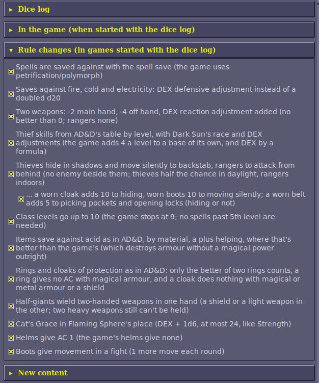

**Spell slots.** `Priest spells left: 1st 5/5, 2nd 3/3, 3rd 2/2`
means five first-level priest spells can still be cast out of five, and so
on. Casting a spell uses one slot of its level, and resting fills them
again. Wizard slots belong to preservers; priest slots belong to clerics,
druids and rangers. A multi-class character's classes add up, for example a
druid/preserver has both. The "most" is worked out the way the game does it
when it refills them (its tables are read from memory):
- Preservers: from their level only.
- Clerics and druids: from their level plus a WIS bonus.
- Rangers: from their level only, with their first slot at level 8.

The game's WIS bonus doesn't depend on level, so it gives a 2nd-level druid
with WIS 19 slots at the 2nd to 4th levels too, though a druid that level
casts only 1st-level spells. Those aren't shown (here or in the game): only
the spell levels the character's class levels reach, as in AD&D, where the
WIS bonus counts only at levels the priest can cast. For a human dual-class character, a
later class counts only while its level is below the first class's. Checked
against two characters at the start of a new game, whose slots the game had
just filled.

The viewer's **Current AC** row is the AC the game last used for each
character in a fight (armour, DEX and spells included), and the rows under it
say what it was made of: armour and shield (and spells that take their place,
such as Spirit Armor and Magical Vestments), DEX (the game's table: −1 at 15
down to −6 at 24; not counted when attacked from behind), and spells, rings
(see [The Ring +1](#new-items)) and anything else. They show "-" until the game has worked out that character's AC
in a fight.

Ability scores such as `STR 24 (20 without spells)` show the score now and, in
brackets, the character's own score when a spell (Strength, for one) has
raised it. The character's own score already includes the racial adjustment:
a half-giant's 20 + 4 shows as 24.

### The Spells tab

What each wizard and priest spell and psionic power does, read from the
running game's records: its damage dice and kinds (and that damage stops
growing at caster level 10), its saving throw (which of the five, any
modifier, whether the d20 counts double, and whether saving halves or stops
the damage), the effect it gives and what that does, how long it lasts, and
each party member's caster level for it. **Show** picks wizard, priest or
psionic, and **Only spells the party has a caster level for** leaves out the
rest. **Save...** writes it to a text file. It's filled when you open the tab
(or press **Refresh**) while the game is running.

### The Dialogue tab

Everything the game shows in its dialogue window, one entry per window of
text, with the replies offered numbered underneath (and the list's title,
such as "Answer Yes or No", above them), and then the one you picked:
`You chose: No`.

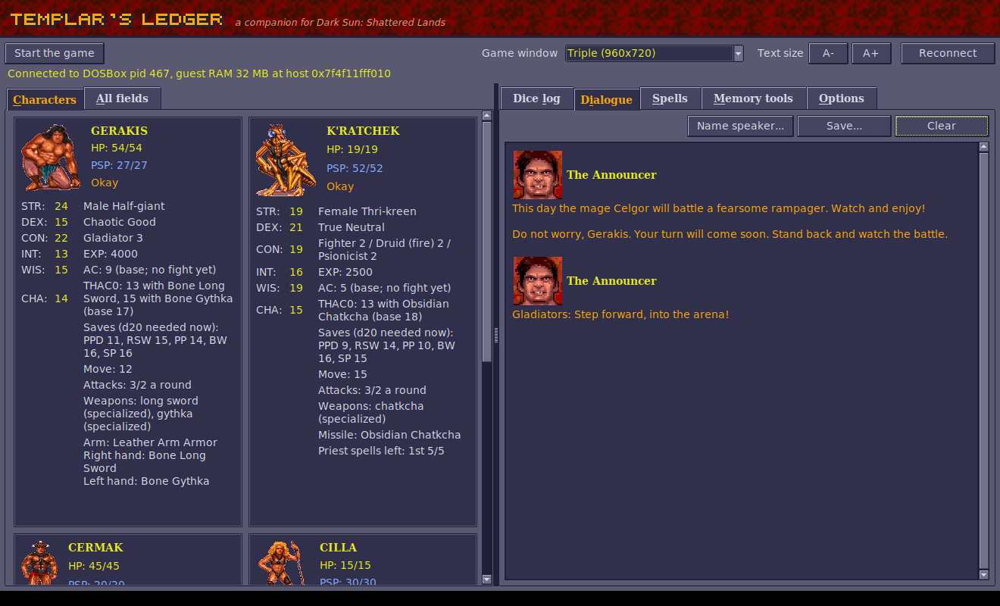

**Who's speaking.** The game's dialogue window gets only a portrait number,
never a name. But when the game runs a script on someone (you click them, or
they come up to you), it notes who; the log reads that when a conversation
opens. A conversation that shows one face, started on a named creature outside
the party, is that creature talking, and from then on the portrait carries its
name: in the pens, portrait 5 became `Kurzak` ("Legcrusher! Get gladiators!")
and portrait 100 `Legcrusher` ("Kurzak told me to bring you to the arena").
When several faces take turns in one conversation, nothing is learned from it,
as it can't be told who is who. Names learned are shown on the lines already
there too, and kept in `settings.json` (`speakers_learned`). A speaker not
named yet shows as `Portrait 57`. Portrait 119 is named `The Announcer`, as the
game itself calls him ("Yell something back at the Announcer?"). That name isn't
replaced by one learned (he calls out in the middle of fights, when the
game's last script ran on a fighter). To name a
speaker yourself (your name wins over a learned one), right-click the name
line in the Dialogue tab, or press **Name speaker...** (it names the latest
speaker). The name replaces the number on every line from that portrait,
the ones already shown included, and is remembered in `settings.json` for
next time (the command-line log uses it too). Leave the name empty to go back
to the number. Text shown without a face (the emblem instead) is `Narration`.

Each entry shows the speaker's portrait, as the game's own dialogue window
does. Portraits and the title's lettering are read from your installed game
at run time (GPLDATA.GFF and RESOURCE.GFF in the install folder the launcher
remembers); nothing from the game is copied into Templar's Ledger. Without
the game installed the window uses its own lettering and no portraits.

## The dice log

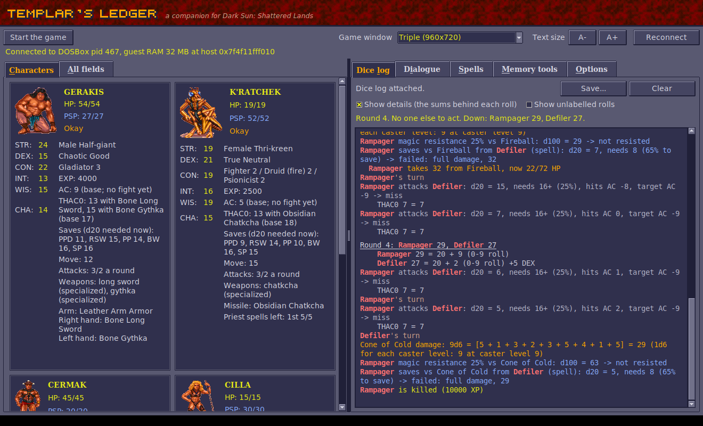

**Reading it at a glance.** Lines at the left edge are the events: a round
starting, whose turn it is, attack rolls, saves, spells, kills. Lines indented
two spaces are their results (damage, HP left); lines indented four spaces are
the details: the sums behind a THAC0, a save's modifiers, the initiative
scores. Untick **Show details**, above the log, to hide the details and keep
the rest; they come back when it's ticked again. In the window, each kind has its colour
(hits green, misses grey, damage amber, saves blue, turns sand, rounds
underlined with a gap above), but the words say the same thing, so nothing
depends on telling colours apart. Names stand out in bold: each party member
in a colour of their own (cyan, magenta, peach and white, by place in the
party) and every monster and other creature in red, so who acts and who is
hit can be followed down the log. Every colour has at least 4.5:1 contrast
with the log's background (WCAG 2.0 AA, as AODA asks).

**Fights**

| Line | Meaning |
|---|---|
| `Round 2: K'ratchek 32, Cermak 31, Cilla 30, Gerakis 26, Slig 26` | A new round of a fight, numbered from the fight's start, and the order everyone acts in (highest first). The order also stays in view above the log for the whole round, however far the log has scrolled: `Round 2. Now: Cilla (30). Still to act: Gerakis 26, Slig 26. Done: K'ratchek 32, Cermak 31. Down: ...`, and the in-game turn summary ends with who is still to act (or the next round's order). The lines under it (shown with **Show details**) give each score's make-up: `    Gerakis 26 = 20 + 6 (0-9 roll), tie broken by 38 (0-199 roll)` (see Initiative below). If the log was started in the middle of a round, the list has only the rolls it saw. |
| `Gerakis's turn` | Whose turn it is now, each time the turn passes in a fight. |
| `X attacks Y with Long Sword +1 (1d8+1): d20 = 14, needs 12+ (45%), hits AC 1, target AC 3 -> HIT` | An attack roll, the weapon and its damage dice. `needs 12+ (45%)` is the d20 this attacker needed against this target (THAC0 − target AC) and the chance of rolling it; `hits on anything but a 1` or `only a 20 hits` when it's out of the ordinary range. `X attacks Y from behind ...` and `X attacks Y BACKSTAB ...` mark attacks from behind and backstabs (see below). "Hits AC" is the lowest AC this roll hits (THAC0 − d20); the target AC is the one the game used, with armour, DEX and spells. A natural 20 always hits and a natural 1 always misses, but a 20 does no extra damage: the game has no critical hits (see below). |
| `    THAC0 16, +1 Blessed, +6 STR, +1 weapon = 8` | Where the attacker's THAC0 for this attack comes from: STR (melee) or DEX (missiles), spells (Bless, Prayer, Slow, Graft Weapon, the target's Blur), attacking from behind, the weapon's plus, the penalty for non-metal weapons (wooden −3, bone −1, stone and obsidian −2), the two-weapon adjustment (see below), and the difficulty setting for monsters. |
| `  X hits Y for 14: 1d8 = [6] +8 STR 20` | The damage of that hit: the dice, the weapon's bonus, and the STR bonus the game adds for melee. Damage is at least 1. |
| `  X hits Y for 51: (1d8 = [5] +12 STR 24) x3 backstab` | A backstab (see below) multiplies the whole damage, STR bonus included. |
| `Chosen with Tab: Guard (50 HP) - Enter attacks it` | An enemy chosen with Tab in a fight (see [Choosing an enemy](#choosing-an-enemy-tab-enter-and-the-rings)). |

**Spells, saves and effects**

| Line | Meaning |
|---|---|
| `Shocking Grasp damage: 1d8 = [5] +10 = 15 (1d8 + 1 for each caster level: 10 at caster level 20, which counts as 10)` | A spell's damage roll, rolled for each target before its saving throw, with the spell's formula from the game's data. Damage stops growing at caster level 10 (Fireball does at most 10d6). Magic Missile, Flame Arrow and Minute Meteors are rolled elsewhere in the game, without the caster's level, so their line says how many steps the dice stand for. |
| `  Slig takes 15 from Shocking Grasp, now 3/18 HP` | What the spell really did to each creature, after its save, resistances and protections (or the healing it gave). A creature that is Out Cold gets no save and takes the most the dice can do (the game's damage code does that), marked `(Out Cold: the most the dice can do)`. |
| `    Blur lasts 23 rounds (caster level 20: 1 for each caster level = 20 + 3 from the dice; dice 3d1)` | How long a spell's effect lasts, and how the game worked it out. A round is 60 game seconds. The game often "rolls" dice with one side, which are fixed numbers. |
| `    Stoneskin has 23 charges (caster level 20: 1 for each caster level = 20 + 3 from the dice; dice 1d4 = [3])` | Effects that last a number of uses rather than a time (Stoneskin's blows, Mirror Image's images, Invisibility's one attack, Poison's rounds): the game stores them as charges, worked out like a duration. |
| `    Acid on Slig: 2d4 = [3 + 1] = 4 acid damage` / `    Ironskin on Cilla: one charge used` | Acid Arrow's damage each round while the acid lasts; and an effect with charges using one up (Stoneskin or Ironskin stopping a blow, Mirror Image losing an image...). |
| `Strength: 1d6 = 5 -> Cilla's STR +5 while it lasts (at most 24)` | The amount Strength (or Adrenalin Control) adds. |
| `Y magic resistance 30% vs Fireball: d100 = 71 -> not resisted` | The magic resistance roll (only shown for targets that have some), counting Mind Bar and Lower Resistance. |
| `    Dispel Magic on Slig's Blessed: d100 = 60, needs 85 or less (50 + 5 x 7 - 5 x 0 (its caster's level)) -> dispelled` | Dispel Magic tries each effect on its target separately: 50 + 5 for each of the dispeller's levels, less 5 for each of the level the effect was cast at. It can't touch some (Biofeedback, Diseased, Feeblemind, Poisoned, Graft Weapon, No spell use, Stuck, Mind Bar and a few more). |
| `    Abjure on Y: d20 = 14, needs 12 or more (11 - caster level 5 + its level 6) -> sent away` | Abjure sends a summoned creature away (1000 damage) on a d20 at or over 11 - the caster's level + the creature's. |
| `    Summoning: 1d3 = 2 picks which of its 3 creatures comes` | Which creature a summoning spell brings. |
| `Y saves vs Fireball from X (petrification/polymorph): d20 = 6, doubled against fire = 12 +1 Blessed = 13, needs 11 (80% to save) -> saved: half damage, 19 of 38` | A saving throw: which of the target's five saves it uses, the d20, each of the game's modifiers by name (see Saving throws below; anything the log can't account for shows as `other`), and the number it had to reach. With the [rule changes](#rule-changes) off, the game uses petrification/polymorph for almost every spell and doubles the d20 against fire, cold and electricity spells, as here (see [The game's saving throws](#the-games-saving-throws)); with them on (the default), the line names the spell save and DEX's adjustment instead (`+5 DEX 21 dodging`). A natural 1 always fails and a natural 20 always saves. The chance of saving is worked out for you (`needs 14 (70% to save)`); with the game's doubled d20, Fireball's victims usually save. For a damaging spell the result says what the save left, from that target's damage roll just before it: `saved: half damage, 19 of 38`, `failed: full damage, 38`, or `saved: no damage` for spells such as Chill Touch. The HP line after it shows what the creature really lost, once resistances and protections have had their say. A failed save also lets the spell's effect take hold. Spells left on the ground (Grease, clouds) make creatures save again as they stay in them; those lines have no "from". |
| `X gives Blessed to Y, Z: +1 to hit, +1 on saves` / `Blessed ends on Y` | A spell or psionic effect starting or ending, with what it does in the game's code where that is known: to-hit, AC and saving throws, movement and attacks, whether the creature can attack or cast, who controls it (see Spells and effects below). `Stuck on Y` (no "gives") is an effect a creature has from a spell on the ground or cast on itself. |

**Checks, thief skills and searches**

| Line | Meaning |
|---|---|
| `X DEX check: d20 = 9, needs 16 or less (DEX 16) -> success` | An ability check. A natural 20 always fails. |
| `Cilla tries to open locks: d100 = 35, needs 40 or less -> success` / `    open locks 40 = 18 + 16 thief level 4 + 10 elf...` | A thief skill roll (see Thief skills below), and what its chance is made of. |
| `Cilla hides in shadows: d100 = 21, needs 27 or less (54, halved in daylight) -> hidden` / `  Cilla moves silently: ...` | A thief's or ranger's hiding and moving silently at the start of their turn (the [stealth rule](#rule-changes)). |
| `    X's special effect on Y: d10 = 1, works on a 1 -> it works` | The 1-in-10 extra effect some creatures' hits have (the thri-kreen bite, for one). |
| `    X's Bone Long Sword nearly broke: 0 on 0-7, then 12 on 0-19 (needed 0)` / `... BREAKS` | The weapon check the game makes after an attack sequence whose last attack hit. Only non-magical wood, bone, stone and obsidian weapons can break (and not every kind: clubs and quarterstaffs can't): they break when a 0-7 roll and then a 0-19 roll both come up 0, 1 chance in 160. The line only appears when the first roll comes up 0. |
| `  Rampager's acid on Gerakis's Leather Chest Armor: d20 = 12, needs 10 (AD&D's, 10 for leather; the game's: destroyed without a roll) -> safe` | An item the Rampager's acid or the Babau's corroding touch could destroy: the d20, the number it needed and whose number that was (see [Items saving against acid](#items-saving-against-acid)). |
| `Haystack searched: 0-10 = 7, an old, soiled loincloth (the party's 2nd find of 6 in hay)` / `  The rat's bite: 0-4 = 3 damage` | Searching a junk pile, a haystack or a wardrobe: the game's roll, what it found, and how far its count has got (see [Searching junk, hay and wardrobes](#searching-junk-hay-and-wardrobes)); a rat's bite or a falling pot rolls its damage the same way. |

**Hit points, kills and levels**

| Line | Meaning |
|---|---|
| `  Slig now 8/18 HP (-10)` / `  Gerakis now 51/54 HP (+1)` | Any combatant's hit points going down or up, with what's left out of their most. The game never shows a monster's HP; this does. The line comes just after the damage that caused it (sometimes after the next roll, when the game is quick). |
| `  Gerrard regenerates 1 HP (CON 22), now 16/35 HP` | A hit point back by itself: the game gives one now and then to anyone with CON 20 or more (in the game, CON 20 regenerates and 18 or 19 don't). |
| `  Rampager now 69/72 HP (-3: 3 of the 7 rolled, non-magical weapons do half)` / `  Mastyrial takes none of the 6 damage: crushing weapons can't hurt it` | A weapon hit that took less than its roll, or none at all (no HP lost three seconds on, or by the next round), with the reason when the monster's own defences give one (what weapons hurt it); otherwise "a protection or resistance took it" (Stoneskin, say). |
| `Slig is killed (270 XP)` | A creature dying, with the XP it's worth (from its character sheet). |
| `XP: Gerakis +67, K'ratchek +22, ... (for Slig 270)` | Experience the party got, and for which kills. The game gives it right after the kill: an equal share to each character, split again between a multi-class character's classes (the sheet counts XP per class, so a three-class thri-kreen shows a third of the share). |
| `Cilla is now a 3rd level Ranger` / `    max HP 15 -> 21 (+6)` | A level gained, and the new maximum HP. |
| `    max HP unchanged: the game divides the hit point total by the classes, ...` | A multi-class character gained a level and its most hit points stayed the same: every class level rolls its die, but the game divides the whole total by the number of classes, so a small roll can add only a fraction (it counts at a later level). (With [multiclass hit points](#multiclass-hit-points) each level adds at least 1.) A human who changed class gets none in the new class until its level passes the old class's. |
| `Cilla's 3rd Ranger level: hit points d10 = 2, raised to 3 for CON 21` | The hit point roll for a new level: the class's die (d8 clerics and druids, d10 fighters, gladiators and rangers, d4 preservers, d6 psionicists and thieves), never less than 2, 3 or 4 with CON 20, 21-22 or 23+, and doubled for half-giants. After level 9 or 10 there's no roll, just a fixed gain (thieves roll at 10th too with [levels up to 10](#rule-changes)). With [the better of two](#hit-dice-the-better-of-two) both rolls show (`d10 = 2 and 7, the better 7`), and with [multiclass hit points](#multiclass-hit-points) the share (`, / 2 classes = 3`). |

**Character creation**

| Line | Meaning |
|---|---|
| `Character creation, STR 17: best of four 4d4 (7, 11, 9, 10) = 11, +4, +1 dwarf = 16, raised to 17 (the Fighter's prime requisite)` | An ability score rolled on the character creation screen (see below). The die rolls a whole character several times while it tumbles; the log gives only the one it stops on, once it stops, each ability checked against the one the screen shows. Rolls that came too fast to record leave the game's number: `Character creation, DEX 19 (its rolls came too fast to record)`, and likewise for hit points. |
| `Character creation, hit points 15: Fighter d10 per level: 7 + 9; Thief d6 per level: 5 + 1 = 22, / 2 classes = 11, +4 CON 16 = 15` | The new character's hit points: a die for every level of every class, divided by the number of classes, plus CON's bonus (see below). With [the better of two](#hit-dice-the-better-of-two) each die shows both rolls (`10 (the better of 2 and 10)`); with [multiclass hit points](#multiclass-hit-points) each is shared on its own and CON's bonus too (`each / 2 classes (at least 1) = 9, +2 CON 16 shared = 11`). |
| `Character creation: a name picked at random, 1d33 = 6` | The game picks a new name from its lists when the sex or race changes. |

**Everything else**

| Line | Meaning |
|---|---|
| `Message: Long Sword is broken !` | The game's own message boxes: broken or corroded weapons and armour, level-ups, "NO PATH FROM HERE" and so on. |
| `Dinos cooks the vulture and the party eats with him: ... restored as after a full rest (HP, PSP and spell slots); the game gives each 100 XP` | Dinos asked about the cooked vulture (see [The cooked vulture](#the-cooked-vulture)); the XP itself is on the `XP:` line after it. |
| `Dice: 1d8 = [3] = 3` | Dice the log couldn't tie to anything (for example a spell with no saving throw). |
| `(The Ledger stopped one of its own writes over the game's memory: ...)` | A safety net: the Ledger never writes over the start of memory (the interrupt vectors, the BIOS's and DOS's data) or the first bytes of the game's data, which its C runtime checks ("Null pointer assignment"). Such a write could only come from a pointer the game has left empty for a moment; the line says where in the Ledger it came from. Please report it. |

The log keeps its newest line in view. Scroll up to read back and it stays
where you are; scroll to the bottom again and it follows the new lines once
more. The Dialogue tab does the same.

**Show unlabelled rolls**, beside it, also lists everything else the game randomises
(creatures wandering, animations and so on), as raw numbers with where in the
game's code they came from. It's noisy, but useful for finding more rolls worth
labelling.

Tested in play: the attack and damage lines match the HP the game takes off,
for both the party and the monsters, and every saving throw of a Fireball is
logged.

### Initiative

From the game's code: at the start of every round each combatant's initiative
is 20 + a roll of 0-9 + a DEX adjustment + Hasted +2, Slowed −2 and Blind −2.
The DEX adjustment has its own table: −6 at DEX 1, −4 at 2, −3 at 3, −2 at 4,
−1 at 5, none for 6-15, +1 at 16, +2 at 17-18, +3 at 19-20, +4 at 21-23 and
+5 at 24-25. The weapon makes no difference (there are no weapon speeds). The
highest score acts first; a second roll, 0-199, decides between equal scores
(the log shows it only for those). Choosing Wait lowers the character's score
to 10 (or by one, if it's 10 or less already) so they act later in the round.

### Spells and effects

What the log says about spells comes from the game's own spell records and
code, checked by casting each spell in a fight. Where the game differs from the
AD&D rules, the log follows the game.

**Damage.** Each spell's record gives its dice: base dice plus dice (and a flat
bonus) for each step of caster level, counted up to level 10. So Fireball and
Lightning Bolt do at most 10d6, and Burning Hands 1d3 + 2 a level. A save halves
the damage, or stops it all for spells such as Chill Touch. A creature that is
Out Cold gets no save and takes the most the dice can do.

**Saves.** Almost every spell is saved against with petrification/polymorph,
and against fire, cold and electricity the save's d20 counts double: see
[The game's saving throws](#the-games-saving-throws).

**How long.** A duration is (caster level × so much + dice) × a unit of time.
A round is 60 game seconds. Some effects last a number of uses instead
(charges):
- Stoneskin: 1 a level + 1d4. Any damage uses a charge, even fire that gets
  through, but only blows are stopped.
- Ironskin: 1d6 blows stopped.
- Mirror Image: 1 a level + 1d4 images. Each weapon attack has a 75% chance to
  hit an image.
- Invisibility: one attack or hostile spell ends it. Improved Invisibility is
  timed instead, so attacking doesn't end it.
- Minor Spell Turning: one spell turned back.

Charm, Feeblemind, Web and a few others last until removed.

**What effects do**, from the game's code:

| Effect | In the game |
|---|---|
| Blessed / Cursed | +1 / −1 to hit (Bless also +1 on saves); each one cancels the other instead of being added |
| Hasted / Slowed | Hasted: double movement and attacks, +2 initiative. Slowed: half movement and attacks, loses every other turn, −4 to hit, AC 4 worse, −2 initiative. Each cancels the other; Free Action and Protection from Paralysis stop Slow |
| Paralyzed | Loses its turns, can't move, fails every saving throw. Free Action and Protection from Paralysis stop it |
| Stuck (Grease, Web, Entangle, Solid Fog, Quicksand) | Can't move; Free Action stops it; some creatures are immune |
| Afraid | The computer runs it; it can't attack or cast. Undead are immune, and Cloak of Bravery stops the next fear (and ends) |
| Charmed | Joins the caster's side, run by the computer |
| Confused | Each turn a d10: 1 runs off, 2–6 does nothing, 7–9 fights for a side picked with a d2, 10 acts normally (the log shows the rolls) |
| Berserk | Fights for a side picked at random each turn; can't cast |
| Can't Attack (Stinking Cloud) | Can't attack or cast harmful spells |
| No spell use, Feeblemind | Can't cast spells |
| Blind | AC 4 worse, −2 initiative, can't cast spells that need sight |
| Acid (Acid Arrow) | 2d4 acid damage each round |
| Poisoned | Fatal (1000 damage) if time passes out of combat, for instance resting, before it wears off or is cured |
| Cloak of Fear | Whoever hits the wearer has Cause Fear cast on them, once |

Other things the game does its own way:
- Cause Serious Wounds rolls 2d9, and Cause Critical Wounds 3d9 (AD&D: 2d8+1
  and 3d8+3). The Cure spells are 1d8, 2d8+1 and 3d8+3 as in AD&D.
- Strength adds 1d6 to STR while it lasts, up to 24. The same goes for
  the psionic Adrenalin Control, and Weakened or lending strength takes it away
  (never below 3).
- Shillelagh, Flame Blade and Spiritual Hammer need an empty hand: with a
  weapon ready the game says "Failed, weapon in hand" and nothing happens.
- Death spells (Slay Living, Dismissal) do the target's HP + 10 on a failed save.
- In the arena, summonings fail ("Your summoning goes unanswered").
- A spell's caster level is the caster's highest level in a class that shares
  a sphere with the spell. Priests have one element each (cleric, druid and
  ranger classes come in air, earth, fire and water): Flame Blade, Focus Heat
  and Flame Strike are fire spells, Blood Flow and Dehydrate water, Deflection
  air, while spells such as Bless, Barkskin or Spiritual Hammer belong to
  every sphere. Cast by a priest of another element, an elemental spell counts
  caster level 0. The game shows each priest only their element's spells, so
  this only happens if a character somehow has the others. The log's
  `caster level 0` lines in testing came from an earth druid given every spell.

The spell's area catches its caster too. Cilla's Scare made her Afraid, and her
Fireball, cast at a Slig next to her, killed her.

### Psionics

Psionic powers are numbered after the spells (Detonate 138 to Thought Shield
171) and go through the same code: the same records for damage, saves and
effects, so the log treats them like spells and names them. Some things are
their own:

- **Level.** A power works at the character's psionicist level; anyone else
  with psionic powers counts as level 1.
- **PSP.** A power costs its PSP to use. Kept-up powers (Inertial Barrier,
  Biofeedback, Graft Weapon...) cost more PSP at the start of each round, and
  the game puts them on again for another round; when the PSP runs short, the
  power drops. The log shows every change in a party member's PSP
  (`    K'ratchek spends 18 PSP (52 -> 34)`).
- **Psionic defence.** Attacked by a psionic attack mode (Psychic Crush, Ego
  Whip, Id Insinuation, Psionic Blast), a character automatically raises the
  best defence mode they know and can pay for, and pays its PSP.
- **Mind Bar** adds 75% magic resistance against mind-affecting spells:
  charms, holds, Scare, Confusion, Chaos, Feeblemind, Minor Malison. The log's
  magic resistance line counts it, and Lower Resistance halving the result.
- **Body Weaponry** makes unarmed attacks 2d4; **Animal Affinity** at least 1d10.
- Monsters use them too: the Screamer Beetle's "special attack" in earlier
  logs was Psychic Crush (1d8, save vs paralysis/poison/death for half).

What each costs, from the game's own table (it differs from the books in
places: Enhanced Strength and Domination cost nothing to start):

| Power | Discipline | PSP to use | PSP each round kept up |
|---|---|---|---|
| Detonate | psychokinesis | 18 | — |
| Disintegrate | psychokinesis | 40 | — |
| Project Force | psychokinesis | 10 | — |
| Ballistic Attack | psychokinesis | 5 | — |
| Control Body | psychokinesis | 8 | — |
| Inertial Barrier | psychokinesis | 7 | 5 |
| Animal Affinity | psychometabolism | 15 | 4 |
| Energy Containment | psychometabolism | 10 | — |
| Life Draining | psychometabolism | 11 | — |
| Absorb Disease | psychometabolism | 12 | — |
| Adrenalin Control | psychometabolism | 8 | 4 |
| Biofeedback | psychometabolism | 6 | 3 |
| Body Weaponry | psychometabolism | 9 | 4 |
| Cell Adjustment | psychometabolism | 5 | — |
| Displacement | psychometabolism | 6 | 3 |
| Enhanced Strength | psychometabolism | 0 | 8 |
| Flesh Armor | psychometabolism | 8 | 4 |
| Graft Weapon | psychometabolism | 10 | 1 |
| Lend Health | psychometabolism | 4 | — |
| Share Strength | psychometabolism | 6 | 2 |
| Domination | telepathy | 0 | — |
| Mass Domination | telepathy | 0 | — |
| Psychic Crush (attack mode) | telepathy | 7 | — |
| Superior Invisibility | telepathy | 5 | 5 |
| Tower of Iron Will (defence mode) | telepathy | 6 | 0 |
| Ego Whip (attack mode) | telepathy | 4 | — |
| Id Insinuation (attack mode) | telepathy | 5 | — |
| Intellect Fortress (defence mode) | telepathy | 4 | 0 |
| Mental Barrier (defence mode) | telepathy | 3 | 0 |
| Mind Bar | telepathy | 6 | 4 |
| Mind Blank (defence mode) | telepathy | 0 | 0 |
| Psionic Blast (attack mode) | telepathy | 10 | — |
| Synaptic Static | telepathy | 15 | 10 |
| Thought Shield (defence mode) | telepathy | 1 | 0 |

### Character creation

Every click of the die on the creation screen (and every change of race or sex)
rolls a new character. From the game's code, and checked against the screen:

* **Abilities.** Each score is rolled four times as 4d4 + 4 + the race's
  adjustment, and the best of the four counts. That's 8 to 20 before the race's
  adjustment. The score is then raised, if need be, to the least that the
  classes allow: 17 in the class's prime requisite (STR for fighters and
  gladiators, WIS for clerics, druids, psionicists and rangers, INT for
  preservers, DEX for thieves), and otherwise 9 (clerics, fighters, preservers,
  thieves), 12 (druids, psionicists), 13 (gladiators) or 14 (rangers). A
  multi-class character takes the highest of their classes' minimums.
* **Race adjustments** (STR, DEX, CON, INT, WIS, CHA): dwarf +1 −1 +2 0 0 −2;
  elf 0 +2 −2 +1 −1 0; half-elf 0 +1 −1 0 0 0; half-giant +4 −5 +2 −5 −3 −3;
  halfling −2 +2 −1 0 +2 −1; mul +2 0 +1 −1 0 −2; thri-kreen 0 +2 0 −1 +1 −2.
  Humans have none.
* **Hit points.** One die for every level of every class (d8 clerics and
  druids, d10 fighters, gladiators and rangers, d4 preservers, d6 psionicists
  and thieves), doubled for half-giants. The total is divided by the number of
  classes (rounded down), and then CON's bonus is added for every level: a
  warrior's full bonus (+1 at CON 15, +2 at 16, +3 at 17, +4 at 18, +5 at
  19-20, +6 at 21-23, +7 at 24-25; −1 at 4-6, −2 at 2-3, −3 at 0-1), and at
  most +2 for levels in the other classes. There is no automatic maximum at
  first level: the first level rolls like the rest.
* **Choices without dice.** Raising a score to a new class's minimum (adding
  Thief raises DEX to 17) and PSP aren't rolled, so they don't appear in the
  log. The creation screen's other random numbers only choose pictures.

Changing sex or race can make the game roll hit points twice, once with the
old scores and once with the new: the last hit point line is the one that
counts.

### Monsters' defences

From the game's damage code (DSUN.EXE); none of this is in the manual:

- Every creature has a monster kind, and each kind a resistance class and a
  set of properties, in a table the game fills when it starts.
- Every hit has damage kinds: fire, cold, electricity, acid, poison, draining,
  psionic, death, and for weapons crushing, edged or pointed, from the item's
  type. A weapon's hit also carries its magic: one bit for +1 or better, one
  for +2 or better and one for +3 or better (the weapon's plus, or its
  ammunition's if that's higher). A monster's own attacks count as magical by
  its level: (level - 2) / 2, so a 6th-level monster hits like a +2 weapon.
- A resistance class is up to four rules: "these kinds of damage: this
  percent of it". The largest percent that applies counts. So "crushing, edged
  and pointed: 0%; +1 or better: 100%" is a monster only magical weapons hurt.
  The game's 14 classes come to: only +1 (or +2) weapons hurt it, sometimes
  with immunity to poison and draining, or to fire; half damage from
  non-magical weapons and psionic attacks (the Rampager); immune to crushing
  weapons (the mastyrials); immune to crushing and pointed weapons, fire and
  acid, so that only edged weapons hurt it (the slimes); immune to fire and
  cold (and half from electricity); half from fire; immune to poison; immune
  to psionic attacks.
- Properties: can't be charmed or held; unaffected by spells left on the
  ground (fogs, clouds, walls, Web, Grease); not held by Grease, Web,
  Entangle, Solid Fog or Quicksand; and hits that also cast one of the
  monsters' powers on the target: 2d6 cold, 2d6 or 20 acid, paralysis,
  poison of 10 or 30 damage, a deadly Poison, disease on 1 hit in 10. The 20
  acid (the Rampager's) and a corroding touch (the Babau's) can also destroy a
  worn item (see [Items saving against acid](#items-saving-against-acid)).
- Undead (race 9 on the character sheet) take nothing from poison and
  draining, and mind-affecting spells, charms and holds don't work on them.

The dice log notes a weapon hit that takes less than its roll, or nothing at
all, with what the monster's defences say about it (`Mastyrial takes none of
the 6 damage: crushing weapons can't hurt it`: the game's mastyrials take
nothing from clubs and maces, only from edged and pointed weapons).

### Searching junk, hay and wardrobes

Junk piles, haystacks and wardrobes are searched by one of the game's scripts,
each with a roll of its own: 0 to N, each number as likely. A low roll finds
nothing, and junk and hay stop giving anything once the party has found 6
things in them (each kind counts its own finds); wardrobes count every search,
and after 6 every wardrobe is empty.

| Search | Roll | Finds nothing on | What the rolls find |
|---|---|---|---|
| Junk pile | 0-14 | 0-1, or after 6 finds in junk | 2 a scorpion bite, dodged; 3 a scrap of paper ("Watch out for the..."); 4 a dead rat; 5 stale bread; 6 a piece of a grainpot; 7 a rat's bite (0-4 damage); 8 magic fruit; 9 wood for a club; 10 a drawing of a four-armed statue; 11 trinkets with a gem; 12 dung; 13 arrows; 14 magic fruit |
| Haystack | 0-10 | 0-2, or after 6 finds in hay | 3 a bone needle; 4 a piece of a pot; 5 a rat's bite (0-4 damage); 6 a table leg for a club; 7 a soiled loincloth; 8 15 ceramic coins; 9 a bug; 10 a small gem |
| Wardrobe | 0-10 | 0-2 (after 6 searches, empty) | 3 a rat's bite (0-4 damage); 4 a piece of a pot; 5 "Gareth the scribe was here."; 6 magic fruit; 7 a falling pot (0-5 damage); 8 a small gem; 9 a falling pot that misses; 10 "Don't trust Pehtucl." |

The script also has outcomes for the rolls that find nothing (a scorpion's bite
in junk, a skull in hay, coins in a wardrobe...), but its "nothing" check comes
first, so they never happen.

How it works: [DEVELOPMENT.md](DEVELOPMENT.md#searching-junk-hay-and-wardrobes).

### No critical hits

A natural 20 on an attack always hits, and a natural 1 always misses, but
that is all the d20 does: the game has no critical hits or fumbles. Its attack
routine uses the d20 only for those two checks and the comparison with THAC0,
and never passes it to the damage routine, so a hit on a 20 rolls the same
damage as any other. A backstab is the only thing that multiplies damage.

## Two weapons

The game's rule for fighting with two weapons, then the rule change for it (its
box under Rule changes on the Options tab).

### The game's two weapons

The manual says a character with two weapons ready uses the second "at a
disadvantage", unless a ranger or dextrous. The game's code does something
else: with two weapons ready (in melee), every attack, first hand and second
alike, is adjusted by the DEX table used for initiative with its sign flipped
and never below 0, and rangers are left out. That comes to a **bonus** of +6 at
DEX 1, +4 at 2, +3 at 3, +2 at 4 and +1 at 5, and nothing at DEX 6 and up, so
in practice there is no off-hand penalty at all: both weapons hit as well as a
single one would. The log names it, e.g. `+2 two weapons at DEX 4`. (Tested
in an arena fight by changing DEX in memory: +6 on both weapons at DEX 1,
nothing at 15 or 25, nothing with one weapon.) It looks like a sign slip:
AD&D uses the same DEX adjustment to make two-weapon fighting *harder* at low
DEX.

### AD&D's penalties

With **Two weapons** ticked, and two melee weapons ready, a character who isn't a ranger attacks at -2
with the main (right) hand and -4 with the off (left) hand, and the DEX
reaction adjustment (the table under [Initiative](#initiative)) is added. It
can lessen the penalty to 0 but never make it a bonus, and low DEX
makes it worse: DEX 17 is 0 and -2, DEX 21 0 and 0, DEX 3 -5 and -7. Rangers
have no penalty (in any armour). It takes a melee weapon in each hand: one
weapon, a two-handed weapon, a weapon and a shield, or a weapon and a bow or
sling (the missile slot) have no penalty. The game's own rule, a small bonus
at DEX 5 or less, is gone. The dice log names it (`-4 two weapons, off hand at
DEX 15`), as do the THAC0 lines on the Characters tab and the inventory
screen.

How it works: [DEVELOPMENT.md](DEVELOPMENT.md#two-weapons-adds-penalties).

## Thieves

What the game does with thieves' skills and attacks from behind, what the two
rule changes for them do, and picking pockets, the Ledger's use for a thief's
pick pockets skill. All three have their boxes in the Options tab's **Thieves**
section.

### How the game works out thief skills

The game never shows thief skills, but it rolls them: for traps, and for the
locks, walls and so on its scripts ask for (see Where the game rolls them). The
roll is a d100 that must come in under the skill's chance. The game's code works
the chance out as:
- a base for each skill (28, 18, 13, 28, 18, 23, 78, −4),
- plus 4 for each thief level,
- plus a racial adjustment. These are AD&D's, for example a dwarf gets +10 to
  open locks, +15 to find traps, −10 to climb walls and −5 to read languages.
- plus DEX: −5 for each point below 12, 11, 12, 13 or 11 (the first five skills);
  +5 for each point above 16, 15, 17, 16 or 16; and −3 for each point above
  21, 20, 21, 19 or 19, so very high DEX gains less,
- minus an equipment penalty (5, 0, 0, 10, 5, 0, 10, 0) when the thief has
  anything at all in the leg armour slot, the quiver or either hand. That is the
  game's own check: it doesn't look at what the item is (leather or metal) and
  ignores chest and arm armour and helmets, so a thief holding any weapon pays
  it. (The manual's "anything other than leather-type armor" is AD&D's rule,
  not what the code does.) In games started with the dice log there is no
  equipment penalty at all: the slots are a list in the game's data
  (DSUN.EXE 44F70h: legs, quiver, left hand, right hand), and the dice log's
  copy of the game empties it. The Ledger reads the list from the running
  game, so its numbers match whichever game it is.
- plus the situation's bonus or penalty (a hard lock, say).

With **Thief skills from AD&D's table** ticked (see
[Thief skills from AD&D's table](#thief-skills-from-adds-table)), the first
two and the DEX part are AD&D's instead.

Only characters with thief levels have the skills; everyone else's chance is 0.
The character's condition must be Okay (the status the character screen shows
under HP): a thief who is
Stunned, Out Cold, Dying and so on can't use the skills. A character not yet
played (New, before the game starts) counts as Okay, so a party's thief skills
show while it is made (see [More characters](#more-characters)).

Some effects rule out a skill:
- Blind, Afraid, Confused, Berserk and Paralyzed stop them all, except that a
  blind thief can still hear noise.
- Slowed stops all but picking pockets.
- Fire Shield stops picking pockets and hiding; Mirror Image stops hiding.
- Graft Weapon stops picking pockets, opening locks and climbing.
- Feeblemind stops reading languages.
- Enlarge scales the situation's bonus or penalty, not the skill: for hiding it's
  divided by (100 + 10 × Enlarge's level)%, for climbing multiplied by it. With
  no bonus or penalty it changes nothing; with a penalty, climbing gets harder.

Two effects make a skill certain instead: Detect Traps (anyone, thief or not,
finds traps) and Invisible (hiding in shadows).

These effects work on the situation's bonus: ruling a skill out takes 1000 off
it, so the roll can't succeed, and making it certain adds 1000. (One more rule
in the code would make move silently certain, and hearing noise impossible, for
someone wearing one particular item on their legs, but the game passes that
check its two lists the wrong way round, so it never applies.)

The game gives the skills no names. The eight are AD&D's in AD&D's order (pick
pockets, open locks, find/remove traps, move silently, hide in shadows, hear
noise, climb walls, read languages): the checks above fit them.

### Where the game rolls them

There is no hide or sneak command, and nothing in the game's code rolls a thief
skill on its own: every roll comes from the game's scripts (conversations,
doors, walls...), which ask in two ways. Every script in GPLDATA.GFF decodes
(see `dscompanion/gpl.py`), so these are all of them:
- **13 skill checks**: find/remove traps 4 times (a hidden passage, a secret
  door, a loose rug, a cord on a lava-dome egg; bonuses −10 to +3), open locks
  4 times (a safe, a grate and cell doors; −4 to +8), climb walls 3 times, and
  pick pockets and hear noise once each (a key in a trustee's pocket; two men
  arguing by a wagon, a check for the whole party). Most are made by the
  character who acted.
- **50 trap triggers, in 16 scripts.** A script sets off an object at a spot on
  the map (a trap, or a blast: the bound prisoners in the arena, a Drajian
  messenger's thrown sphere, a summoning circle, a breaking mirror...). First
  the party's best at find/remove traps rolls, with no bonus; success, or
  Detect Traps on the character who set it off, avoids it. This is the roll the
  arena prisoner makes.

A party check always goes to the member with the best chance. (The game also
has a script command that lets each member try in turn, but no script uses it.)

**Move silently, hide in shadows and read languages are never rolled** anywhere
in the game, so they make no difference; nor does the equipment penalty on
them. (The Ledger rolls move silently when a pocket isn't picked, see
[Picking pockets](#picking-pockets), and hide in shadows and move silently in
fights with the [stealth rule](#rule-changes).) The scripts also make 3 ability checks (a d20 under the ability): CHA
twice and STR once.

`python -m dscompanion checks` lists them all with the script's text around
each (spoilers).

The **Characters** tab shows each thief's chances as they stand, with the
equipment penalty (none in games started with the dice log) and effects (but
not the situation's bonus or penalty), for the five skills the game rolls
(pick pockets, open locks, find/remove traps, hear noise, climb walls) and
the two the Ledger rolls: move silently (when a pocket isn't picked, see
[Picking pockets](#picking-pockets)) and hide in shadows (for the
[stealth rule](#rule-changes)), with any Thieves' Tools carried. **All
fields** has them in a row (`PP/OL/FT/MS/HS/HN/CW`).

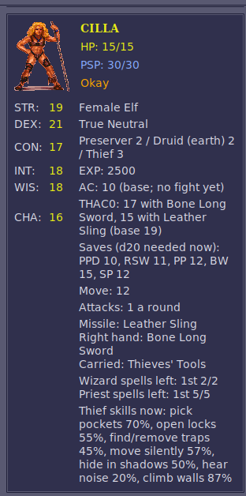

### Attacks from behind and backstabs

From the game's code:

- An attack is **from behind** when the attacker stands in the square directly
  behind the way the target is facing. A creature faces nowhere in particular
  at the start of each round; the first attack on it in the round turns it
  to face that attacker (one of eight directions), and it keeps facing that
  way for the rest of the round. So a second attacker on the far side, later
  in the same round, attacks from behind. (Its own attacks don't turn it.)
  It gets +2 to hit, and the target loses its DEX bonus and its shield.
- A **backstab** is an attack from behind by a thief, in melee, with a weapon
  that isn't too heavy (the game's weight value at most 40; a long sword's
  is 20). It gets another +2 to hit (+4 in all), and on the thief's first
  attack of the round the damage, STR bonus included, is multiplied: x2 at
  thief levels 1-4, x3 at 5-8, x4 at 9-12, x5 from 13.

Which weapons can backstab, the game's and the [Ledger's](#new-items), magic
ones included. Weight belongs to the weapon's kind and
material, in the game's units, which look like tenths of a pound (a dagger is
10, a club 30, a mace 100, as AD&D's 1, 3 and 10 lb), so the limit is 4 lb.
Missile weapons (slings, bows, a thrown chatkcha) never backstab: it has to be
melee.

| Weapon | Material (weight) | Damage | Backstab |
|---|---|---|---|
| Dagger | bone, stone, obsidian, metal (10) | 1d4 | yes |
| Short sword | bone (15); obsidian, metal (30) | 1d6 | yes |
| Long sword | bone, obsidian, metal (10 to 40, metal at the limit) | 1d8 | yes |
| Club | wood (30) | 1d6 | yes |
| Quarterstaff | wood (40) | 1d6 | yes |
| Axe | bone (35) | 1d8 | yes |
| Pick | stone, metal (40) | 1d4+1 | yes |
| Shillelagh, Flame Blade, Spiritual Hammer (spells) | (10, 40, 40) | 2d4, 1d4+4, 1d4+1 | yes |
| Axe | obsidian, metal (70) | 1d8 | no |
| Great axe | bone (50); obsidian, metal (70) | 1d10 | no |
| Mace | bone, obsidian, metal (100) | 1d6+1 | no |
| Cahulaks, gythka | bone (120) | 1d6, 2d4 | no |
| Polearm | bone, metal (150) | 1d10 | no |

About a dozen more weapon kinds are in the game's tables with no item of
theirs in its data (monsters' own, made by scripts, or unused).

### Thief skills from AD&D's table

The game's thief skills come out high: a 3rd-level elf thief with DEX 22 has
move silently 66 and hide in shadows 61. AD&D gives 27 and 20 at 3rd level
before race and DEX. The game adds 4 a level to a base of its own, and its DEX
formula gives move silently and hide in shadows less than Dark Sun's table at
high DEX, and some other skills more. With **Thief skills from AD&D's table**
ticked, a skill is:

- AD&D's average for the thief level (the Player's Handbook's table, up to
  10th level),
- plus the race's adjustment, the game's own (already the Dark Sun rules'
  numbers),
- plus DEX's: AD&D's table up to 19, the Dark Sun rules' exceptional DEX
  past it, for the first five skills (hear noise, climb walls and read
  languages have none).

AD&D's averages, by thief level:

| Thief level | 1 | 2 | 3 | 4 | 5 | 6 | 7 | 8 | 9 | 10 |
|---|---|---|---|---|---|---|---|---|---|---|
| Pick pockets | 30 | 35 | 40 | 45 | 50 | 55 | 60 | 65 | 70 | 80 |
| Open locks | 25 | 29 | 33 | 37 | 42 | 47 | 52 | 57 | 62 | 67 |
| Find/remove traps | 20 | 25 | 30 | 35 | 40 | 45 | 50 | 55 | 60 | 65 |
| Move silently | 15 | 21 | 27 | 33 | 40 | 47 | 55 | 62 | 70 | 78 |
| Hide in shadows | 10 | 15 | 20 | 25 | 31 | 37 | 43 | 49 | 56 | 63 |
| Hear noise | 10 | 10 | 15 | 15 | 20 | 20 | 25 | 25 | 30 | 30 |
| Climb walls | 85 | 86 | 87 | 88 | 90 | 92 | 94 | 96 | 98 | 99 |
| Read languages | 0 | 0 | 0 | 20 | 25 | 30 | 35 | 40 | 45 | 50 |

The race adjustments, as the game has them (humans, half-giants and
thri-kreen have none):

| Race | Pick pockets | Open locks | Find/remove traps | Move silently | Hide in shadows | Hear noise | Climb walls | Read languages |
|---|---|---|---|---|---|---|---|---|
| Dwarf | 0 | +10 | +15 | 0 | 0 | 0 | −10 | −5 |
| Elf | +5 | −5 | 0 | +5 | +10 | +5 | 0 | 0 |
| Half-elf | +10 | 0 | 0 | 0 | +5 | 0 | 0 | 0 |
| Halfling | +5 | +5 | +5 | +10 | +15 | +5 | −15 | −5 |
| Mul | 0 | −5 | 0 | +5 | 0 | 0 | +5 | −5 |

The DEX adjustments:

| DEX | Pick pockets | Open locks | Find/remove traps | Move silently | Hide in shadows |
|---|---|---|---|---|---|
| 9 | −15 | −10 | −10 | −20 | −10 |
| 10 | −10 | −5 | −10 | −15 | −5 |
| 11 | −5 | 0 | −5 | −10 | 0 |
| 12 | 0 | 0 | 0 | −5 | 0 |
| 13-15 | 0 | 0 | 0 | 0 | 0 |
| 16 | 0 | +5 | 0 | 0 | 0 |
| 17 | +5 | +10 | 0 | +5 | +5 |
| 18 | +10 | +15 | +5 | +10 | +10 |
| 19 | +15 | +20 | +10 | +15 | +15 |
| 20 | +20 | +25 | +12 | +20 | +17 |
| 21 | +25 | +27 | +15 | +25 | +20 |
| 22 | +27 | +30 | +17 | +30 | +22 |

then the situation and effects as before. So Azil, a 3rd-level elf thief with
DEX 22: pick pockets 40 + 5 + 27 = 72, open locks 58, find traps 47, move
silently 62, hide in shadows 52, hear noise 20, climb walls 87. A ranger's
move silently and hide in shadows take the same race and DEX adjustments.
Untick it for the game's numbers.

How it works: [DEVELOPMENT.md](DEVELOPMENT.md#thief-skills-from-adds-table).

### Hiding in shadows to backstab

The game never rolls hide in shadows, and a thief only backstabs a target that
has turned to face someone else. With **Thieves hide in shadows and move
silently to backstab, rangers to attack from behind** ticked, a thief whose
turn comes in a fight with no enemy in any of the eight squares around them
tries to hide in shadows; if they do, they try to move silently up to someone;
and if both succeed, their next attack that turn counts as one from behind: +2
to hit, the target's DEX and shield don't count, and with a weapon that can
backstab it is a backstab, the damage multiplied as usual. The attack gives
the thief away, and so does the turn ending without one. An enemy next to the
thief when the turn comes means no hiding at all: get clear first. A worn
cloak adds 10 to hiding in shadows (before daylight halves it) and worn boots
add 10 to moving silently, for rangers too, up to 95: `needs 18 or less (26
+10 cloak = 36, halved in daylight)`. With that switched on, a cloak's or
boots' item box (right-click it on the inventory screen) says so under its
name, `Hide +10` or `Move +10` (the skills' short names, as the inventory
screen's thief rows have them).

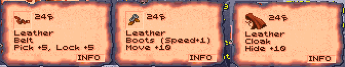

The [Cloak and Boots of Elvenkind](#new-items) do more (whatever the plain
gear's switch). Only thieves and rangers can wear them (multiclasses too; for
anyone else, the game's "Cannot use this item"). In the cloak, hiding in
shadows needs 95 or less under the open sky and 90 under a roof, not halved by
the light (AD&D's: all but invisible in the wild, 90% among buildings), unless
their own chance is better; in the boots, moving silently needs 95 or less.
Their boxes say `Hide 90-95%` and `Move 95%`.

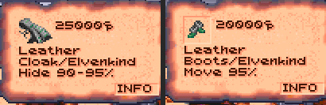

The same switch has a worn **belt** add 5 to a thief's **picking pockets and
opening locks**, whether hiding is on or not: the game's own lock picking
counts it, and so do the Ledger's pockets and its thief rows (`PICK 80`,
`LOCK 64`). A belt's box says `Pick +5, Lock +5`.

Plain cloaks, boots and belts cost 24 (the game's Leather Cloak is 20), anywhere
in the region, shops included; magic ones (with a plus, or dearer than 100)
keep their prices.

```
Cilla's turn
Cilla hides in shadows: d100 = 21, needs 27 or less (54, halved in daylight) -> hidden
  Cilla moves silently: d100 = 30, needs 54 or less -> unheard: their next attack this turn is from behind (a backstab with a weapon that can)
Cilla attacks Slig BACKSTAB with Bone Long Sword (1d8): d20 = 11, needs 10+ (55%), hits AC 2, target AC 3 -> HIT
    THAC0 19, +2 from behind, +2 backstab, +3 STR, -1 bone = 13
  Cilla hits Slig for 16: (1d8 = [1] -1 weapon (raised to the minimum of 1) +7 STR 19) x2 backstab
```

The chance to hide is **halved in daylight**. Which maps are under the open
sky goes by the game's regions: open desert and rock, the villages' open
ground and the arena are; the slave pens, the sewers, the lava caverns and
the other underground or roofed places aren't. Three maps have both, buildings
with floors of their own standing on open ground: there it goes by the floor
under the thief (from the game's map of the region in memory), so a thief in
a building is out of the sun and one in a roofless ruin isn't. The chances
are the thief's own as they stand (level, race, DEX, and effects: Invisibility makes hiding certain, Fire Shield and Mirror Image
rule it out).

**Rangers** hide and move silently too, with the same box ticked. The game
gives rangers no thief skills, so the Ledger uses AD&D's ranger table, by
ranger level, with the race's and DEX's adjustments as for a thief:

| Ranger level | 1 | 2 | 3 | 4 | 5 | 6 | 7 | 8 | 9 | 10 |
|---|---|---|---|---|---|---|---|---|---|---|
| Hide in shadows | 10 | 15 | 20 | 25 | 31 | 37 | 43 | 49 | 56 | 63 |
| Move silently | 15 | 21 | 27 | 33 | 40 | 47 | 55 | 62 | 70 | 78 |

The light works the other way round for these outdoorsmen: the **full chance
under the open sky, half indoors** (the same maps and floors as for thieves).
Their attack from behind gets +2 to hit, and the target's DEX and shield don't
count, but it is never a backstab. Armour doesn't matter, nor does what
they hold. The Characters tab shows a ranger's two chances (**Ranger skills
now**), and the game's inventory screen shows them where a thief's `MOVE`
and `HIDE` go. Someone with thief levels hides as a thief.

```
Gerakis hides in shadows: d100 = 15, needs 63 or less (63, a ranger under the open sky) -> hidden
  Gerakis moves silently: d100 = 42, needs 78 or less -> unheard: their next attack this turn is from behind
Gerakis attacks Slig from behind with Wooden Club (1d6): d20 = 12, needs 10+ (55%), hits AC 1, target AC 3 -> HIT
```

How it works: [DEVELOPMENT.md](DEVELOPMENT.md#hiding-in-shadows-to-backstab).

### Picking pockets

The game has one pocket to pick, in the Trustee's conversation (his key). With
**Picking pockets** ticked on the Options tab (it is by default), a thief can
try anyone's with Thieves' Tools; with its **... or the leader, a thief, presses
P in a conversation** ticked too (it is off by default), also with P, the
thief as the party's leader (keys 1-4):

- **Thieves' Tools.** Every thief starts a new game with a set (a satchel) in
  the first free backpack cell, and a thief who joins later gets one too (the
  log says so). A thief who loses or sells theirs can buy another from Kel, who
  sells two sets. On the inventory screen, pick the tools up, go back to the
  game with them on the pointer, and click someone in sight: the result comes
  up in the game's message window, and the tools stay on the pointer for the
  next try. (Clicking open ground drops them, as with anything carried.) Not in
  a fight: there's no time for it then.
- **P in a conversation** (if ticked). In a conversation, press **P**.

Either way, the Ledger rolls the leader's pick pockets chance as
it stands now (effects and a worn belt's 5 counted, as in the thief rows):

- **Success:** one small thing goes into the thief's backpack (its first free
  cell): something weighing 10 or less (a bag or arrows are 10, a helm 15, a
  long sword 30) that isn't worn on the body (armour, a belt, boots, a helm, a
  cloak). A dagger, a ring, an amulet, a gem or food can be lifted, and so can
  three weapons whatever their weight: Kurzak's Shadowseeker, Churrr's
  Gutterknot and Maris's Mindshard (see [New items](#new-items)). Lifting one is
  worth 200 XP to the thief, given as the game gives a quest's ("Cilla
  receives 200 experience points!", with the quest's sound; split among a
  multi-class thief's classes). Keys stay, as scripts may look for them. People outside the party keep all they own in
  their pack, so this goes by what each thing is.
- **Failure:** a move silently roll. Made, the thief slips away unnoticed;
  missed, they're caught.

With nothing like that left on them, the thief takes what's in their purse
instead: a few ceramic pieces (2 to 5), added to the party's money. That is
the last try on that person.

A thief can go on trying the same person until **caught** (both rolls failed)
or until they take the coins; after that, that person keeps a hand on their
pockets for good. The Ledger remembers who in `settings.json`,
for this party, with the time on the game's clock: load a game saved before
the try and the clock goes back past it, so the try is forgotten and the
person can be tried again. The Trustee is left to his own conversation. What happens is
added to the conversation's text (use its arrow to scroll down to it if the
text is long) and to the dice log:

```
Daaki picks Kurzak's pocket: d100 = 71, needs 63 or less -> failed
  Daaki moves silently to get away: d100 = 12, needs 55 or less -> success
  Daaki fumbles Kurzak's pockets, but slips away unnoticed.
```

How it works: [DEVELOPMENT.md](DEVELOPMENT.md#picking-pockets).

## Saving throws

The game's saving throw, then the two rule changes for it (each its own box on the
Options tab).

### The game's saving throws

From the game's saving throw routine. The spell names which of the character
sheet's five saves to use; a natural 1 always fails and a natural 20 always
saves; otherwise the d20 and the modifiers below must reach the save's number.

**Petrification/polymorph for almost every spell.** The game's code maps the
spell's save kind 5 to the sheet's third save; kind 1 is
paralysis/poison/death, used by the clouds, Poison, Slay Living and the
psionic attacks. The spell save, the one AD&D uses for spells, is never used:
a 3rd-level warrior needs 13 against Psychic Crush (paralysis) and 14 against
Fireball (petrification), where the spell save would be 16.

**Fire, cold and electricity: the d20 counts double.** Each spell's record
has a word of flags saying what kind of damage it does, and the saving throw
code doubles the d20 whenever the kind is fire, cold or electricity
(`test word [flags], 86h` then `shl al, 1` in DSUN.EXE). Nothing else is
doubled: not acid (Acid Arrow), crushing (Ice Storm, Magical Stone), poison
(Cloudkill), draining (Vampiric Touch, the Cause Wounds spells) or the
psionic attacks. The doubled spells are:
- fire: Burning Hands, Flaming Sphere, Fireball, Flame Arrow, Minute Meteors,
  Fire Shield, Wall of Fire (both), Focus Heat, Produce Fire, Flame Strike;
- cold: Chill Touch, Cone of Cold;
- electricity: Shocking Grasp, Lightning Bolt.

In between a 1 and a 20 the doubled roll makes saving far easier: needing 14,
a normal d20 saves 35% of the time and a doubled one 70%, which is why
Fireball's victims usually get away with half damage. It isn't AD&D, and the
game never explains it; it may have been meant as a dodge. The log says it on
each save: `d20 = 7, doubled against fire = 14`. The two
[rule changes](#spells-saved-against-with-the-spell-save) below put the spell
save back and take the doubled d20 away.

The target's spells and effects:
- Blessed +1, Barkskin +1, Spirit Armor +3 (but not on
  paralysis/poison/death saves), and the Save penalty effect -1.
- Prayer: +1 if its caster is on your side, -1 if not.
- Protection from Evil +2 against an evil caster (lawful, neutral or chaotic
  evil); Protection from Fire and from Cold +3 against fire and cold spells;
  Protection from Lightning +4 against electricity.
- +4 against a spell aimed at one target (not an area) when the caster can't
  see you: the caster is Blind, or you're Invisible (or Invisible to Undead,
  against an undead caster) and the caster can't detect invisibility.

Class, race and abilities:
- WIS, against mind-affecting spells, charms and holds, fear and illusions:
  -6 at WIS 1, -4 at 2, -3 at 3, -2 at 4, -1 at 5-7, +1 at 15, +2 at 16,
  +3 at 17 and +4 at 18 and up.
- CON, on paralysis/poison/death saves: -2 at CON 1, -1 at 2, +1 at 19-20,
  +2 at 21-22, +3 at 23-24 and +4 at 25. Dwarves and halflings also add
  CON x 2 / 7 (+1 for every 3.5 points).
- Druids +2 against fire and electricity; psionicists +2 against
  mind-affecting spells and charms.
- Some spells carry a modifier of their own (a monster's poison at -4).

Spells with rules of their own: creatures of 6th level or lower can't save
against Cloudkill; against Chaos only warriors (fighters, gladiators and
rangers) can; against Dismissal the target adds its level and takes away the
caster's; and against Scare, 6th level and up always save and everyone below
can't. The Scare code looks meant to let some elf or half-elf priests save
(AD&D gives elves, half-elves and priests a bonus), but it asks for a
creature that is both an elf and a half-elf, so no one qualifies.

Rules in the code that never come into play: Cloak of Bravery's +4 against
fear applies only to a kind of spell that no spell in the game is marked as,
and so does AD&D's DEX defensive adjustment for attacks that can be dodged
(+5 at DEX 1 to -6 at DEX 25 on AC, so -5 to +6 on the save), unless the
[rule change](#rule-changes) puts it on the fire, cold and electricity spells. And nothing in the game gives saves from items: there
are no rings or cloaks of protection, which is why the Ledger adds
[a ring](#new-items) and [a cloak](#new-items). Their +1 is in the
log's saving throws as `+1 Ring of Protection` and `+1 Cloak of Protection`
(with [AD&D's rules for them](#rings-and-cloaks-of-protection) off, all of it
as `Ring of Protection`).

### Spells saved against with the spell save

Almost every spell is marked for the game's "kind 5" save, which it treats as
petrification/polymorph; with this rule it is the spell save. The spells
marked for paralysis/poison/death (the poison clouds, Poison, Slay Living, the
psionic attacks) keep it, as AD&D has them, and so do three monsters' powers
marked for petrification/polymorph. The dice log and the Spells tab name the
save used.

How it works: [DEVELOPMENT.md](DEVELOPMENT.md#spells-saved-against-with-the-spell-save).

### Fire, cold and electricity: DEX instead of a doubled d20

The game doubles the save's d20 against those spells (and nine monsters'
attacks of those kinds). With this rule the d20 isn't doubled and
AD&D's DEX defensive adjustment is added instead, as AD&D does for attacks
that can be dodged: -5 at DEX 1, -4 at 3, -3 at 4, ... none for 7-14, +1 at
15, +2 at 16, +3 at 17, +4 at 18-20, +5 at 21-23 and +6 at 24-25. Fireball
stays dangerous for slow targets (needing 14 at DEX 12: 35% to save, where the
doubled d20 gave 70%) and much less so for quick ones (DEX 21: 60%). The log
names it: `+5 DEX 21 dodging`.

How it works: [DEVELOPMENT.md](DEVELOPMENT.md#fire-cold-and-electricity-dex-instead-of-a-doubled-d20).

## In the game

The game itself shows more, in its own lettering and windows, when it is started
from the Ledger (or either `.bat` file).

### THAC0, saves and thief skills

Started with the dice log, the game's own inventory screen (the one with the
character's figure and their equipment) shows five more things in its
right-hand panel, drawn by the game's text routine so they look like the rest:


- above STR, **THAC0** and the five **saving throws**, with the usual AD&D
  short labels: `PPD` paralysis/poison/death, `RSW` rod/staff/wand, `PP`
  petrification/polymorph, `BW` breath weapon, `SP` spell;
- at the right of each weapon's damage line, the THAC0 with that weapon
  (`T14`);
- right of the abilities, level with STR to CHA, for a character with thief
  levels, six **thief skills**: `PICK` pockets, open `LOCK`s, find/remove
  `TRAP`s, `MOVE` silently, `HIDE` in shadows and `CLMB` walls. Move silently
  and hide in shadows are the ones the Ledger rolls (for
  [picking pockets](#picking-pockets) and the [stealth rule](#rule-changes)).
  A worn belt's 5 is in `PICK` and `LOCK`. Hear noise (one script check) and
  read languages (none) are left out for want of room. A ranger, with the [stealth rule](#rule-changes) on, gets their
  `MOVE` and `HIDE` in the same places (the other four left out);
- right of SP in the saves (where RSW and BW sit on the rows above), the DEX
  **reaction adjustment** (`REAC +4`): -6 at DEX 1 to +5 at DEX 24-25, the
  number the [two-weapon rule](#rule-changes) adds to its penalties, and the
  one initiative uses. It is worked out from the character's DEX each time
  the panel is drawn, so it follows any change (Cat's Grace's, while it
  lasts).
- right of the AC line, the DEX **defensive adjustment** (`DEF -5`), as
  AD&D's table gives it, on AC: +5 at DEX 1 to -6 at DEX 24-25 (-4 at 18, -5
  at 21-23). The game counts it in AC already; on saving throws against what
  can be dodged it counts the other way round (DEF -5 is +5 on the save), with
  the [rule change](#rule-changes) for fire, cold and electricity. Worked out
  the same way as REAC, each time the panel is drawn.

The **View Character** screen gets THAC0 and the saves too, under the item
icons: `THAC0: 15` and `SAVE: 8 12 11` / `15 13`, the saves in the order
above.


They're the numbers as they stand now, worked out by the Ledger the way the
game's own attack and saving throw routines do. Each time the game draws one
of these screens, the helper has the Ledger bring them up to date first (the
game waits a moment for it), so putting on a ring or readying another weapon
shows at once. Spells start and end as time passes in the game, which it
doesn't while these screens are open; open the screen again to see such a
change.

- **THAC0**: the character's THAC0 less STR's to-hit adjustment (DEX's for a
  missile weapon), the weapon's plus (or, for a plain wooden, bone, stone or
  obsidian weapon, its material's penalty), Bless and Prayer (+1), Curse
  (-1), Slow (-4) and Graft Weapon (+1). The THAC0 at the top is the main
  weapon's: the right hand's, else the left's, else the missile weapon's.
  What depends on the target (attacking from behind or backstabbing, a Blurred
  target) is left out; the dice log shows it on each attack.
- **Saves**: the d20 each needs, the character sheet's number less what the
  game adds to every save: the [Ring +1](#new-items) and the
  [Cloak of Protection](#new-items), Bless, Prayer,
  Barkskin, Spirit Armor (not on PPD), the Save penalty, and on PPD the CON
  adjustment (and a dwarf's or halfling's CON bonus). What depends on the
  spell or its caster (WIS against mind spells, Protection from Fire, a
  doubled d20 against fire...) is left out; the dice log shows it on each
  save. A 1 always fails and a 20 always saves, so they show between 2 and 20.
- **Thief skills**: as they stand (with no equipment penalty in games started
  with the dice log: see Thief skills), 0 for a skill an effect rules out or when the thief isn't Okay (New counts as Okay),
  and 100 for one an effect makes certain (Detect Traps). Only the situation's
  bonus or penalty (a hard lock) is left out: the dice log shows it on each
  roll (see Thief skills).

The Characters tab shows the same THAC0 with each weapon and saves. The
game's own numbers (the character sheet's) come back on these screens when
the Ledger isn't running.

**The next level's class.** For a character of more than one class, the number in brackets on View
Character's experience line is the XP at which the first of their classes
goes up a level, and the Ledger adds which class that is:
`EXP:87230 (90000 Pr)` means the preserver goes up next, at 90,000. Each
class is a letter, except preserver and psionicist, which both start with P:

| Class | Letters |
|---|---|
| Cleric | C |
| Druid | D |
| Fighter | F |
| Gladiator | G |
| Preserver | Pr |
| Psionicist | Ps |
| Ranger | R |
| Thief | T |

When two classes go up at the same XP, both are named:
`(20000 Pr/T)`. A class already at the highest level (9, or 10 with
[levels up to 10](#levels-up-to-10)) has no next level, so it is never named.
A character of one class shows the line as the game always has, and so
does a human, who can only dual-class: the game counts only one of their
classes there.

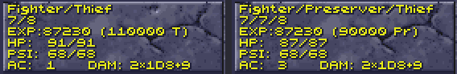

How it works: [DEVELOPMENT.md](DEVELOPMENT.md#thac0-saves-and-thief-skills).

### Spell slots on the USE screen

The game's USE (cast spells) screen shows, at the top of the panel under the
spells, how many spells of each level the selected character can still cast,
and the most they get after resting: `WIZ` for preservers' wizard spells, `PRI`
for clerics', druids' and rangers' priest spells, one `left/most` per spell
level from the 1st (six to a line), up to the highest level the character can
cast (more appear as they level up):


The numbers go down as spells are cast (the screen shows the new count when it
is next drawn) and back up after resting. That panel is where the game puts
the icons of the character's usable magic items (fruit, wands and the like),
along its bottom from the left, so the slots take only the three lines above
them: a character with both wizard and priest spells gets the two lines without
the `SPELLS LEFT BY LEVEL` heading.

The numbers are the Characters tab's (see Spell slots), WIS bonus included,
printed with the game's own text routine; they show while Templar's Ledger (or
its command-line dice log) is running.

### Each turn's rolls

With **Show each turn's rolls in the game** ticked on the Options tab (it is
off unless you tick it; or `python -m dscompanion dicelog --popups`), the game
stops at the end
of every turn in a fight in which someone attacked or cast a spell, and shows
that turn's rolls in its own dialogue window, with **Continue** to go on. Below
the box, pick how much it says: **at the least**, **in short** or **in
detail**. In detail, they are the dice log's own lines: each attack's d20, the AC it would hit and the
target's AC, how the THAC0 was worked out, and for a hit the damage dice and
bonuses; a spell's damage dice, and each saving throw against it. (The chance
to hit or to save is left out: the log has it.) The last line says who is
still to act this round (`Still to act this round: Jellybelly, Mountain
Stalker`), `End of round 2.` when everyone has, or, when the new round's
order is already in, that order (`Round 3: Dreamwalker, Jellybelly, Mlemlem,
Daaki`). The window shows five lines at a time; its **MORE** arrow shows the
next ones:


**In short** (or `--short-popups`) gives one line per target instead (and each
spell's first line):


`20 vs 11+ HIT, 12 damage` is the d20, the roll it needed (THAC0 − the
target's AC; a natural 20 always hits, a 1 always misses), and the damage the
hit did.

**At the least** (or `--minimal-popups`) gives only what came of the turn, no
dice: `Mlemlem hits Mountain Stalker for 12, misses. Slig takes 9 from
Fireball`. It leaves out who is still to act.

Each turn gets its own window, monsters' included. Only fights the party is in get them:
the fights the game stages without the party, such as the Defiler's show at
the start of the arena, are run by scripts waiting on the same dialogue window,
and a window of ours there would let the script go on before the fight ends.

How it works: [DEVELOPMENT.md](DEVELOPMENT.md#each-turns-rolls).

### What hurts a monster (the Look box)

In a fight, Look at a monster (right-click until the cursor is the Look icon,
then click the monster) and the game's small box, under its name and level,
now also shows its hit points and AC (`HP 15/15 AC 2`), its THAC0 and
alignment (`THAC0 17 AL TN`), its magic resistance beside its level
(`LEVEL: 3   MR 30`), and its most important defence: `NEEDS +1 WEAPON`,
`IMM FIRE COLD`, `NO CRUSH`, `HALF FROM WPNS` or `UNDEAD`. The alignment is in
two letters: `LG`, `LN`, `LE`, `NG`, `TN`, `NE`, `CG`, `CN` or `CE`. (A line
that would run past the box's edge, such as a monster's with over 100 HP, loses
its spaces.) Its own status lines (casting, charmed, held...) follow in any
row left. When there's more to say, closing
the box shows everything in the game's dialogue window: the weapons it needs,
the damage it's immune to or takes half of, spells that don't work on it, and
what its hits do besides damage. The dice log gets the same lines (`Look:
...`). Untick **Describe monsters when you Look at them in a fight** on the
Options tab to turn this off.

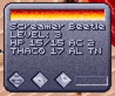

(The arena's first monsters, like the people in the early fights, have no
magic resistance or special defences, so the box shows just the numbers and
the alignment.)

How it works: [DEVELOPMENT.md](DEVELOPMENT.md#what-hurts-a-monster-the-look-box).

### No manual check

The game's copy protection is gone. Leaving the sewers (the Tari's warrens) the
first time, the game has a dragon appear and ask for a word from the manual
("The 3rd word on page 14, line 1, begins with the letter 'p'. What is that
word?"), and three wrong answers kill the party. Started from the Ledger, the
dragon doesn't come: the game goes on as if it had been answered. Always on.

How it works: [DEVELOPMENT.md](DEVELOPMENT.md#no-manual-check).

## Rule changes

Seventeen changes to the game's rules, each with its own box on the Options tab,
under **Rule changes** (the two thief rules under **Thieves**). All are on by
default, and they take effect in games started with the dice log: with the
Ledger running, or with **Play Dark Sun (in-game rolls)**, which uses the
Options as last set. Untick one and the game's own rule is back at once. The
rules for two weapons, thieves and saving throws are described with what the
game itself does, under [Two weapons](#two-weapons), [Thieves](#thieves) and
[Saving throws](#saving-throws).

| Rule (its box on the Options tab) | What it changes |
|---|---|
| [Weapon specialization](#weapon-specialization) | fighters and gladiators specialize in kinds of weapon, fighters on to mastery and grand mastery, rangers take expertise (and every ranger the bow); specialists and rangers shoot missiles faster; other weapons at a warrior's plain rate (missiles faster from 7th level) |
| [Kits](#kits) | a character of one class takes one of three kits for its class, or none (being built: half work so far) |
| [Class restrictions](#class-restrictions) | each class's limits on armour, shields and weapons hold, the strictest winning; a multiclass preserver casts no spells in armour |
| [Multiclass hit points](#multiclass-hit-points) | each level's die and CON's bonus shared between a character's classes |
| [Hit dice: the better of two](#hit-dice-the-better-of-two) | each hit die rolled twice, the better kept, for every character |
| [Spells saved against with the spell save](#spells-saved-against-with-the-spell-save) | the spell save rather than petrification/polymorph |
| [Fire, cold and electricity: DEX instead of a doubled d20](#fire-cold-and-electricity-dex-instead-of-a-doubled-d20) | DEX's defensive adjustment on those saves rather than a doubled d20 |
| [Two weapons](#two-weapons) | -2 main hand, -4 off hand, DEX's reaction adjustment added; rangers none |
| [Thief skills from AD&D's table](#thief-skills-from-adds-table) | AD&D's table by level, with Dark Sun's race and DEX adjustments |
| [Hiding in shadows to backstab](#hiding-in-shadows-to-backstab) | thieves hide and move silently to backstab, rangers to attack from behind; a worn cloak, boots and belt help |
| [Levels up to 10](#levels-up-to-10) | every class goes to 10th level (the game stops at 9) |
| [Items saving against acid](#items-saving-against-acid) | an item the acid or corroding touch could destroy needs the easier of the game's number and AD&D's save by material, a plus helping |
| [Rings and cloaks of protection](#rings-and-cloaks-of-protection) | two rings don't add up, a ring gives no AC with magical armour, a cloak does nothing with magical or metal armour or a shield |
| [Half-giants' two-handed weapons](#half-giants-two-handed-weapons) | a half-giant wields a two-handed weapon in one hand |
| [Cat's Grace](#cats-grace) | a new spell in Flaming Sphere's place: DEX + 1d6 |
| [Helms give AC 1](#helms-and-boots) | the game's helms give AC 1 rather than 0 |
| [Boots give movement in a fight](#helms-and-boots) | whoever wears boots gets 1 more move each round of a fight |

### Weapon specialization

With **Weapon specialization** ticked, fighters, gladiators and rangers train
in chosen weapon specs (kinds of weapon), as in AD&D. **Every ranger starts
with expertise in the bow**, on top of the weapon spec it chooses.

| Who | Chooses | With a weapon of a chosen weapon spec |
|---|---|---|
| **Fighter** (one class or more) | 1 weapon spec | specialized: +1 to hit, +2 damage; **mastery** from 5th fighter level (+3 to hit, +3 damage); **grand mastery** from 9th (the same, the damage die a size larger, d8 to d10, and one more attack a round) |
| **Gladiator** | 2 weapon specs at creation, a 3rd at 6th level and a 4th at 9th | specialized in each: +1 to hit, +2 damage |
| **Ranger** (one class or more) | **the bow from the start**, and 1 weapon spec (any but the bow) | expertise: the game's attacks a round in melee, a specialist's rate of fire with a missile weapon, no other bonus |

The game already gives every fighter, gladiator and ranger the specialist's
attacks in melee (3/2 a round, 2 from 7th level). With the rule, a warrior
fighting with a weapon outside its chosen weapon specs gets AD&D's plain rate, half
an attack less; with a chosen weapon spec it keeps the game's rate (a grand
master one more).

Missile weapons have a rate of fire of their own in the game, the same for
everyone (a bow 2 a round, a sling, staff sling or chatkcha 1). With the rule,
fighters and gladiators shoot faster with a chosen weapon spec, and rangers
with theirs and every bow: AD&D's specialist's rate for the sling, a step above
it for the bow, staff sling and chatkcha. From 7th level every warrior shoots
its other missile weapons faster too, a step behind a specialist, as in melee
(AD&D keeps the weapon's own rate). Mastery's and grand mastery's bonuses to
hit and damage count for missiles too.

**Attacks a round,** by skill and level (a warrior's level: the highest of its
fighter, gladiator and ranger levels; characters stop at 10):

| Skill with the weapon | Who | Melee, levels 1–6 | Melee, levels 7–10 | Bow, levels 1–6 | Bow, levels 7–10 | Sling, staff sling or chatkcha, levels 1–6 | Sling, staff sling or chatkcha, levels 7–10 |
|---|---|---|---|---|---|---|---|
| none | non-warriors: clerics, druids, preservers, psionicists, thieves | 1 | 1 | 2 | 2 | 1 | 1 |
| not a chosen weapon spec | any warrior | 1 | 3/2 | 2 | 3 | 1 | 3/2 |
| expertise | a ranger: every bow, and its chosen weapon spec | 3/2 | 2 | 3 | 4 | 3/2 | 2 |
| specialized | a fighter's or gladiator's chosen weapon spec | 3/2 | 2 | 3 | 4 | 3/2 | 2 |
| mastery | a fighter's chosen weapon spec, from 5th level | 3/2 | 2 | 3 | 4 | 3/2 | 2 |
| grand mastery | a fighter's chosen weapon spec, from 9th level | | 3 | | 5 | | 3 |

The sixteen weapon specs take in the game's
weapons of every material and its named ones (Bloodwrath, Swiftbite and the
like are long swords); spell-made weapons and gloves are none.

| Weapon specs (four to a page) |
|---|
| long sword, club, dagger, short sword |
| mace, axe, great axe, pick |
| quarterstaff, polearm, gythka, cahulaks |
| chatkcha, bow, sling, staff sling |

**Choosing at creation.** On the character creation screen, the panel under
the classes (the psionic disciplines, or a cleric's or ranger's spheres) has
**WEAPON SPEC** for a warrior: four pages of weapon specs, **MORE SPECS** to the next,
and on the last **VIEW PSIONICS** back to the panel. It works as the game's
disciplines do: the long sword is marked to start with (a gladiator's two:
the long sword and the club), the others greyed; click a marked one to take
it back, then another. A multiclass warrior can choose only the weapon specs its other
class lets it use: those of which the game (or the Ledger) has a weapon the
character may use, in any material. The rest stay greyed:

| A warrior (fighter, gladiator or ranger)… | Weapon specs it can choose | Starts with |
|---|---|---|
| …of one class, or with thief, preserver or druid | all sixteen (a ranger all but the bow) | the game's bone long sword |
| …with psionicist (small weapons) | club, dagger, short sword, mace, chatkcha, bow, sling | a wooden club |
| …with air cleric (missile weapons, and the dagger that can be thrown) | dagger, chatkcha, bow, sling, staff sling | an obsidian dagger |
| …with earth cleric (stone, obsidian, metal, wood) | long sword, club, dagger, short sword, mace, axe, great axe, pick, quarterstaff, polearm, chatkcha, bow (the polearm in the Ledger's metal) | an obsidian long sword |
| …with fire cleric (obsidian) | long sword, dagger, short sword, mace, axe, great axe, chatkcha | an obsidian long sword |
| …with water cleric (bone, wood) | long sword, club, dagger, short sword, mace, axe, great axe, quarterstaff, polearm, gythka, cahulaks, bow | the game's bone long sword |

(The starting weapon is for the weapon spec marked first; the next table has the
rest. A ranger never has the bow to choose: its expertise with the bow comes
anyway.)

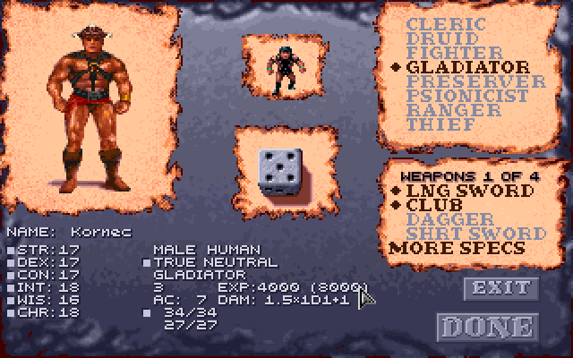

A new character starts the game with a plain weapon of its first weapon spec in
place of the bone long sword the game gives warriors, in a material it may
use, and the log says so (`Grog starts with a plain obsidian long sword for the
weapon specialization chosen, in place of the bone long sword`):

| Weapon spec | Starting weapon | For a cleric's sphere that can't use it |
|---|---|---|
| long sword | the game's bone long sword | obsidian (fire, earth) |
| club, quarterstaff, bow | wooden (a bow with 20 arrows) | |
| dagger, chatkcha | obsidian | a dagger: bone, the Ledger's (water) |
| short sword | bone, the Ledger's | obsidian (fire, earth) |
| mace, polearm, gythka, cahulaks | bone | a mace: obsidian, the game's plain Mace type with a picture of the Ledger's; a polearm: metal, the Ledger's (earth) |
| axe | bone, the Ledger's | obsidian (fire, earth) |
| great axe | bone, the Ledger's | obsidian (fire, earth) |
| pick | stone | |
| sling, staff sling | leather | |

A two-handed weapon held in the hands puts the game's starting shield in the
backpack (not a half-giant's, with [its rule](#half-giants-two-handed-weapons)).
A bow or staff sling goes in the missile slot instead, and the shield stays, as
the game asks nothing of the hands for it. The weapon is
made once: a long sword handed to the character later stays one.

**At a level gained.** A warrior with fewer weapon specs than it is due (a gladiator
reaching 6th or 9th, or any warrior from a game begun before the rule) picks
the rest the way a psionicist picks a new power: in the game's own pop-up,
the weapon specs its classes allow in light letters, those it can't (or has) greyed,
the picks left beside **EXIT** (which asks, as for powers, whether to leave
with picks unmade: they're offered again at the next level).

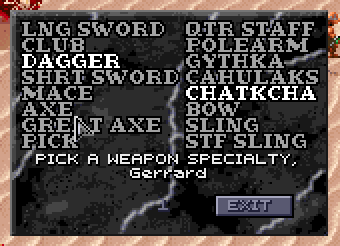

**Where it shows.** The **Effects** screen lists the selected character's
weapon specs under its effects ("SPECIALIZED IN", "MASTER OF", "GRAND MASTER OF",
"EXPERT IN"); View Character's DAM line counts it; the Characters tab lists
them (**Weapons: long sword (grand mastery)**) and gives the attacks a
round with each weapon ready, a missile weapon's its own (**Attacks: 3/2 a
round with Long Sword, 1 with Axe, 3 with Bow**); and the dice log names it on
each attack (`+1 specialized`, `+3 grand mastery`, `(d10 for d8: grand
mastery)`). A ranger's expertise with the bow isn't a chosen weapon spec, so neither
list shows it, but it counts; and View Character, as the game has it, gives a
character's melee rate whatever weapon is ready.

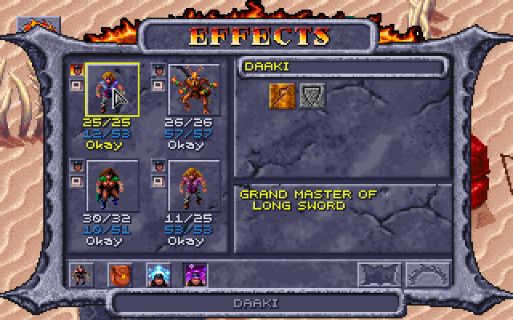

A human who dual-classes keeps what it earned as a fighter, gladiator or
ranger: it counts again (and so do those weapons, whatever the new class
allows) once the new class's level passes the old.

How it works: [DEVELOPMENT.md](DEVELOPMENT.md#weapon-specialization).

### Kits

Being built: half the kits work; the rest can be chosen but do nothing yet.
With **Kits** ticked, a character of one class may take one of three kits for
its class when it is made, or none (the class as it is). Each gives something
and costs something.

| Kit | Gives | Costs |
|---|---|---|
| **Myrmidon** (fighter) | a second weapon spec at 1st level, on to mastery and grand mastery as the first | −4 on saves against charms (Charm Person, Charm Monster, Charm Person or Mammal, Domination, Mass Domination) |
| **Sentinel** (fighter) | AC 2 better with a shield in a hand; +2 initiative | −1 on saves against wizards' and priests' spells |
| **Ravager** (fighter) | +1 to hit and damage in melee; a base AC by level (7 at 1st and 2nd level, 6 at 3rd and 4th, 5 at 5th and 6th, 4 at 7th and 8th, 3 at 9th to 11th, 2 at 12th to 14th, 1 at 15th to 17th, 0 from 18th), armour bettering it as usual | no missile or thrown weapons; no shield; light armour only (leather, or none) |
| **Arena Champion** (gladiator) | with a shield in a hand: +1 to hit and damage in melee, and AC 1 better | −1 to hit in melee with no shield |
| **Twin-blade** (gladiator) | no penalty for two weapons (with the two-weapons rule) | no shield; no two-handed weapon (a half-giant may hold one in one hand, with the half-giants' rule) |
| **Brute** (gladiator) | +2 to hit and damage with a two-handed melee weapon | two-handed melee weapons only (a half-giant may add a shield); missile weapons, but not as a weapon spec |
| **Stalker** (ranger) | +2 movement in a fight; +15 hide in shadows and move silently | light armour only (leather, or none) |
| **Assassin** (thief) | hiding in shadows not halved in daylight | −15 pick pockets and open locks |
| **Swashbuckler** (thief) | a warrior's THAC0 (21 less its level) | −10 to every thief skill |
| **Grove Warden** (druid) | AC 1 better for every 3 druid levels | no metal weapons |
| **Wanderer** (druid) | resists fire and cold as the Resist Fire and Resist Cold spells do: +3 on saves against fire and cold spells | AC 1 worse |
| **Arcanist** (preserver) | a spell slot more at each spell level it has slots at | −2 CON |
| **Shinobi** (thief) | preserver spells from 6th level, on the Seeker's slots (one 1st-level slot at 6th, two at 7th, and a 2nd-level slot at 8th, two at 9th, and a 3rd-level slot at 10th), cast at the thief level less 5, in light armour too: its own 14 (Gaze Reflection, Charm Person, Shield, Color Spray, Wall of Fog; Invisibility, Mirror Image, Blur, Detect Invisibility, Fog Cloud; Blink, Haste, Protection from Normal Missiles, Hold Person), one learnt at each level up from 6th | none learnt from scrolls; dagger, short sword, quarterstaff, chatkcha, sling, staff sling and bow only; light armour only; no shield |
| **Lifebinder** (druid) | Cure Light, Serious and Critical Wounds heal a d8 more, Blood Flow a d6 | blunt weapons only (club, mace, quarterstaff, sling, staff sling) |
| **Healer** (cleric) | Cure Light, Serious and Critical Wounds heal 1 more a die (+1, +2, +3) | no weapon in the off hand (a shield is fine) |
| **Scholar** (preserver) | a spell more learnt at each level up (CHOOSE A SPELL comes up twice) | −1 to hit (THAC0 1 worse) |
| **Crusader** (cleric) | a warrior's THAC0 | one fewer spell slot at each spell level |
| **Elementalist** (cleric) | *to come:* a second sphere: its spells and its weapons | spell slots a level behind (a 7th-level Elementalist has a 6th-level cleric's; none at 1st level) |
| **Seeker** (ranger) | priest spell slots from 6th level: one 1st-level slot at 6th, two at 7th, and a 2nd-level slot at 8th, two at 9th, and a 3rd-level slot at 10th (and on), in place of a ranger's, cast at the ranger level less 5 (a ranger's: less 7) | *to come:* its sphere's weapon limits (but it keeps the bow) |
| **Justifier** (ranger) | *to come:* the bow's and its weapon spec's expertise become specialization | one 1st-level priest spell slot from 10th level, in place of a ranger's slots, cast at the ranger level less 9 |
| **Battle Mage** (preserver) | a warrior's THAC0; a spell still cast after being hit earlier in the round; *to come:* a d6 hit die, expertise in a one-handed melee weapon, spells cast in light armour | one fewer spell slot at each spell level; nothing in the off hand |
| **Mind Warrior** (psionicist) | a warrior's THAC0; *to come:* a d8 hit die | *to come:* a tenth fewer PSP |
| **Mind Bender** (psionicist) | telepathy powers (the defence modes too) cost 2 PSP less to use | psychokinesis powers cost 2 PSP more |
| **Kineticist** (psionicist) | psychokinesis powers cost 2 PSP less to use | telepathy powers (the defence modes too) cost 2 PSP more |

Still to come: the parts marked *to come* above.

The Lifebinder's die
is rolled by the helper from the game's own random numbers; the dice log notes
it, and the HP line shows what was healed.

The Mind Bender's and Kineticist's PSP is both the cost to use a power and the
cost to keep it up each round, never less than 1 (a power with no upkeep
still has none); psychometabolism is as it was.

A character hit in a fight can't cast a spell until the next round: the game
won't let it choose one, and drops one it chose before the hit. The Battle
Mage isn't stopped.

The kits' spell slots are the game's own wherever it counts them (on resting,
in the spell lists), and the Ledger's Spells tab shows the same. A kit's
casting level is the one a spell's duration and damage take, and the one
that sets the spell levels it may cast, half of it rounded up (the dice log's
spell lines show it); the game's own rangers cast with their whole level,
though their spell levels count it 7 less. WIS's bonus
slots count for the Arcanist, Crusader and Elementalist as for their classes,
not for the Seeker's and Justifier's own tables.

A warrior's THAC0 is the game's own for a fighter, given where it is better
than the character's class's; it and the Scholar's are in the THAC0 the game
keeps for the character (View Character's, the attack's), worked out when the
character is made and at each level up.

The Arcanist's CON changes once, when the character is first played, kept
within 3 to 25. The Brute's +2 is for melee: a bow or staff sling, two-handed
as it is, doesn't get it. The game's Resist Fire and Resist Cold don't halve
fire's or cold's damage, so neither does the Wanderer's resistance. The Myrmidon takes its second weapon spec on
the weapon pages after the kit is taken (go back to them from the KIT page),
and loses it if another kit is taken. The dice log and the Ledger show each
kit's part: a Ravager's to-hit and damage (`+1 Ravager`), a Sentinel's initiative and saves,
a Stalker's hiding, the THAC0 shown for each weapon.

The kit is chosen on the creation panel's **KIT** page, opened with **KITS**,
the button at the end of the panel's pages: under the psionic disciplines for
a fighter, gladiator (without weapon specialization), preserver, psionicist
or thief; under the clerical spheres for a cleric, druid or ranger; on the
last weapon page for a fighter, gladiator or ranger choosing weapon specs.
NO KIT, the first row, is what a new character has. As with the clerical
spheres, the rows not chosen are greyed: click the marked row to take it back,
then click the kit you want. A few names are shortened to fit the panel
(CHAMPION, SWASHBUCK, ELEMENTAL, WARDEN, BATTLMAGE, M-BENDER, M-WARRIOR). Choosing
another class puts the kit back to none. The Effects screen names the kit
(`KIT: RAVAGER`), as does the Ledger's Characters tab.

### Class restrictions

With **Class restrictions** ticked, a character's classes keep it from
armour, shields and weapons as in AD&D, the strictest class winning. The game
checks only that one of the character's classes may use an item; with the rule
the others must allow it too, and putting on what one forbids gets the game's
own "Cannot use this item":

| Class | Armour and helms | Shields | Weapons |
|---|---|---|---|
| **Psionicist**, whatever its other classes | light only (leather, hide, silk: Drake, Shimmer and Silk Armor) | leather only | daggers, short swords, maces, clubs, chatkchas, bows and slings |
| **Thief**, multiclass | light only | a leather one, and only if another of its classes allows shields | as its classes allow |
| **Preserver**, one class | none | none | as the game has it |
| **Druid** | none | none | any |
| **Cleric** | any | any | its sphere's: air missile and thrown weapons and daggers; earth stone, obsidian, metal and wood; fire obsidian; water bone and wood |

A **multiclass preserver** may wear what its other classes allow, but casts no
spells (wizard or priest) while wearing armour (a helm counts, a shield
doesn't), as the game's own "No spell use" stops them. The **USE** screen
heads its spell slots **NO SPELLS IN ARMOUR**, and the Characters tab adds
"(no spells in armour)" to them. A human who has
changed class is held by the class it has now; another race by all of its
classes. A ranger turned cleric uses both spheres' weapons, and a warrior who
dual-classed uses the weapons it specialized in once the new class's level
passes the old (a fighter's, gladiator's or ranger's chosen weapon specs, and a
ranger's bow). A ranger's bow is always its own: a fire ranger/cleric, whose
fire sphere allows only obsidian weapons, may still use bows.

How it works: [DEVELOPMENT.md](DEVELOPMENT.md#class-restrictions).

### Multiclass hit points

With **Multiclass hit points** ticked, a character of more than one class
gains hit points as in AD&D: each class's die at its level, divided by the
number of classes (dropping fractions, at least 1), and CON's bonus divided
between them too (dropping fractions). The game adds each level's full die
and divides only the total, and gives CON's bonus whole. At creation, too,
each class's die is shared on its own. A human who dual-classes isn't
affected (one class at a time). The rule
is meant for a new game: ticked during one, a character's next level shares
CON's bonus for all its levels, which can lower its most hit points. The log
shows the share:

```
Gerrard's 4th Fighter level: hit points d10 = 8, / 2 classes = 4
```

How it works: [DEVELOPMENT.md](DEVELOPMENT.md#multiclass-hit-points).

### Hit dice: the better of two

With **Hit dice rolled twice** ticked, every character's hit die is rolled
twice and the better roll kept: at creation (one die for each starting level
of each class) and at every level gained. Everything after the roll is the
game's (or the other rules'): CON's least, a half-giant's double, and a
multiclass character's share. It isn't AD&D's, but it softens a bad roll; on
average a d10 gives 7.15 instead of 5.5, a d8 5.8 instead of 4.5, a d6 4.5
instead of 3.5 and a d4 3.1 instead of 2.5. Levels past the dice (a fixed
gain) don't change. The log shows both rolls:

```
Cilla's 3rd Ranger level: hit points d10 = 2 and 7, the better 7
Character creation, hit points 18: Fighter d10 per level: 10 (the better of 2 and 10) + 5 (the better of 5 and 1); ...
```

How it works: [DEVELOPMENT.md](DEVELOPMENT.md#hit-dice-the-better-of-two).

### Levels up to 10

The game stops every class at level 9 (its manual's tables end there too).
With **Class levels go up to 10** ticked, each class goes one level further,
at the XP AD&D gives for 10th level:

| Class | XP for 10th level |
|---|---|
| Cleric | 450,000 |
| Druid | 125,000 |
| Fighter, gladiator | 500,000 |
| Preserver | 250,000 |
| Psionicist | 400,000 |
| Ranger | 600,000 |
| Thief | 160,000 |

Everything else at 10th level is the game's own: it had it all along, and
only the cap kept it out of reach. Its XP tables (DSUN.EXE 3E5A4h, in
hundreds of XP) go on to level 20 (druids
with a table of their own, not the cleric's), and THAC0, saves, spell slots
and thief skills are worked out from the level. So at 10th level:

- **Hit points** follow AD&D past 9th: preservers and thieves still roll
  (d4 and d6, CON's bonus counting too), while the others gain a fixed amount
  (+3 for fighters, gladiators and rangers, +2 for clerics, druids and
  psionicists). The game's own table has the fixed gain for thieves too, as
  it keeps thieves and psionicists together and AD&D's psionicist stops
  rolling at 9th; with the rule the helper gives thieves their 10th die
  (`INT E6h`, and `INT E5h` where CON's bonus is counted).
- **Gladiators** optimise their armour, as the game already has them do:
  AC 1 better for every 5 gladiator levels, so -2 at 10th where it was -1.
  (The Ledger counts it in **AC: spells, rings, other**. The game gives it
  with or without armour.)
- **THAC0 and saves** improve as the game's formulas give: 11 for a
  gladiator, 14 for a druid, as for AD&D's warriors and priests.
- **Spell slots** grow at the levels casters already have, up to 5th; no
  class gets 6th-level slots (a cleric would at 11, a preserver at 12), so no
  spells past 5th level are needed. A 10th-level preserver or druid has
  5 4 3 2 2 before WIS.
- **A preserver picks a new spell** on the game's own CHOOSE A SPELL screen,
  as at every level, offered from spell level (class level + 1) / 2 down:
  5th at 10th as at 9th. **A psionicist picks a new power** (the game gives
  one at each level, two at odd levels and 4th).
- Spell damage that grows with the caster's level already counts up to
  level 10 in the game, so a 10th-level caster gets the last step.

The level-up comes as the game's usual one ("Gerakis gains a level"), and
View Character stops showing the XP for the next level at 10, as it does at
9 without the rule. For a character of more than one class, a class already
at 10 isn't named in the brackets, since it has no next level. Untick it and nobody goes past the level they have: a
10th-level character stays 10th.

How it works: [DEVELOPMENT.md](DEVELOPMENT.md#levels-up-to-10).

### Items saving against acid

Two monsters' hits can destroy an item: the **Rampager's acid** a worn piece
of armour, and the **Babau's corroding touch** a worn piece of armour and the
melee weapon held (the first one in the character's list of held items; bows
and slings never). The game makes the check on every such hit, whether or not
the target's saving throw against the attack succeeds, and shows its own
message when the item goes ("Armor is corroded", "Weapon is corroded"). Only
pieces worn on the arms, legs or chest count, not helms or shields, and at
most one piece of armour is lost to a hit: the first that fails, in the order
of the character's list.

The game's own checks:

- **A weapon** is destroyed on a d20 under 8 less its plus: a plain one 7 in
  20 (35%), a +1 30%, +7 or better never.
- **Armour** with a magical power (Drake Armor, Shimmer Armor) is never
  destroyed. Any other piece is destroyed at once, without a roll, plus or
  no plus: Tanelyv's Armor +2 goes as surely as plain leather. (The game reads
  the byte that holds the item's power, not its plus.)

With **Items save against acid as in AD&D** ticked, each item needs the easier
of the game's number and AD&D's saving throw against acid for its material
(the DMG's table), so no item is worse off than in the game. AD&D's number is
less the item's plus, and 1 less again for a magical power:

| Material | AD&D's number (the DMG's row) |
|---|---|
| Wood | 8 (thick wood) |
| Bone (the game's ring, brigandine and scale armour too) | 11 |
| Stone, obsidian | 5 (glass, the nearest) |
| Metal | 13 |
| Leather | 10 |
| None (Silk Armor) | 12 (cloth) |

| Item | Saved in the game | Saved with the rule |
|---|---|---|
| Leather Chest Armor | 0% | 55% (needs 10) |
| Leather Chest Armor +1 | 0% | 60% (needs 9) |
| Bone scale chest | 0% | 50% (needs 11) |
| Chain chest | 0% | 40% (needs 13) |
| Tanelyv's Armor +2 (metal) | 0% | 50% (needs 11) |
| Drake Armor +1 (a power) | 100% | 100% (the game's) |
| Bone or metal Long Sword | 65% | 65% (the game's: needs 8) |
| Shadowseeker (metal, +1) | 70% | 70% (the game's: needs 7) |
| Obsidian Dagger | 65% | 80% (needs 5) |
| The Ledger's plain bone weapons (Dagger, Short Sword, Axe, Great Axe) | 65% | 65% (the game's: needs 8) |
| The Ledger's plain obsidian weapons (Short Sword, Axe, Mace, Great Axe) | 65% | 80% (needs 5) |
| The Ledger's plain metal weapons (Short Sword, Dagger, Mace, Great Axe, Pick, Polearm) | 65% | 65% (the game's: needs 8) |
| Kreenfang, Drakejaw, Stillwater, Thornwall (bone, +1) | 70% | 70% (the game's: needs 7) |
| Mindshard (obsidian, +1) | 70% | 85% (needs 4) |
| Flame Blade (obsidian, +1, a power) | 70% | 90% (needs 3) |
| Glasshewer (obsidian, +2) | 75% | 90% (needs 3) |
| Deepbiter (stone, +1) | 70% | 85% (needs 4) |
| Gutterknot (wood, +1) | 70% | 70% (the game's: needs 7) |
| Greenbright, Galefang, Headsman, Linebreaker (metal, +2) | 75% | 75% (the game's: needs 6) |

The dice log shows every check, whichever rule is on:

```
Defiler saves vs Acid from Rampager (paralysis/poison/death): d20 = 20 (natural 20) -> saved
  Rampager's acid on Defiler's Metal Chain Leg Armor: d20 = 16, needs 13 (AD&D's, 13 for metal; the game's: destroyed without a roll) -> safe
  Rampager's acid on Defiler's Leather Chest Armor: d20 = 12, needs 10 (AD&D's, 10 for leather; the game's: destroyed without a roll) -> safe
```

The Detonate psionic power, which can blow up an item a target carries, keeps
the game's own rule (a d20 under 15 less the item's plus).

How it works: [DEVELOPMENT.md](DEVELOPMENT.md#items-saving-against-acid).

### Rings and cloaks of protection

The game has no rings or cloaks of protection; the Ledger adds three (the
arena's Ring +1, and Pehtucl's ring and cloak in the slave pens: see
[New items](#new-items)), each +1 to AC and +1 on every
saving throw. With **Rings and cloaks of protection as in AD&D** ticked, they
follow the AD&D rules for them:

- **Two rings don't add up:** only the better one counts (the left hand's,
  if they're equal). The arena's ring and Pehtucl's, both +1, give +1 together,
  not +2.
- **A ring gives no AC with magical armour** (any worn armour piece, helm
  included, with a plus), but still adds to saving throws.
- **A cloak does nothing,** neither AC nor saves, with magical armour, with
  metal armour (Chain, Grey's Scale, Tanelyv's Armor, the Helm of
  Contemplation) or with a shield in either hand. Natural armour is fine:
  leather and bone (Ring, Brigandine and Scale are bone in Dark Sun), and
  plain helms. The cloak still adds to a ring.

Armour here is what is worn on the arms, legs, head or chest; something only
carried in a backpack doesn't count. Untick it and every ring and cloak worn
counts, whatever else is worn (the game's way with the patched game).

### Bracers of defense

A preserver can't cast in armour (with [class restrictions](#class-restrictions)),
so the Ledger adds AD&D's bracers of defense ([where](#new-items)). They are
worn on the arms, in the arm armour's place, and give the AC their name says:
AC 6 is 4 better than no armour, AC 2 is 8 better. As in AD&D they give nothing
while armour is worn: on the arms, legs or chest, or a helm (bone, leather or
metal, magical or not). A shield, rings and cloaks of protection, and the
Ledger's circlet and crown (worn on the head, but not armour) go with them.
They aren't armour to anything else: a preserver casts in them, a thief wears
them, and a ring or cloak of protection still counts. In the game they are
**BRACERS/DEFENSE** with their plus (Bracers/Defense +4 is AC 6), priced 5,000
a point of AC.

How it works: [DEVELOPMENT.md](DEVELOPMENT.md#bracers-of-defense).

### Half-giants' two-handed weapons

Half-giants stand up to twelve feet tall. With **Half-giants wield
two-handed weapons in one hand** ticked, a half-giant can hold a two-handed
weapon (a two-handed sword, a halberd, a bow) in one hand, with a shield or a
light weapon in the other. The game's own rule that the two hands can't both
hold heavy weapons (over 30 in weight each) still stands, so no half-giant
holds two two-handed weapons. With two weapons ready, the two-weapon penalties
apply as for anyone. The inventory screen still writes "2 handed" in the
weapon's line: that is its kind, not a limit.

How it works: [DEVELOPMENT.md](DEVELOPMENT.md#half-giants-two-handed-weapons).

### Cat's Grace

A new spell, in Flaming Sphere's place: a level 2 wizard spell from AD&D's
*Spells & Magic*, made to work exactly as the game's Strength does, for DEX:
the caster touches someone, whose DEX goes up by 1d6 (at most 24) for 60
rounds per caster level. Everything that reads DEX follows it while it lasts:
AC, initiative, REAC and DEF, thief skills, the two-weapon penalties and the
saves against fire, cold and electricity. The log says what it rolled: `Cat's
Grace: 1d6 = 4 -> Gerakis's DEX +4 while it lasts (at most 24)`.

The game has no room for a new spell (wizard spells are numbers 1-68, every
one taken), so Cat's Grace takes the place of Flaming Sphere, the weakest
level 2 spell: 2d4 fire damage once, whatever the caster's level. While the
box is ticked (it is by default), every character and monster who would cast
Flaming Sphere casts Cat's Grace instead, under that name on the USE screen,
with an icon of its own (Strength's tile in a tawny cat's golds, a cat's paw
print in the game's dark line) and its own description in the box a right-click
on it opens; untick it and Flaming Sphere is back.

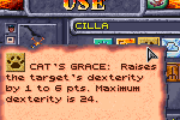

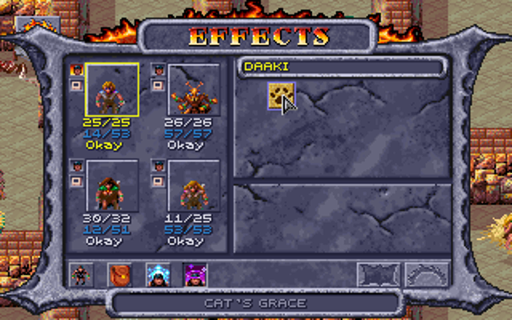

How it works: [DEVELOPMENT.md](DEVELOPMENT.md#cats-grace).

### Helms and boots

The game's helms count as armour but give AC 0. With **Helms give AC 1**
ticked they give 1: the plain leather Helm, Dapartea's Helm, the metal Helm of
Contemplation and the Helm of Might (item types 5, 89 and 109, all at AC 0 in
the game's tables). It shows on the View Character and inventory screens like
any armour.

With **Boots give movement in a fight** ticked, whoever wears boots
(Leather Boots, Serpent Boots: anything on the feet) gets 1 more move each
round of a fight (13 rather than 12, say; Haste and Slow still double and
halve it). The game sets each round's movement when it rolls initiative, so
boots put on mid-fight count from the next round. The Characters tab shows it:
`Move: 12 (13 in a fight: boots)`.

The game has no descriptions of items, only their names, so while the helms'
or boots' rule is on the Ledger renames the plain ones: **Helm (AC 1)** and
**Boots (Speed+1)** ("Speed", as `Move +10` in a boots' item box is moving
silently). The named ones (Dapartea's Helm, Helm/Contempltn, Helm of Might,
Serpent Boots) keep their names, which would be too long for the game's Look
box with the note. With the rule off, or without the Ledger, the names are the
game's own.

How it works: [DEVELOPMENT.md](DEVELOPMENT.md#helms-and-boots).

### The game's own party

START GAME with no party made plays the game's own four. With the rules on,
the Ledger makes them ready for them in the first moments of a new game, and
says so in the dice log:

| Character | With weapon specialization | With class restrictions |
|---|---|---|
| **Gerakis**, half-giant gladiator | specializes in the long sword and the gythka; with [half-giants' two-handed weapons](#half-giants-two-handed-weapons), his club is a bone gythka, a two-handed weapon beside his long sword | |
| **K'ratchek**, thri-kreen fighter, druid and psionicist | specializes in the chatkcha, her only weapon | |
| **Cermak**, human preserver, once a gladiator | specializes in the long sword and the axe, which count once his gladiator levels do again (when his preserver level passes them) | |
| **Cilla**, elf preserver, druid and thief | | no leather armour (a druid wears none), and she knows the **Armor** spell in its place |

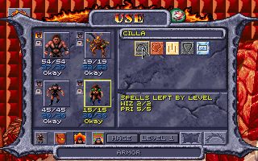

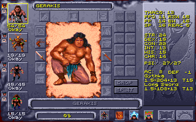

How it works: [DEVELOPMENT.md](DEVELOPMENT.md#the-games-own-party).

## New content

People, a quest and items the Ledger adds to the game, each with a box in the
Options tab's **New content** section, from the next time the game is
started.

### New items

Items the game never had, or never placed. All but the arena's ring (which the
Ledger hands over itself, while it runs) are written
into the game's own data each time the Ledger starts the game, so the game
makes them with their people and chests and then keeps and saves them like its
own. A changed switch takes effect in regions the party hasn't visited yet;
start a new game to have them all. The log doesn't say where they are: they're
there to be found. [Every magic item](#every-magic-item) lists the magic ones
with the game's own.

**Mundane items.** The game has no short sword at all, no bone or obsidian
axe or great axe, no bone dagger and few plain metal weapons; the
Ledger adds them:

| Icon | Item | Where | What it is |
|---|---|---|---|
| 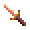 | **Bone Short Sword** | sold by the **Weapon Merchant** in Teaquetzl and **Jark** in Kel's caravan; carried by every **Renegade** | 1d6 |
| 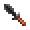 | **Obsidian Short Sword** | sold by the Weapon Merchant and Jark; carried by **Chaero** | 1d6 |
|  | **Bone Axe** | sold by the Weapon Merchant and Jark; carried by every **Wild Mul** | 1d8 |
|  | **Obsidian Axe** | sold by the Weapon Merchant; carried by **Merzol**, the slave pens' gladiator | 1d8 |
| 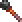 | **Obsidian Mace** | sold by the Weapon Merchant and Jark; carried by every **Tari** in the warrens | the game's Mace (1d6+1), in obsidian (its only obsidian mace is Blackmace) |
|  | **Metal Short Sword** | sold by the Weapon Merchant | 1d6: Shadowseeker without the plus |
|  | **Metal Dagger** | carried by **Tobrian**, in Kel's caravan | the game's dagger, in metal |
|  | **Metal Mace** | carried by the **Templar** of the elven slavers' camp | the game's mace, in metal |
|  | **Bone Great Axe** | a warrior's starting great axe; sold by the Weapon Merchant and Jark; carried by every **Wild Mul** | 1d10, two-handed; lighter than metal (and breaks as bone does) |
|  | **Obsidian Great Axe** | a fire or earth cleric's starting great axe; sold by the Weapon Merchant and Jark | 1d10, two-handed |
| 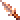 | **Bone Dagger** | a water cleric's starting dagger; sold by the Weapon Merchant and Jark; carried by one of the game's two kinds of **Defiler** (the other carries the game's obsidian Dagger, so a dead defiler leaves a body to search) | 1d4: the only dagger a water cleric can use |
|  | **Metal Great Axe** | sold by the Weapon Merchant | the game's great axe, in metal |
|  | **Metal Pick** | sold by the Weapon Merchant | the game's pick, in metal |
| 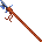 | **Metal Polearm** | carried by one of the six **Castle Guards** of the Upper Castle; an earth cleric's starting polearm | the game's polearm, in metal |
|    | **Bone Scale Arm Armor**, **Leg Armor** and **Bone Helm** | in the slave pens' chest with the Bone Scale Chest Armor and Arrows +3 (the game has the set but places only the chest piece) | the set; the helm AC 1 with [Helms give AC 1](#helms-and-boots), worn by those who can wear the armour (not thieves) |
|  | **Helm** | in **Kurzak**'s pack, in the slave pens | the game's leather helm |
|  | **Thieves' Tools** | every thief's backpack; sold by **Kel** in his caravan (two sets, 30 each) | [picking pockets](#picking-pockets) |

The bone and obsidian weapons are also new characters' starting weapons with
[weapon specialization](#weapon-specialization), each in a material the
character can use.

**Magic items:**

| Icon | Item | Where | What it does |
|---|---|---|---|
|  | **Ring of Protection +1** | the arena's Tied-up Prisoner: free him, then look at his body (the game's script says there's nothing; the Ledger finds a ring sewn into his loincloth, 50 XP to whoever searched) | +1 AC and +1 on every saving throw |
|  | **Ring of Protection +1** | worn by **Pehtucl**, the slave pens' head templar (in the south-west corner, with the Obsidian Bloodwrath) | the same |
|  | **Cloak of Protection +1** | worn by Pehtucl | the same, from the cloak slot |
|  | **Inixhide** | worn by **Legcrusher**, the pens' half-giant | Leather Chest Armor +1: the leather's AC, +1 |
|  | **Shadowseeker** | in the pack of **Kurzak**, the pens' guard leader | a short sword +1 (1d6+1): whoever wields it, in either hand, sees the invisible |
|  | **Kreenfang** | the 2 handed Bone Gythka on the dead body by the arena's stone arch | a gythka +1 (2d4+1) |
|  | **Six scrolls** | [Kalzith's](#kalzith) shop | spells the game has no scroll of |
|  | **Gutterknot** | carried by **Churrr** in the warrens; a thief can lift it (200 XP) | a club +1 (the game has no magic club) |
|  | **Deepbiter** | carried by one of the **Undermountain folk** (the miners) | a stone pick +1 (the game has no magic pick) |
|  | **Windlash** | sold by the **Bowyer** | a staff sling +1 (the game has no magic staff sling) |
|  | **Greenbright** | carried by **Arant**, who holds the captured gladiators | a metal short sword +2 |
|  | **Drakejaw** | carried by one of the **Magera** guarding the wagon's prisoners | a bone axe +1 (1d8+1): a water cleric can wield it |
|  | **Glasshewer** | carried by the **Templar** of the elven slavers' camp (the one with the Chain Arm Armor) | an obsidian axe +2 (1d8+2): a fire or earth cleric can wield it |
|  | **Headsman** | in the arena **Announcer**'s stash, with his Stoneskin scroll, rings and gems | a metal great axe +2 |
|  | **Galefang** | carried by the **Rogue Shaman**, with his Shaman Followers | a metal dagger +2 an **air cleric** can wield (none of the game's daggers are) |
|  | **Mindshard** | carried by **Maris**; a thief can lift it (200 XP) | an obsidian short sword +1: a **psionicist** can wield it, alone or with a fire or earth cleric |
| 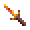 | **Stillwater** | in the chest **Chaya** gives as her apology | a bone short sword +1: a **psionicist** can wield it, alone or with a water cleric |
| 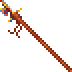 | **Linebreaker** | carried by the **Troop Leader** | a metal polearm +2 |
| 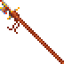 | **Thornwall** | on the slave pens' **weapon rack**, in place of one of its two plain bone polearms | a bone polearm +1 |
| 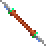 | **Gythka +2** | the **Elven Leader**'s gift, after the fight with his men | the game's Gythka +1, made +2 |
|  | **Flame Blade** | in the pack of the **Templar** of the Hot Springs (the one with the Drake Shield) | an obsidian long sword +1 (1d8+1) whose blade burns what it hits: the fire clerics' Focus Heat, 2d6 fire damage to the creature hit (a save for half), as the game's Dark Flame casts Burning Hands. Obsidian, so a fire (or earth) cleric can wield it |
|  | **Tome of Understanding** | **Father Garyn**'s gift, in Teaquetzl, when the party brings him the ranike pith from Notaku | read as a scroll is (right-click it in the inventory, click its icon): the one whose pack it is in gains a point of WIS for good (at most 25), and the tome is gone. Not in a fight, as no scroll can be read in one |
|  | **Arrowbane** | sold by **Kel** | a silver circlet: Protection from Normal Missiles on its wearer while worn (normal arrows, sling stones and chatkchas can't hurt them); worn on the head, not armour |
|  | **Sunking Crown** | worn by **Keldar**, the templar of Dagolar's tunnels | a gold crown: Protection from Evil on its wearer while worn; worn on the head, not armour |
|  | **Warden's Helm** | on **Dagolar**'s body (the one carrying Dag's Dagger) | the game's metal helm +1: Cloak of Bravery on its wearer while worn |
|  | **Warden's Arms** | the Lower Castle's treasure chest, with Dark Flame (behind the wall the Serpent Boots show, where the vrock perch) | plate arm armour +1 (AC 2, +1) |
|  | **Warden's Legs** | the Gemfields' chest | plate leg armour +1 (AC 2, +1) |
|  | **Warden's Chest** | on **Balkazar**'s body | plate chest armour +1 (AC 3, +1): Resist Fire on its wearer while worn |
|  | **Cloak of Elvenkind** | the **Elven Leader**'s gift with his Gythka +2, after the fight with his men: "And take this cloak, woven by my own tribe for our best runners..." (left on the ground by him when it can't be carried, as the Gythka is) | a grey cloak: [all but invisible](#hiding-in-shadows-to-backstab) in a fight, with the hiding rule; thieves and rangers only |
|  | **Boots of Elvenkind** | the buried chest of Kel's caravan, with the Cahulaks +1 | soft boots: [silent](#hiding-in-shadows-to-backstab), with the hiding rule; thieves and rangers only |
| 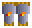 | **Bracers of Defense** | **Mikquetzl** (AC 6, in his pack), **Wyrmias** (AC 5), **Balkazar** (AC 4), **Dagolar** (AC 2, the one carrying Dag's Dagger) | AC for those wearing no armour: [bracers of defense](#bracers-of-defense) |

**Prices** follow the game's own: magic melee weapons 20,800 a plus (41,600
for a +2; a +1 with a spell 22,000), Windlash 2,800 (as its Sling +1), plain metal weapons 50 to
300, bracers 5,000 a point of AC, Arrowbane 30,000, the Sunking Crown 40,000,
the rings and cloak of protection 15,000, Inixhide 6,000, the
Cloak of Elvenkind 25,000 and Boots 20,000, the Warden's Arms and Legs 27,000
each, Chest 36,000 and Helm 30,000, and the Tome of Understanding AD&D's 43,500.

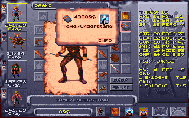

**The Warden's Plate** is plate mail +1 in four pieces (AC 11 as a set, 12
with [helms giving AC 1](#helms-and-boots)): metal armour, worn by the classes
that can wear the game's chain (no single-class thieves), and kept from more
with [class restrictions](#class-restrictions). **Grey's Scale**'s arm and
leg armour is AC 3 each (the game's is 2).

**New items, magical and mundane** on the Options tab places them all, the
arena's ring too; a thief's tools come with picking pockets. A thief can
[lift](#picking-pockets) Pehtucl's ring, Shadowseeker, Gutterknot and
Mindshard (200 XP for each weapon).


**Icons and names.** Each has an icon of its own (in the tables above), made from the plain item's
the way the game makes its magic items' (a few pixels in the colours it cycles
like fire); dropped on the map they look like the plain item. The game's names
are at most 15 letters, so the rings are **RING/PROTECTION** and the cloak
**Cloak/Protectn**; the Ledger's screens and the log give them in full. As with
its own items, the game puts the material first: **Leather Inixhide**,
**Metal +1 Shadowseeker** in the item box.

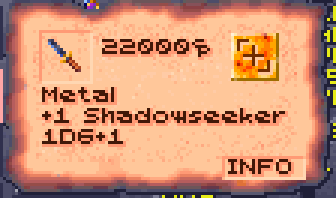

**Alagorn**, the wizard of the Painted Badlands who identifies magic items,
tells the story of every magic item in the table but the plain Gythka +2
when the party carries it,
in the menu the game would put it in (swords, weapons, rings, armor, clothes
or other items), before "Nothing". As with the game's own, one story for each
kind: the four pairs of bracers share one, and so do both rings of
protection. The Warden's Plate's pieces each tell a part of Haldren's, the last
of the Wardens.

How it works: [DEVELOPMENT.md](DEVELOPMENT.md#new-items).

### New people

Two people of the slave pens, in new games: those that reach the pens with the
Ledger's copies of the game's files in use (a save keeps the pens as they were
when the party first went in).

#### Kalzith

A new person in the slave pens: **Kalzith**, a defiler slave the templars put
in the arena now and then (the crowd loves to watch a defiler burn), kept in
a pen of his own in the middle column the rest of the time. He has the
arena Defiler's figure and a face of his own: the game's portrait 61 with a
slave's brand on the brow, so the Dialogue tab never mistakes him for anyone
else.

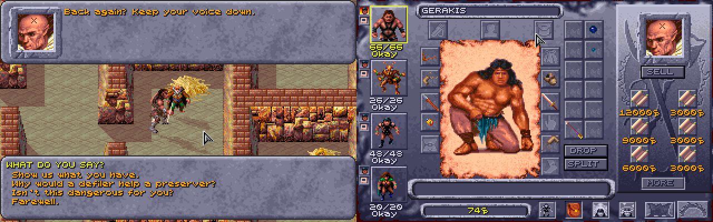

Talk to him as to anyone (click him with the look pointer, then the Look box's
Talk button). His conversation is the game's kind, just him speaking:

- **With respect** ("We mean no harm. We're slaves too."), he owns up to
  scribing spells on scraps of hide at night, to bribe a guard, and offers
  them: **Show us what you have** opens the game's shop screen, with his six
  scrolls, one of each:

  | Level | Scroll | Price |
  |---|---|---|
  | 1 | Shield, Burning Hands | 3,000 ceramic each |
  | 2 | Blur, Cat's Grace | 6,000 each |
  | 3 | Lightning Bolt, Haste | 9,000 each |

  None of them is a spell the game has a scroll of, so they're something you
  can't find elsewhere. The prices are the game's own for the spell's level
  (3,000 a level, as most of its scrolls are).

  Cat's Grace is there only with its rule on (see
  [Rule changes](#rule-changes)). A preserver learns a scroll's spell as from
  any of the game's (right-click it in the inventory, click its spell), by the
  game's own rules: a spell of a level the preserver can cast. He remembers a
  friend ("Back again? Keep your voice down."). As with the game's own people,
  a question goes from his list once asked, until the next time you talk to
  him; the shop stays.
- **During the escape**, with the alarm sounding (the game's own alarm, which
  the pens' other slaves also answer to), he has only a line for the party,
  by how he stands with them, and no talk: to a friend, "That's the alarm. So
  it's you breaking out. Go, and go quickly: if they find you at my cell, I
  burn with you."
- **Calling him a defiler**, he answers back; take it back and he's friendly,
  or **threaten to tell the templars** and he won't speak to the party again
  until they make amends: **50 ceramic** (offered only to a party that has
  it), or a plea that he wins over with a **Charisma check** (the character
  talking rolls it).

Killed, he leaves one of the scrolls he still had, chosen at random, a Cloak
and a Quarterstaff (the game's own) in his body, and the log says what. Once
the party has bought all six scrolls, he has nothing more to sell and wears
the cloak and carries the staff himself. Attacked, he turns on the party as the
pens' other slaves do, and only the guards near him join the fight. If he dies,
Dinos and the Trustee speak of him as dead; after the party's escape he is gone
from the pens with everyone else.

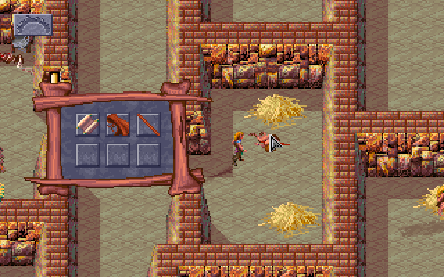

How it works: [DEVELOPMENT.md](DEVELOPMENT.md#kalzith).

#### Semyon

Untie the arena's prisoner and he is **Semyon**, of the Veiled Alliance. He
meets the party again in the arena's bone area, where they can recruit him to
the Alliance. Recruited, he fights beside them in the next fight and, if he
survives it, leaves: "That's enough for me. I'm leaving. I'll go find more
members for the Alliance." (Some of his replies in the bone area send him off
before that: "That's enough for me. I'll see you in the holding pens.", "Right,
see you there!", or, still weak, "Why don't I meet you in the holding pen?")
Each way, he walks out through the arena's entrance to the pens, where a
script takes him off the map, and nothing in the pens brings him back.

With the Ledger, if he left after the fight he helped in, he is there, in a pen
of his own above Kalzith's, the first time the party is in the pens after it.
His other ways out stay as in the game, and so does a Semyon who was killed: he
isn't in the pens. Talk to him (Look, then Talk): he says why the templars tied
him up in the arena (he was asking about the Veiled Alliance), passes on what he
has heard (who carries keys), reminds the party where he hid his gem (the grain
pots), and talks about the Alliance's plans, in his own voice from the arena.
As with the game's own people, each question goes from the list once asked,
and comes back the next time you talk to him.

Attacked in his pen, he turns on the party as the pens' other slaves do.

**Breaking out with Scar.** A rare way through the arena: recruit Semyon just before the fight with Scar,
take up Scar's offer to break out together, and head for the west exit. In the
game, when the alarm goes up ("Gladiators escaping! Guards! Sound the
alarms!"), Scar and his henchmen come along to the slave pens and Semyon is left
behind. With the Ledger, if he is still in the arena, alive and on the party's
side, he comes too: he stands beside Scar's men in the pens and fights the guards
with them, on the party's side. Talked to then, he says: "Scar's gladiators and
the Veiled Alliance, side by side! Who would have believed it? Stay close to
Scar: he knows the way out, and I'm right behind you." He isn't made one of the
pens' slaves while the escape lasts, and once the party is out through the
grate, he is gone with everyone else.

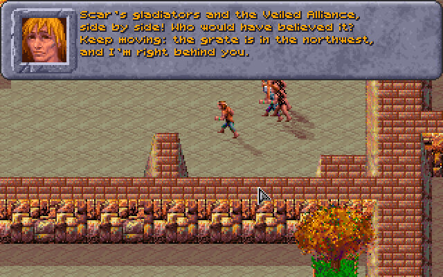

How it works: [DEVELOPMENT.md](DEVELOPMENT.md#semyon).

#### What Dinos and the Trustee say about them

Dinos ("Who else is in here?") and the Trustee ("Who else is in the
slavepens?") each answer questions about the others in the pens. With the
Ledger their menus also ask about Kalzith, and about Semyon once he is in his
pen ("What do you know about Kalzith?", "What can you tell me about
Semyon?"). Kalzith's question waits until the Ledger has found him in the pens
(the game's test for whether someone is there only knows the game's own
people); Semyon's once he has been in his pen. As with the game's own
questions, each is shown only until it's answered in that talk.

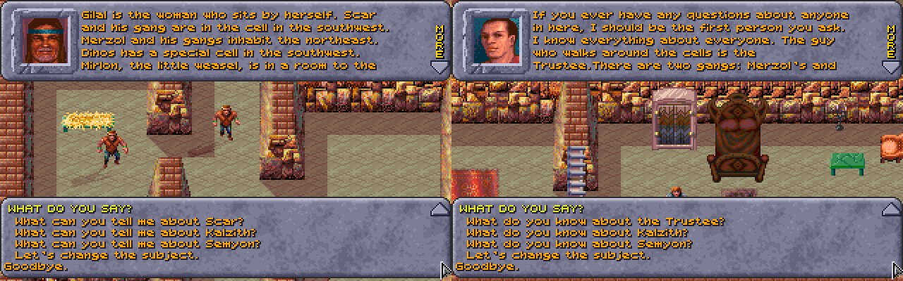

If either has been killed, they speak of him as they do of the game's dead:
the Trustee asks "What was Kalzith like?" (or Semyon) instead, with an answer
of its own, and Dinos keeps the question and answers it differently. The
Ledger marks each death with a flag (772 Kalzith, 771 Semyon) when it sees his
record dead.

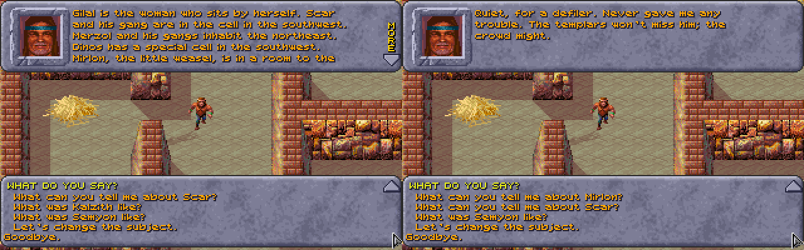

After the party's escape, when the game empties the pens ("They killed
everybody except for myself", the Trustee says on the torture rack), Kalzith
and Semyon are taken off the map too, the way the game takes the others (flag
775), and Semyon is never put in his pen after it.

How it works: [DEVELOPMENT.md](DEVELOPMENT.md#what-dinos-and-the-trustee-say-about-them).

### The cooked vulture

Hit the arena's vulture and its feathers come off (a plucked vulture); the
slave pens' campfire cooks it. In the game itself the cooked vulture is then no
use to anyone: no script asks for it. With the Ledger running, **Dinos**, the
pens' fine cook, can be asked about it: talk to him while someone in the party
carries it, and among the first things the party can say to him, just before
"Goodbye.", is **"We cooked the vulture from the arena."** He takes it ("A vulture! Give it here. A pinch of salt,
some agafari leaf, slow over the coals... Sit down and eat with me. A meal like
this puts the strength back in you."), and the game's own window for a quest's
reward follows, as for any of its quests: "Each party member receives 100
experience points!", with the sound the game plays when a quest is done (as for
the Trustee's key or the filled water jug). Each party member gets **100 XP**
(split between a multi-class character's classes, as the game splits all its
XP) and is **restored as after a full rest**: HP, PSP and spell slots full, and
anyone knocked out back on their feet. No time passes.
The question is gone once the vulture is. (Eaten by the party on their own,
used on one of them from the inventory, it's too tough to be worth the chewing.)

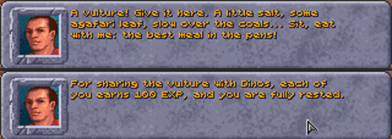

How it works: [DEVELOPMENT.md](DEVELOPMENT.md#the-cooked-vulture).

## Item tables

Every magic item and every mundane weapon in a game with the
[new items](#new-items), the game's and the Ledger's, with their icons.

### Every magic item

All the magic items in a game with the Ledger's new content on: the game's own,
read from its data (each item type's slot and material, each item's plus and
power, and who carries it), and the Ledger's, in **bold**. In **Where**, "—"
means the item isn't placed with anyone in the data: the game's scripts hand it
out (a reward, a gift or a find).

**Weapons**, by material, then kind:

| Icon | Material | Kind | Item | Bonus / power | Where |
|---|---|---|---|---|---|
|  | Bone | long sword | Swiftbite | +2 | — |
|  | Bone | long sword | Draketooth | +1, strength | — |
| 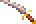 | Bone | long sword | Hornblade | +1 | Kalinin's reward |
|  | Bone | short sword | **Stillwater** | +1; a psionicist can wield it | the chest Chaya gives as her apology |
| 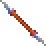 | Bone | gythka | Gythka +3 | +3 | — |
|  | Bone | gythka | **Gythka +2** | +2 (the game's +1) | the Elven Leader's gift |
|  | Bone | gythka | **Kreenfang** | +1 | the arena's dead body |
|  | Bone | axe | **Drakejaw** | +1 | a Magera guarding the wagon's prisoners |
|  | Bone | mace | Mace +2 | +2 | a chest |
| 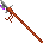 | Bone | polearm | Polearm +1 | +1 | — |
|  | Bone | polearm | **Thornwall** | +1 | the slave pens' weapon rack |
| 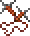 | Bone | cahulaks | Cahulaks +1 | +1, Cause Light Wounds | the caravan's buried chest |
| 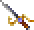 | Metal | long sword | Dragonsbane | +4 | — |
|  | Metal | long sword | El's Drinker | +2, Vampiric Touch | — |
|  | Metal | short sword | **Greenbright** | +2 | Arant |
|  | Metal | short sword | **Shadowseeker** | +1, Detect Invisibility | Kurzak |
|  | Metal | dagger | Dag's Dagger | +3, extra damage | Dagolar |
|  | Metal | dagger | **Galefang** | +2; an air cleric can wield it | the Rogue Shaman |
|  | Metal | axe | Soulcrusher | +1 | Kel |
|  | Metal | axe | Axe +1 | +1 | — |
|  | Metal | great axe | **Headsman** | +2 | the arena Announcer's stash |
|  | Metal | polearm | **Linebreaker** | +2 | the Troop Leader |
|  | Obsidian | long sword | Dark Flame | +2, Burning Hands | the Lower Castle's chest |
| 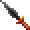 | Obsidian | long sword | Bloodwrath | +1 | Pehtucl, the pens' templar |
|  | Obsidian | long sword | **Flame Blade** | +1, Focus Heat | the Hot Springs' Templar |
|  | Obsidian | short sword | **Mindshard** | +1; a psionicist can wield it | Maris |
| 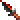 | Obsidian | dagger | Terror Blade | +2, poison | — |
|  | Obsidian | mace | Blackmace | +1, Shocking Grasp | the Shadow King |
|  | Obsidian | axe | **Glasshewer** | +2 | the elven slavers' Templar |
| 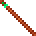 | Wooden | quarterstaff | Quarterstaff +2 | +2 | Maris |
| 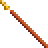 | Wooden | quarterstaff | Balk's Staff | +1, Slow | Balkazar |
|  | Wooden | quarterstaff | Parting Staff | +1 | — |
|  | Wooden | club | **Gutterknot** | +1 | Churrr |
|  | Stone | pick | **Deepbiter** | +1 | an Undermountain miner |
|  | none | great axe | Great Axe +3 | +3 | the Army Commander |

**Missile weapons and ammunition:**

| Icon | Material | Kind | Item | Bonus / power | Where |
|---|---|---|---|---|---|
|  | Wooden | bow | Bow +2 | +2 | a chest |
|  | Wooden | bow | Phrain's Bow | +1, Acid Arrow | — |
|  | Leather | sling | Sling +2 | +2 | Chaya and her apology chest; a chest |
|  | Leather | sling | Sling +1 | +1 | a chest |
|  | Leather | staff sling | **Windlash** | +1 | sold by the Bowyer |
|  | Obsidian | chatkcha | Chatkcha +1 | +1, Produce Fire | the Guardian |
| 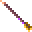 | Wooden | arrows | Arrows +3, +2, +1 | | chests; Kel and the Elven Leader (+1) |

**By weapon spec**, for [weapon specialization](#weapon-specialization):

| Weapon spec | Magic weapons |
|---|---|
| Long sword | Dragonsbane +4, Swiftbite +2, El's Drinker +2, Dark Flame +2, Draketooth +1, Hornblade +1, Bloodwrath +1, **Flame Blade** +1 |
| Short sword | **Greenbright** +2, **Shadowseeker** +1, **Mindshard** +1, **Stillwater** +1 |
| Dagger | Dag's Dagger +3, Terror Blade +2, **Galefang** +2 |
| Axe | **Glasshewer** +2, **Drakejaw** +1, Soulcrusher +1, Axe +1 |
| Great axe | Great Axe +3, **Headsman** +2 |
| Gythka | Gythka +3, **Gythka +2**, **Kreenfang** +1 |
| Polearm | **Linebreaker** +2, Polearm +1, **Thornwall** +1 |
| Mace | Mace +2, Blackmace +1 |
| Quarterstaff | Quarterstaff +2, Balk's Staff +1, Parting Staff +1 |
| Sling | Sling +2, Sling +1 |
| Club, pick, cahulaks | **Gutterknot** +1, **Deepbiter** +1, Cahulaks +1 |
| Bow, staff sling, chatkcha | Bow +2, Phrain's Bow +1, **Windlash** +1, Chatkcha +1 |

**Body armour:**

| Icon | Material | Item | Bonus / power | Where |
|---|---|---|---|---|
|  | Leather | Shimmer Armor | +3, Free Action | Dakaren |
|  | Leather | Drake Armor | +1, Resist Cold | the Wyvern Master |
|  | Leather | **Inixhide** | +1 | Legcrusher |
|  | Metal | **Warden's Chest** | plate +1, Resist Fire | Balkazar |
|  | none | Silk Armor | +2 | — |

**Arm and leg armour:**

| Icon | Slot | Material | Item | Bonus | Where |
|---|---|---|---|---|---|
|  | Arms | Metal | Tanelyv's Armor | chain +2 | — |
|  | Arms | Metal | **Warden's Arms** | plate +1 | the Lower Castle's chest |
|  | Arms | Metal | Grey's Scale | no plus (AC 3 with the Ledger) | Arant |
|  | Legs | Metal | Tanelyv's Armor | chain +2 | — |
|  | Legs | Metal | **Warden's Legs** | plate +1 | the Gemfields' chest |
|  | Legs | Metal | Grey's Scale | no plus (AC 3 with the Ledger) | Arant |

Tanelyv's Armor also has a chest piece, with no plus.

**Head:**

| Icon | Material | Item | Power | Where |
|---|---|---|---|---|
|  | Leather | Helm of Might | strength | — |
|  | Leather | Leather helm +1 | | a chest |
|  | Metal | Helm of Contemplation | a shield of thought against psionic attacks | the Warren Chief |
|  | Metal | **Warden's Helm** | +1, Cloak of Bravery | Dagolar |
|  | none (not armour) | **Arrowbane** | Protection from Normal Missiles | sold by Kel |
|  | none (not armour) | **Sunking Crown** | Protection from Evil | Keldar |

**Shields and gloves** (worn in a hand, in this game):

| Icon | Material | Item | Bonus / power | Where |
|---|---|---|---|---|
|  | Leather | El's Shield | +2 | — |
|  | Leather | Drake Shield | +1, Resist Fire | the Hot Springs' Templar |
|  | Leather | Chameleon Gloves | blind whoever they touch | Mikquetzl |
|  | none | Quicksilver Gauntlets | graft a one-handed weapon to the hand | — |

**Other worn items:**

| Icon | Slot | Item | Power | Where |
|---|---|---|---|---|
|  | Arms | **Bracers of Defense** | AC 6, 5, 4 or 2 with no armour | Mikquetzl, Wyrmias, Balkazar, Dagolar |
|  | Waist | Belt of Might | strength | — |
|  | Feet | Serpent Boots | Displacement | a chest |
|  | Feet | **Boots of Elvenkind** | move silently | the caravan's buried chest |
|  | Cloak | Living Cloak | Inertial Barrier | Dagolar |
|  | Cloak | **Cloak of Protection +1** | +1 AC and saves | Pehtucl |
|  | Cloak | **Cloak of Elvenkind** | hide in shadows | the Elven Leader's gift |
|  | Neck | Silver Necklace | Biofeedback | — |
|  | Neck | Obsidian Necklace | Disintegrate | the Troop Leader |
|  | Neck | Iron Necklace | Fireball | the Hermit |
|  | Neck | Golden Torque | takes on its maker's morals | — |
|  | Finger | Light of Dawn | Dismissal | on the ground, in Balkazar's region |
|  | Finger | Ring of Steadfastness | Constitution | — |
|  | Finger | Ring of Insight | Wisdom | — |
|  | Finger | El's Ring | Dexterity | on the ground |
|  | Finger | Storm Ring | Ice Storm | a chest |
|  | Finger | Wind Ring | Protection from Normal Missiles | the Wyvern Master |
|   | Finger | **Ring of Protection +1** (two) | +1 AC and saves | the arena's Tied-up Prisoner; Pehtucl |

**Held, or used from the pack:**

| Icon | Item | Power | Where |
|---|---|---|---|
|  | Orb of Knowledge (held) | watch the one it's tuned to | — |
|  | Dagolar's Wand | Control Body | Dagolar |
|  | Wand of Missiles | Magic Missile | a chest |
|  | Derth's Wand | Lightning Bolt | — |
|  | Wildwynd Wand | Confusion | — |
| 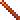 | Llod's Rod | travel between the obelisks | the Visionary |
|  | **Tome of Understanding** | +1 WIS when read | Father Garyn's gift |
|    | Magic fruit (14 kinds), spell scrolls (18), psionic scrolls (11), **Kalzith's six scrolls** | used once | many places |

### Every mundane weapon

Every plain weapon in a game with the new items, the game's and the Ledger's,
by kind and material: who sells it and who carries it (by the names the game
gives them; many are of a kind, such as every Renegade or Tari). The **Weapon
Merchant** and the **Bowyer** are in Teaquetzl, **Jark** and **Kel** in Kel's
caravan. The game's plain stone pick is only ever a
[starting weapon](#weapon-specialization); Deepbiter is its magic one.

| Icon | Kind | Material | Sold by | Carried by, or found in |
|---|---|---|---|---|
|  | long sword | bone | Jark, Weapon Merchant | Ranger, Templar, Chaero, Castle Guard, Arant's Guard, Warrior, Dagolar Guard, Caravan Guard, Guard, Lt. Kwerin, Slaver Guard, Messenger, Visitor, Renegade, Silt Runner |
| 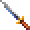 | long sword | metal | Weapon Merchant | Uskuye, Elven Leader, Elite Guard, Village Hero, a chest in the warrens |
| 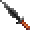 | long sword | obsidian | Jark, Weapon Merchant | Wyvern Master, Arant, Keldar, Kurzak, Guard, Chaya, Uskuye, Scar, Arena Guard, Caravan Master, Chahl, Mayor of Gedron, Merzol, Drajian Guard, Council Member, Templar |
|  | club | wood | Weapon Merchant | Warren Chief, Churrr, Tari, Skull Guardian, Worshipper, Low Warren Thug, Gladiator, Wild Mul, Guard, Legcrusher, a dead body in the arena, a chest, a weapon rack |
|  | dagger | bone | Jark, Weapon Merchant | Defiler |
|  | dagger | metal | — | Tobrian |
| 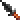 | dagger | obsidian | — | Defiler, Notaku |
|  | dagger | stone | Jark, Weapon Merchant | Balkazar, Dagolar, Wyrmias, Hermit, Tobrian, Villager, Linara, Maris, a chest in Dagolar's tunnels |
|  | short sword | bone | Jark, Weapon Merchant | Renegade |
|  | short sword | metal | Weapon Merchant | — |
|  | short sword | obsidian | Jark, Weapon Merchant | Chaero |
| 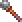 | mace | bone | Jark, Weapon Merchant | Wyvern Master, Krikor, Templar, a chest, a chest in Dagolar's tunnels |
|  | mace | metal | — | Templar |
|  | mace | obsidian | Jark, Weapon Merchant | Tari |
|  | axe | bone | Jark, Weapon Merchant | Wild Mul |
|  | axe | metal | — | Slaver Guard, Uzoma, a weapon rack in the Lower Castle, a weapon rack, a weapon rack in the slave pens |
|  | axe | obsidian | Weapon Merchant | Merzol |
|  | great axe | bone | Jark, Weapon Merchant | Wild Mul |
|  | great axe | metal | Weapon Merchant | — |
|  | great axe | obsidian | Jark, Weapon Merchant | — |
|  | pick | metal | Weapon Merchant | — |
|  | quarterstaff | wood | Jark, Weapon Merchant | Mikquetzl, Troop Leader, Dakaren, Dagolar, Wyrmias, Hermit, Father Garyn, Notaku, a weapon rack in the Lower Castle, a skeleton in the Undermountain, a chest, a weapon rack in the slave pens |
| 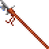 | polearm | bone | Weapon Merchant | a weapon rack in the Lower Castle, a weapon rack in the slave pens |
|  | polearm | metal | — | Castle Guard |
| 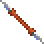 | gythka | bone | Jark, Weapon Merchant | Guardian |
|  | cahulaks | bone | Weapon Merchant | — |
|  | chatkcha | obsidian | Jark, Bowyer | — |
|  | bow | wood | Jark, Kel, Bowyer | Wyvern Master, Ranger, Arant, Castle Guard, Guard, Arant's Guard, Arena Guard, Caravan Guard, Slaver Guard, Elven Leader, Uzoma, Drajian Guard, Army Commander, Elite Guard, Village Hero, a chest in the Upper Castle, a chest, a chest in Dagolar's tunnels |
|  | sling | leather | Bowyer | Mehtar, Renegade, Silt Runner, a chest in the slave pens, a bag in the slave pens |
|  | staff sling | leather | Jark, Bowyer | — |

## On the screen

What the Ledger draws on the game's map. Each is switched on the Options tab's
**On the screen** group.

### What the party wears

The party's figures on the map and in fights show what each one wears, and
change as soon as their gear does (switch it off on the Options tab to see the
game's own). The game draws each race and sex the same whatever they carry;
the Ledger keeps the artist's pictures and adds to them, frame by frame,
walking and fighting:

| Worn | Shown |
|---|---|
| **Weapons and shields** | each kind its shape (dagger, sword, club, mace, axe, polearm, gythka, staff, a round shield), in its material's colours (wood, bone in ivory, stone, obsidian, metal; Kreenfang's two blades in the fire colours and Shadowseeker's in night steel, as their icons); walking, a one-handed weapon is worn at the belt, hanging down and back like a scabbard, two-handed ones are carried upright, and a shield is on the arm (from the side, on the far arm held forward of the chest, so it shows past the body); in a fight they are in the hands and swung, and the shield is on the other forearm in every pose (placed by hand for each model where the arm is hidden or flung) |
| **Bows and slings** | the bow and quiver on the back (the game draws the bow when shooting), a sling or chatkcha at the hip |
| **Armour** | the character's own clothing recoloured toward its material, shade for shade (leather, bone, chain, plate, scale...): the chest piece above the waist, arm pieces at the wrists, leg pieces below the waist; on figures the artist drew mostly bare (the mul, the dwarf man) only their straps and loincloth change, so it shows little |
| **Helms** | a circlet at the brow blended into the hair: a feather on leather, a dark stone on iron, low spikes on bone |
| **Cloaks** | the human and half-elf woman's own cloak (its folds and swing as she walks and fights) fitted to the wearer, under the hair, in the cloak's colours; hers takes them too |
| **Boots and belts** | the feet and the waist recoloured |

The colours are muted ones no region's palette changes. A thri-kreen shows
only weapons and shields (all it can use). Two party members of the same race
and sex each show their own equipment: the game gives them one figure, so the
second is moved to pictures of their own.


How it works: [DEVELOPMENT.md](DEVELOPMENT.md#what-the-party-wears).

### Shadows

Every living figure on the map (the party, the people, the monsters; not the
dead, nor items) casts a soft see-through shadow on the floor, its outline laid
long toward the lower right, the way the walls' own shadows fall (the light on
the game's maps comes from the upper left). The shadows are drawn on the floor
before anything else, so every figure and wall stands on top of them: a shadow
never covers another figure. Switch them off on the Options tab.


How it works: [DEVELOPMENT.md](DEVELOPMENT.md#shadows).

### Dust

Anyone walking on sand or dirt raises little puffs of dust behind their feet,
which spread, rise a little and fade in about a second. The walls and figures
stand in front of them, as with the shadows. Switch it off on the Options tab.


How it works: [DEVELOPMENT.md](DEVELOPMENT.md#dust).

## Controls

Each is switched on the Options tab's **Controls** group.

### Choosing an enemy: Tab, Enter and the rings

In a fight, a red ring on the ground can mark the enemies, under their feet (the
figures stand in it, as on their shadows). On a party member's turn, **Tab**
chooses an enemy, the nearest first, then the next nearest (**Shift+Tab** goes
back): its ring is drawn thicker and redder, the view scrolls to it if it is
out of sight, and the log names it. **Enter** then attacks it, as clicking on
it does (walking up to it first when it is out of reach), even where another
figure stands in front of it. On the Options tab the rings are **none**, **only
under the enemy chosen with Tab** (the default: none until Tab is pressed) or
**under all the enemies** (the chosen one's thicker and redder); Tab and Enter
have a switch of their own.


Tab and Enter also make attacking possible without aiming the mouse at all.

How it works: [DEVELOPMENT.md](DEVELOPMENT.md#choosing-an-enemy-tab-enter-and-the-rings).

### Scrolling the map

Press the mouse wheel on the map and move the mouse: the map moves with the
pointer, as if dragged, in fights too. In Windows, turning the wheel scrolls the
map up and down while the game's window is in front, and sideways with Shift
held (or a wheel that tilts). On the Options tab it can be switched off, or
holding the right button made to drag the map as well (a right click, let go
before the pointer has moved, still changes the pointer between walking, using
and looking). The game still scrolls on its own when the pointer touches the
screen's edge, and still brings the view back to whoever's turn it is in a
fight.

The view can't be zoomed: the game draws a 320 by 200 screen at one scale,
with the view's size built into its drawing code and its video memory pages.

How it works: [DEVELOPMENT.md](DEVELOPMENT.md#scrolling-the-map).

### Spells on the Effects screen

On the Effects screen (a character's spells and powers in effect), a click on
an effect's icon ends it in the game, so a stray click loses a spell. With the
Ledger a click leaves a spell on; a psionic power's effect still ends, as that
is how a power is stopped. It is a change to the game itself, from the next
time it is started.

## More saves and characters

### More saves

The game's save and load window holds 10 saves. With the Ledger it holds 40,
on four pages of ten: the **PAGE 1** to **PAGE 4** buttons under EXIT show a
page, the page shown has its button greyed, and **PgDn** and **PgUp** go to
the next page and the one before. Save and load as always; the window opens
on the page last shown. In the load window, PgDn and PgUp pass by pages with
no saves; a page's button shows it even with none, with **LOAD** greyed (and
Enter doing nothing) until you go to a page with a save. (The game itself
never lets you choose an empty row to load; loading one would start a new
game.)


Page 1 is the game's own saves, `SAVE01.SAV` to `SAVE10.SAV` in the game
folder; pages 2 to 4 are `SAVB01.SAV` to `SAVB10.SAV`, `SAVC..` and `SAVD..`,
next to them. The game started without the Ledger shows page 1 only, as
always: it looks for `SAVE??.SAV`, and the other pages' names don't match. (It
had better not see them: it puts each save it finds in the row its number
names, with room for ten, and a `SAVE11.SAV` would be written past the end.)

How it works: [DEVELOPMENT.md](DEVELOPMENT.md#more-saves).

### More characters

The game keeps up to 19 characters made with CREATE CHARACTERS (and the party
members dropped back to the roster); a 20th is refused with "Maximum
characters". With the Ledger it keeps 29. The roster in the ADD window
scrolls through them all, as it did through 19.

They are in the game's own `CHARSAVE.GFF`, each under a number, 1 to 29. The
game started without the Ledger reads numbers 1 to 19 only: characters saved
under 20 to 29 aren't shown, and aren't lost; they come back with the Ledger.
(The game saves a new character under the highest free number, so the first
ten made after the 19th go to 20 to 29.)

The patched game also fixes a bug of the game's own: **DELETE** in the
roster deleted the character in the row clicked counting from the top of the
list, not from the top of what was shown. With the list scrolled down,
another character was deleted. Now it deletes the one chosen.

A character made with CREATE CHARACTERS is **New** until the game starts,
when the game makes it Okay (and gives a New one the starting gear). The game's
tests for Okay left New out, so a New thief's skills all showed 0 on the
inventory screen, and the Ledger did the same. The patched game counts New as
Okay wherever it tests for Okay, and so does the Ledger. Left as they were: the
status under the portrait still reads New, and the game still gives the
starting gear and makes New characters Okay when the game starts.

How it works: [DEVELOPMENT.md](DEVELOPMENT.md#more-characters).

## Game speed

The game draws the view a frame at a time and shows each at the screen's next
refresh (70 a second), and a walking figure takes a step a frame. A frame that
takes a moment longer than a refresh waits for the next one, so it shows
twice as late, and walking goes at half speed. Everything drawn adds up: four
figures rather than the leader alone (the game's manual says collapsing the
party "speeds up the game"), the gear on them, the shadows, the dust.

The launcher gives DOSBox more of the computer's time: 20,000 cycles a
millisecond by default, where GOG's settings give 7,000. On the Options tab
**Game speed** is GOG's own, that, or 35,000: there, with everything on, the
whole party in view walks as fast as the leader alone, but it needs a faster
computer. It applies the next time the game is started. Both of the Ledger's
run on DOSBox's dynamic core (GOG's settings run this game on the slower
normal core): the same cycles do more, and cost the computer about a third
less.

Measured in the slave pens, walking (the leader's speed in pixels a second of
the game's time; higher is smoother):

| | All four in view | The leader alone |
|---|---|---|
| 20,000 cycles, the Ledger's shadows, dust, rings and gear off | 248 | 254 |
| 20,000, everything on | 139 | 263 |
| 30,000, everything on | 214 | 264 |
| 35,000, everything on | 258 | 254 |
| 40,000, everything on | 267 | 269 |

So at 20,000 the Ledger's own drawing is what slows the whole party: without
it the four walk as fast as one. Of it, the dust costs the most (each puff is
worked out pixel by pixel, and four walkers raise four times as many), then
the shadows. What each setting asks of the computer: [Suggested system
requirements](#suggested-system-requirements).

How it works: [DEVELOPMENT.md](DEVELOPMENT.md#game-speed).

## Accessibility

Templar's Ledger aims at the AODA's standard for software people read,
WCAG 2.0 level AA:

- **Contrast:** every colour used for text has at least 4.5:1 contrast with
  its background (the game's lighter stone is kept for bevels, not behind
  text). `tests/test_theme.py` checks each pair.
- **Colour is never the only signal:** log lines say `HIT`, `miss`, `saves`
  and so on in words, and changed bytes in the record view are underlined as
  well as highlighted.
- **Text size:** **A+** / **A-** at the top, or **Ctrl +**, **Ctrl -** and
  **Ctrl 0** (back to normal), enlarge or shrink all text up to 2.5 times.
  The Options tab's longer lines wrap to the window rather than run out of it.
- **Keyboard:** Tab and Shift+Tab move between controls, and the one with the
  keyboard focus is outlined in yellow. **Ctrl+Tab** switches tabs, as do
  **Alt+L** (Dice log), **Alt+I** (Dialogue), **Alt+S** (Spells), **Alt+M**
  (Memory tools) and **Alt+O** (Options), and on the party side **Alt+C** (Characters) and
  **Alt+A** (All fields).
- **In the game,** Tab and Enter choose and attack an enemy in a fight with no
  aiming of the mouse (see [Choosing an enemy](#choosing-an-enemy-tab-enter-and-the-rings)).
- **The game's font** is only used for the title: it's a 9-pixel bitmap
  font, fine enlarged as a heading but harder to read than ordinary text,
  so everything else is in the system's fonts.
- **Screen readers:** tkinter's windows are not read well by screen readers.
  **Save...** on the Dice log and Dialogue tabs writes the log to a text file,
  and `python -m dscompanion dicelog` prints the same log (dialogue included) in
  a command prompt, which screen readers do read.

## Without the game

**Checking a save file:** drag a `SAVEnn.SAV` file from the game folder onto
**`Show Save.bat`**.

**Practising:** `tests/make_fake_party.py` writes `FAKEPTY.COM`, a tiny DOS program holding two
made-up characters in the same record shapes as the game. The first character
loses 1 HP every second. Run it in DOSBox and try the viewer (search for
`SADIRA`).

```
python tests/make_fake_party.py
dosbox FAKEPTY.COM
```


